# ROS Catographer

> 参考《机器人SLAM导航》（张虎）

## 1. Catographer 基本原理

Cartographer 是一款可以跨多个平台和传感器配置提供 2D 和 3D 实时同步定位和绘图(SLAM)的系统。这个项目提供了 Cartographer 的 ROS 集成。

Cartographer 是 google 推出的一套基于图优化的 SLAM 算法。该算法的主要目标是实现低计算资源消耗，达到实时 SLAM 的目的。

- Catographer 局部建图

  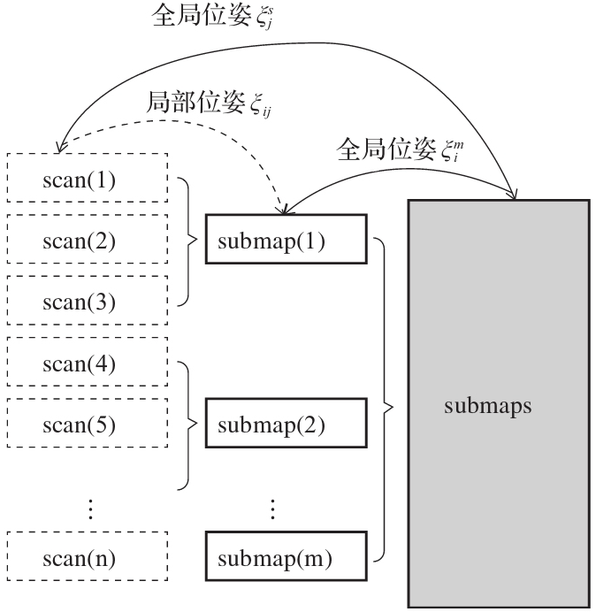

  Catographer 采用局部子图（`submap`）组织整个地图，若干个激光雷达扫描帧（`scan`）构成一个`submap`，所有的 `submap` 构成全局地图`submaps`。雷达扫描帧，局部子图，全局地图之间都是通过位姿关系进行关联。

  假设机器人初始位姿为 $\xi_1 = (\xi_x,\xi_y,\xi_\theta)$，该位姿处雷达扫描帧为 `scan(1)`，并利用`scan(1)` 初始化第一个局部子图 `submap(1)` 。利用 Scan-to-map matching 方法计算 `scan(2)` 相应的机器人位姿 $ξ_2$，并基于位姿$ξ2$ 将 `scan(2)` 加入 `submap(1)`。不断执行 Scan-to-map matching 方法添加新得到的雷达帧，直到新出现的雷达帧完全包含在`submap(1)` 中，即新雷达帧观测不到 `submap(1)` 之外的新信息时就结束`submap(1)` 的创建。

  每个雷达扫描帧都对应一个全局地图坐标系下的全局坐标，同时雷达扫描帧也对应一个局部子图坐标系下的局部坐标。而每个局部子图以第一个插入的雷达扫描帧为起始，该起始雷达扫描帧的全局坐标也就是该局部子图的全局坐标。所有雷达扫描帧对应的机器人全局位姿 $\xi_j^s$，以及所有局部子图对应的全局位姿 $\xi_j^m$ 通过 Scan-to-map matching 产生的局部位姿 $ξ_{ij}$ 进行关联，这些约束构成位姿图。当检测到闭环时，对整个位姿中的所有位姿量进行全局优化，此时所有全局位姿量都会得到修正，每个位姿上对应地地图点也相应地得到修正，这就是全局建图。

  - 局部子图的构建

    雷达扫描一圈得到的距离点 $h_k$，$k$ 是以雷达旋转中心为坐标系进行取值。那么在一个局部子图中，以第一帧雷达位姿为参考，后加入的雷达帧位姿用齐次变换矩阵 $T_ξ=(R_ξ, t_ξ)$ 表示。此时雷达帧的数据点可以转换为局部子图的坐标系表示：
    $$
    T_\xi \cdot h_k
    $$
    
    Cartographer 中的子图也采用概率栅格地图。连续 2D 空间被分成一个个离散的栅格，栅格的边长 $r$ 为分辨率，通常栅格地图的分辨率 $r=5cm$ 。那么扫描到的障碍点就替换成用该障碍点所占据的栅格表示。用概率来描述栅格中是否有障碍物，概率值越大说明存在障碍物的可能性越高。

  - 新雷达数据加入子图

    将新雷达数据转换到子图坐标系，这时候新雷达数据点会覆盖子图的一些栅格，每个栅格存在3种状态：即未知、非占据和占据。

    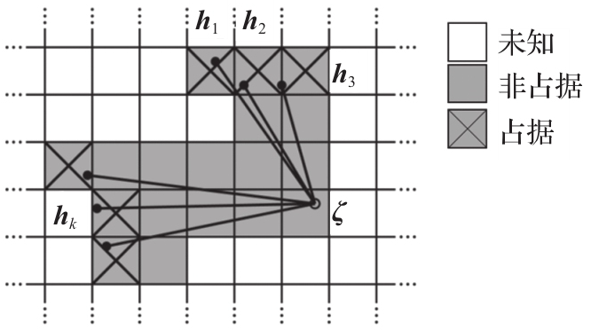

    雷达扫描点所覆盖的栅格就应该为占据状态；而雷达扫描光束起点与终点区域内肯定就没有障碍物，该区域覆盖的栅格就应该为非占据状态；因雷达扫描分辨率和量程限制，未被雷达扫描点所覆盖的栅格就应该为未知状态。因为子图中的栅格可能不只被一帧雷达扫描点所覆盖，所以需要对栅格的状态进行迭代更新。

    > **情况1：**在当前帧，新雷达数据点覆盖的栅格中，如果该栅格之前从未被雷达数据点覆盖（即未知状态），直接执行初始更新。其中，栅格若是被新雷达数据点标记为占据状态，那么就用占据概率给该栅格赋予初值；同理，栅格若是被新雷达数据点标记为非占据状态，那么就用非占据概率给该栅格赋予初值。概率 $P_{hit}$ 和 $P_{miss}$ 的取值由雷达概率观测模型给出。
    > $$
    > M_{new}(x) = \left\{ 
    >     \begin{array}{lc}
    > 	P_{hit} & state(x) = hit \\
    > 	P_{miss} & state(x) = miss 
    >     \end{array}
    > \right.
    > $$
    > **情况2：**在当前帧，新雷达数据点覆盖的栅格中，如果该栅格之前已经被雷达数据点覆盖，也就是栅格已经有取值，执行迭代更新。其中，栅格若是被新雷达数据点标记为占据状态，那么就用占据概率 $P_{hit}$ 进行更新；同理，栅格若是被新雷达数据点标记为非占据状态，那么就用非占据概率 $P_{miss}$ 进行更新。$odds$ 是一个反比例函数，$odds(x) = \frac{x}{1-x}$，$odds^{-1}$ 是 $odds$ 的反函数。$clamp$ 是一个区间限定函数，当函数值超过设定区间的最大值时都取最大值处理，当函数值超过设定区间的最小值时都取最小值处理。
    > $$
    > M_{new}(x) = \left\{ 
    >     \begin{array}{lc}
    > 		clamp(odds^{-1}(odds(M_{old}(x))\cdot odds(P_{hit}))) & state(x) = hit \\
    > 		clamp(odds^{-1}(odds(M_{old}(x))\cdot odds(P_{miss}))) & state(x) = miss
    >     \end{array}
    > \right.
    > $$

    这种栅格更新机制，能有效降低环境中动态障碍物的干扰。

  - 局部优化

    新雷达数据加入子图的操作，是基于雷达位姿 $ξ$ 误差较小的前提。由于从机器人运动预测模型得到的机器人位姿存在较大误差，所以需要先用观测数据对这个预测位姿做进一步更新，以更新后的机器人位姿为基准来将对应的观测加入地图。  

    Cartographer 中采用了 Scan-to-map matching 方法对雷达位姿进行局部优化。在将新雷达数据加入子图之前，先在运动预测出的雷达位姿附近窗口内进行搜索匹配（非线性最小二乘问题），$M_{smooth}$ 用来确定雷达扫描轮廓与局部子图之间的匹配度，匹配度取值范围为[0,1]区间：
    $$
    \min_{\xi}\sum_{k=1}^K(1-M_{smooth}(T_\xi \cdot h_k))^2
    $$
  
- 闭环检测

  Cartographer 中采用分支定界（branch-and-bound）法来提高闭环检测过程的搜索匹配效率。先以低分辨率的地图来进行匹配，然后逐步提高分辨率。

  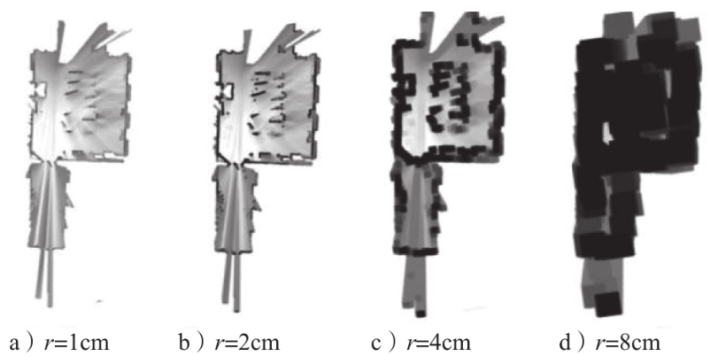
  
  > 假设地图原始分辨率为 $r=1cm$，将其进行平滑模糊处理得到分辨率为 $r=2cm$ 的地图，继续平滑模糊处理可以得到分辨率为 $r=4cm$ 和 $r=8cm$ 的地图。
  
  广度优先搜索，就是先横向比较同一分辨率下划分区域的匹配得分，找到得分最高的区域继续划分。Cartographer 中用到的分支定界策略是深度优先搜索，也就是纵向比较不同分辨率下划分区域的匹配得分。
  
  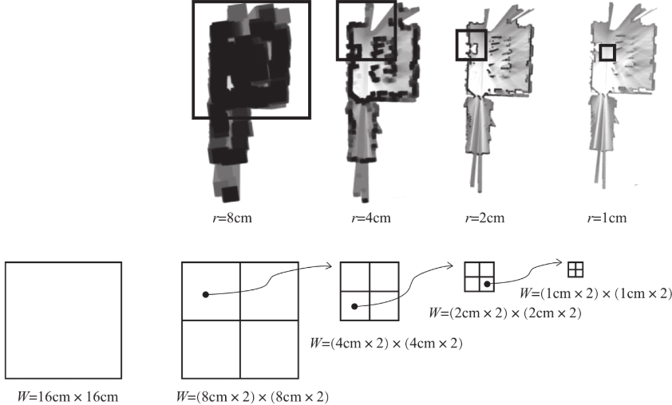
  
  > 以上是广度优先搜索的例子。
  
  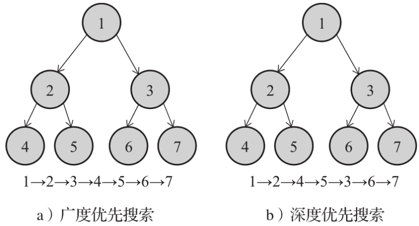
  
- 全局建图
  
  Cartographer 中采用是稀疏位姿图全局优化，优化方法和局部优化方法相似，当检测到闭环时，对整个位姿图中的所有位姿量进行全局优化，所有位姿量都会得到修正，每个位姿上对应的地图点也相应得到修正，这就是全局建图。
  

## 2. Catographer 源码

Catographer 源码如下：

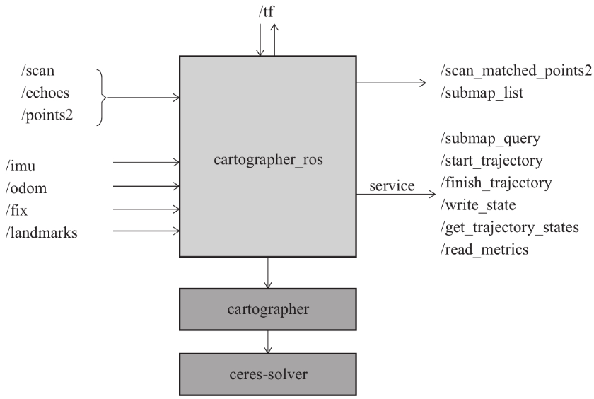

### `catograapher_ros` 功能包

`cartographer_ros` 功能包用于实现算法的 ROS 相关接口，激光雷达数据可以通过多种接口输入算法，当只搭载1个激光雷达时，用户可以根据自己激光雷达的数据类型选择合适的话题（`/scan`、`/echoes`或`/points2`）进行输入，由于 Cartographer 算法支持 2D 和 3D 建图，所以支持单线激光雷达和多线激光雷达。Cartographer 算法还支持搭载多个激光雷达建图，通过参数`num_laser_scans` 可以设置搭载 `scan` 类型激光雷达的个数（大于2个），以及对应的输入话题（`/scan_1`、`/scan_2`、`/scan_3`）；通过参数`num_multi_echo_laser_scans` 可以设置所搭载 `echoes` 类型激光雷达的个数（大于2个），以及对应的输入话题（`/echoes_1`、`/echoes_2`、`/echoes_3`）；通过参数`num_point_clouds`可以设置所搭载 `points2` 类型激光雷达的个数（大于2个），以及对应的输入话题（`/points2_1`、`/points2_2`、`/points2_3`）。IMU 数据通过话题 `/imu`输入算法，轮式里程计数据通过话题 `/odom` 输入算法，GPS 数据通过话题 `/fix` 输入算法，环境已知信标数据通过话题 `/landmarks` 输入算法。Cartographer支持多种模式建图，既可以只采用激光雷达数据建图，也可以采用激光雷达数据 + IMU、激光雷达 + 轮式里程计、激光雷达 + IMU + 轮式里程计等模式建图，并且还可以用 GPS 和环境已知信标辅助建图过程。Cartographer的工作模式和各种参数采用 `lua` 配置文件进行配置。

Cartographer 建图结果通过2个话题输出，其中话题 `/scan_matched_points2` 输出 scan-to-submap 匹配结果，话题 `/submap_list` 输出整个 Cartographer 最终地图结果。Cartographer 提供多个服务接口供用户调用，其中最重要的就是 `/write_state` 服务接口，它用于将Cartographer最终地图的数据保存到文件中。

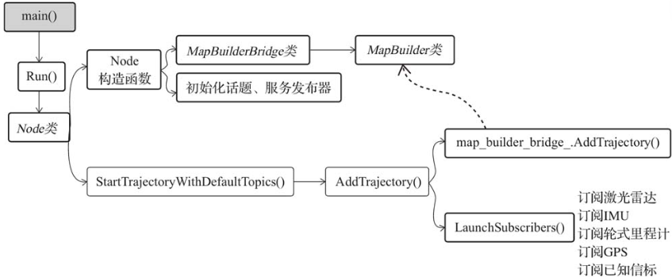

该功能包的节点如下：

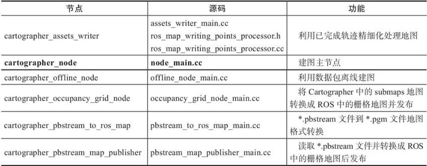

### `catographer` 核心库

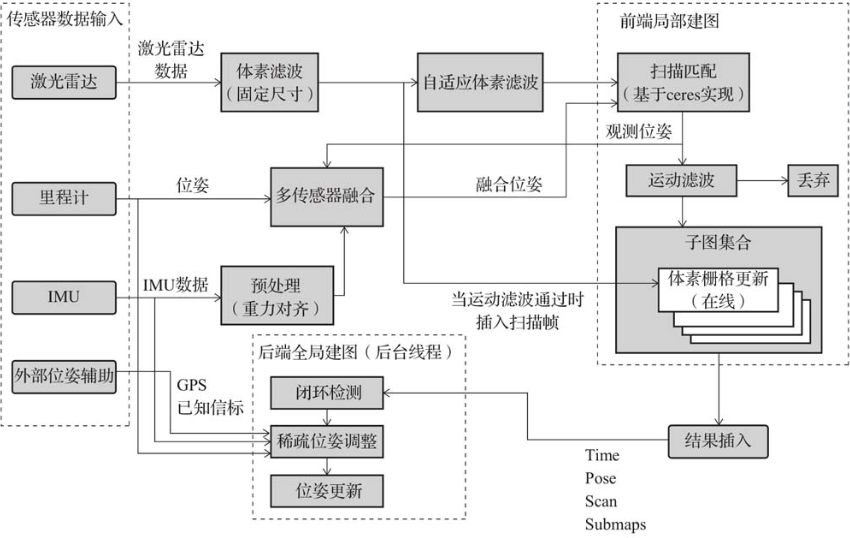

激光雷达数据先经过体素滤波，体素滤波其实就是对点云降采样，一般是将点云划分到不同体素栅格内，再用体素栅格内所有点的重心表示此体素栅格(见PCL笔记) 。经过体素滤波后的激光雷达数据有2个流向：一个流向是直接传给 Submaps用于子图构建，另一个流向是经自适应体素滤波（adaptive voxel filter）后用于扫描匹配。

轮式里程计、IMU 和外部位姿辅助可以与扫描匹配得到的观测位姿进行多传感器融合，经融合后的位姿作为更高精度的初始位姿输入给扫描匹配，这样能大大提高扫描匹配的效率和精度。
$$
position(t) = position(t-1) + \Delta position \\
orientation(t) = orientation(t-1) + \Delta orientation
$$
在 IMU 可用时，更信任 IMU 提供的$Δorientation$ ；在 `odom` 可用时，更信任 `odom` 提供的 $Δposition$；若没有，只能假设匀速模型，即上一个时刻的线速度和角速度在当前时刻依然不变，用线速度和角速度乘以时间间隔就能求出 $Δposition$ 与 $Δorientation$ 。IMU 数据在进行融合之前，需经过预处理，预处理可以得出 IMU 的当前姿态，该姿态既可以用于在多传感器融合中求 $Δorientation$，也可以用于修正在运动中上下抖动的激光雷达扫描数据。轮式里程计、IMU和外部位姿辅助同时输入给后端，用于全局优化。

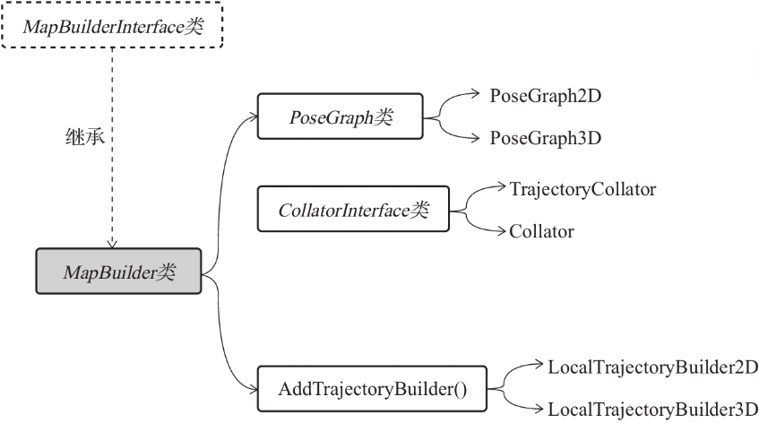

> `PoseGraph` 类用于实现后端全局优化，`CollatorInterface` 类用于实现多传感器融合，`AddTrajectoryBuilder()`函数用于启动建图，首先是启动局部建图，接着就是启动对应的后端全局优化和传感器融合。

### `Ceres-Solver` 非线性优化库

Cartographer 采用优化库 Ceres-Solver 来求解优化问题，主要包括局部建图中扫描匹配涉及的局部优化问题和全局建图中涉及的全局优化问题。

## 3. Catographer 使用示例

### 参数配置

#### 前端参数 `trajectory_builder_2d`

```lua
  -- 是否使用IMU数据
  use_imu_data = true, 
  -- 深度数据最小范围
  min_range = 0.,
  -- 深度数据最大范围
  max_range = 30.,
  -- 传感器数据超出有效范围最大值时，按此值来处理
  missing_data_ray_length = 5.,
  -- 是否使用实时回环检测来进行前端的扫描匹配
  use_online_correlative_scan_matching = true
  -- 运动过滤，检测运动变化，避免机器人静止时插入数据
  motion_filter.max_angle_radians
```

#### 后端参数`pose_graph`

```lua
-- Fast csm的最低分数，高于此分数才进行优化。
constraint_builder.min_score = 0.65
-- 全局定位最小分数，低于此分数则认为目前全局定位不准确
constraint_builder.global_localization_min_score = 0.7
```

#### 参数配置`backpack_2d`

```lua
include "map_builder.lua"
include "trajectory_builder.lua"

options = {
  map_builder = MAP_BUILDER,
  trajectory_builder = TRAJECTORY_BUILDER,
  -- 用来发布子地图的ROS坐标系ID，位姿的父坐标系，通常是map。
  map_frame = "map",
  -- SLAM算法跟随的坐标系ID
  tracking_frame = "base_link",
  -- 将发布map到published_frame之间的tf
  published_frame = "base_link",
  -- 位于“published_frame ”和“map_frame”之间，用来发布本地SLAM结果（非闭环），通常是“odom”
  odom_frame = "odom",
  -- 是否提供里程计
  provide_odom_frame = true,
  -- 只发布二维位姿态（不包含俯仰角）
  publish_frame_projected_to_2d = false,
  -- 是否使用里程计数据
  use_odometry = false,
  -- 是否使用GPS定位
  use_nav_sat = false,
  -- 是否使用路标
  use_landmarks = false,
  -- 订阅的laser scan topics的个数
  num_laser_scans = 0,
  -- 订阅多回波技术laser scan topics的个数
  num_multi_echo_laser_scans = 1,
  -- 分割雷达数据的个数
  num_subdivisions_per_laser_scan = 10,
  -- 订阅的点云topics的个数
  num_point_clouds = 0,
  -- 使用tf2查找变换的超时秒数
  lookup_transform_timeout_sec = 0.2,
  -- 发布submap的周期间隔
  submap_publish_period_sec = 0.3,
  -- 发布姿态的周期间隔
  pose_publish_period_sec = 5e-3,
  -- 轨迹发布周期间隔
  trajectory_publish_period_sec = 30e-3,
  -- 测距仪的采样率
  rangefinder_sampling_ratio = 1.,
  --里程记数据采样率
  odometry_sampling_ratio = 1.,
  -- 固定的frame位姿采样率
  fixed_frame_pose_sampling_ratio = 1.,
  -- IMU数据采样率
  imu_sampling_ratio = 1.,
  -- 路标采样率
  landmarks_sampling_ratio = 1.,
}
```

### 节点关系

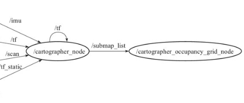

1. `/cartographer_node` 节点:

  该节点从 `/scan` 和 `/odom` 话题接收数据进行计算，输出 `/submap_list` 数据。该节点需要接收一个参数配置文件参数。

2. `/occupancy_grid_node` 节点：

  该节点接收 `/submap_list` 子图列表，然后将其拼接成 `map` 并发布。该节点需要配置地图分辨率和更新周期两个参数。

### 使用示例

1. 准备工作：准备一个机器人仿真功能包(Gazebo)

2. Catographer 安装

   ```shell
   $ sudo apt install ros-humble-cartographer
   $ sudo apt install ros-humble-cartographer-ros
   ```

3. 创建建图功能包

   ```shell
   $ ros2 pkg create fishbot_cartographer
   $ cd fishbot_cartographer
   $ mkdir config
   $ mkdir launch
   $ mkdir rviz
   ```

   此时的功能包结构

   ```
   .
   ├── CMakeLists.txt
   ├── config
   ├── launch
   ├── src
   ├── package.xml
   └── rviz
   ```

4. 添加配置文件

   在 `config` 目录下创建 `fishbot_config.lua` 文件：

   ```lua
   include "map_builder.lua"
   include "trajectory_builder.lua"
   
   options = {
     map_builder = MAP_BUILDER,
     trajectory_builder = TRAJECTORY_BUILDER,
     map_frame = "map",
     tracking_frame = "base_link",					
     published_frame = "odom",						-- base_link改为odom,发布map到odom之间的位姿
     odom_frame = "odom",							
     provide_odom_frame = false,					-- true改为false，不用提供里程计数据
     publish_frame_projected_to_2d = true,			-- false改为true，仅发布 2D 位姿
     use_odometry = true,							-- false改为true，使用里程计数据
     use_nav_sat = false,
     use_landmarks = false,
     num_laser_scans = 1,							-- 0改为1,使用一个雷达
     num_multi_echo_laser_scans = 0,				-- 1改为0，不使用多波雷达
     num_subdivisions_per_laser_scan = 1,			-- 10改为1，1/1=1等于不分割
     num_point_clouds = 0,
     lookup_transform_timeout_sec = 0.2,
     submap_publish_period_sec = 0.3,
     pose_publish_period_sec = 5e-3,
     trajectory_publish_period_sec = 30e-3,
     rangefinder_sampling_ratio = 1.,
     odometry_sampling_ratio = 1.,
     fixed_frame_pose_sampling_ratio = 1.,
     imu_sampling_ratio = 1.,
     landmarks_sampling_ratio = 1.,
   }
   
   MAP_BUILDER.use_trajectory_builder_2d = true							-- false改为true，启动2D SLAM
   TRAJECTORY_BUILDER_2D.min_range = 0.10									-- 0改成0.10,比机器人半径小的都忽略
   TRAJECTORY_BUILDER_2D.max_range = 3.5									-- 30改成3.5,限制在雷达最大扫描范围内，越小一般越精确些
   TRAJECTORY_BUILDER_2D.missing_data_ray_length = 3.						-- 5改成3,传感器数据超出有效范围最大值
   TRAJECTORY_BUILDER_2D.use_imu_data = false								-- true改成false,不使用IMU数据
   TRAJECTORY_BUILDER_2D.use_online_correlative_scan_matching = true 		-- false改成true,使用实时回环检测来进行前端的扫描匹配
   TRAJECTORY_BUILDER_2D.motion_filter.max_angle_radians = math.rad(0.1)	-- 1.0改成0.1,提高对运动的敏感度
   POSE_GRAPH.constraint_builder.min_score = 0.65							-- 0.55改成0.65,Fast csm的最低分数，高于此分数才进行优化。
   POSE_GRAPH.constraint_builder.global_localization_min_score = 0.7		-- 0.6改成0.7,全局定位最小分数，低于此分数则认为目前全局定位不准确
   -- POSE_GRAPH.optimize_every_n_nodes = 0								-- 设置0可关闭全局SLAM
   
   return options
   ```

5. 添加 `launch` 启动文件

   ```python
   
   import os
   from launch import LaunchDescription
   from launch.substitutions import LaunchConfiguration
   from launch_ros.actions import Node
   from launch_ros.substitutions import FindPackageShare
   
   
   def generate_launch_description():
       pkg_share = FindPackageShare(package='fishbot_cartographer').find('fishbot_cartographer')
       
       # 是否使用仿真时间
       use_sim_time = LaunchConfiguration('use_sim_time', default='true')		 
       # 地图的分辨率
       resolution = LaunchConfiguration('resolution', default='0.05')			 
       # 地图的发布周期
       publish_period_sec = LaunchConfiguration('publish_period_sec', default='1.0')
       # config 文件夹路径
       configuration_directory = LaunchConfiguration('configuration_directory',default= os.path.join(pkg_share, 'config') )
       # config 文件
       configuration_basename = LaunchConfiguration('configuration_basename', default='fishbot_config.lua')
       rviz_config_dir = os.path.join(pkg_share, 'config')+"/cartographer.rviz"
       print(f"rviz config in {rviz_config_dir}")
   
       # catographer_node 节点
       cartographer_node = Node(
           package='cartographer_ros',
           executable='cartographer_node',
           name='cartographer_node',
           output='screen',
           parameters=[{'use_sim_time': use_sim_time}],
           arguments=['-configuration_directory', configuration_directory,
                      '-configuration_basename', configuration_basename])
   
       # cartographer_occupancy_grid_node 节点
       cartographer_occupancy_grid_node = Node(
           package='cartographer_ros',
           executable='cartographer_occupancy_grid_node',
           name='cartographer_occupancy_grid_node',
           output='screen',
           parameters=[{'use_sim_time': use_sim_time}],
           arguments=['-resolution', resolution, '-publish_period_sec', publish_period_sec])
   
       # rviz2 节点
       rviz_node = Node(
           package='rviz2',
           executable='rviz2',
           name='rviz2',
           arguments=['-d', rviz_config_dir],
           parameters=[{'use_sim_time': use_sim_time}],
           output='screen')
   
       ld = LaunchDescription()
       ld.add_action(cartographer_node)
       ld.add_action(cartographer_occupancy_grid_node)
       ld.add_action(rviz_node)
   
       return ld
   ```

6. `CMakeLists.txt` 修改

   ```cmake
   install(
     DIRECTORY config launch rviz
     DESTINATION share/${PROJECT_NAME}
   )
   ```

7. 编译后，先启动仿真功能包，再启动建图功能包，最后启用键盘控制功能包控制机器人在地图内运动进行建图。

8. 保存地图到建图功能包内。

   ```shell
   $ sudo apt install ros-humble-nav2-map-server
   
   $ cd src/fishbot_cartographer/ && mkdir map && cd map
   $ ros2 run nav2_map_server map_saver_cli -t map -f fishbot_map
   ```

   生成文件：`.pgm`是地图的数据文件，`.yaml`后缀的是地图的描述文件。