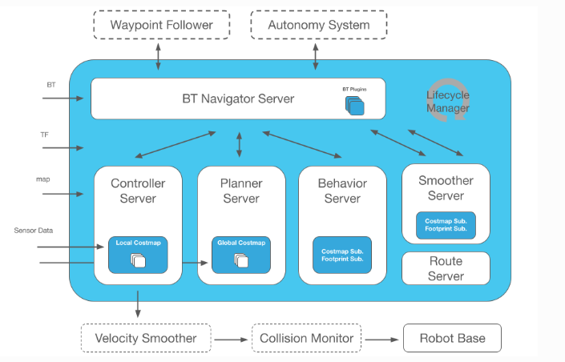

# ROS Navigation2 简介

## 1. Nav2 简介

Nav2 是ROS导航栈的专业支持精神继承者。该项目旨在找到一种安全的方式，使移动机器人能够在多种环境和机器人运动学类别中完成复杂任务。它不仅可以从A点移动到B点，还可以有中间姿态，并代表其他类型的任务，如物体跟踪等。

Nav2 的框架如下：



> Nav2：
>
> - 加载、提供和存储地图（地图服务器）
> - 在地图上对机器人进行定位（AMCL）
> - 规划绕过障碍物的从A到B的路径（Nav2规划器）
> - 控制机器人沿着路径移动（Nav2控制器）
> - 使路径规划更连续和可行（Nav2平滑器）
> - 将传感器数据转换为世界的代价地图表示（Nav2代价地图2D）
> - 使用行为树构建复杂的机器人行为（Nav2行为树和BT导航器）
> - 在发生故障时计算恢复行为（Nav2恢复）
> - 按顺序跟随航点（Nav2航点跟随器）
> - 管理服务器的生命周期和看门狗（Nav2生命周期管理器）
> - 启用自定义算法和行为的插件（Nav2核心）
> - 监视原始传感器数据以检测即将发生的碰撞或危险情况（碰撞监视）
> - 以Pythonic方式与Nav2进行交互的Python3 API（简单指挥官）
> - 在输出速度上进行平滑处理，以确保命令的动态可行性（速度平滑器）

1. 服务

   1. `BT Navigator Server`：导航行为树服务，通过这个大的服务来进行下面四个个小服务组织和调用。
   2. `Planner Server`，规划服务器，其任务是计算完成一些目标函数的路径。根据所选的命名法和算法，该路径也可以称为路线。
   3. `Controller Server`，控制服务器，在 ROS1 中也被称为局部规划器，是跟随全局计算路径或完成局部任务的方法。
   4. `Recovery Server`，恢复服务器，恢复器是容错系统的支柱。恢复器的目标是处理系统的未知状况或故障状况并自主处理这些状况。
   5. `Smoother Server`，路径平滑器。

2. 代价地图

   在机器人导航的时候，仅仅靠一张 SLAM 建立的原始地图是不够的，机器人在运动过程中可能会出现新的障碍物，也有可能发现原始地图中某一块的障碍物消失了，所以在机器人导航过程中维护的地图是一个动态的地图，根据更新频率方式和用途不同，可以分为下面两种。

   1. 全局代价地图（Global Costmap）

      全局代价地图主要用于全局的路径规划器。

      > 通常包含的图层有：
      >
      > - Static Map Layer：静态地图层，通常都是SLAM建立完成的静态地图。
      > - Obstacle Map Layer：障碍地图层，用于动态的记录传感器感知到的障碍物信息。
      > - Inflation Layer：膨胀层，在以上两层地图上进行膨胀（向外扩张），以避免机器人的外壳会撞上障碍物。

   2. 局部代价地图（Local Costmap）

      局部代价地图主要用于局部的路径规划器。

      > 通常包含的图层有：
      >
      > - Obstacle Map Layer：障碍地图层，用于动态的记录传感器感知到的障碍物信息。
      > - Inflation Layer：膨胀层，在障碍地图层上进行膨胀（向外扩张），以避免机器人的外壳会撞上障碍物。


## 2. Nav2 下载和安装

```shell
$ sudo apt install ros-humble-nav2-*

$ ros2 pkg list | grep navigation2
```

- Nav2 的功能包
  |功能包名|内容|
  |-|-|
  |`nav2_controller` |控制器|
  |`nav2_dwb_controller` | DWB控制器，Nav2控制器的一个实现 |
  |`nav2_regulated_pure_pursuit_controller` | 纯追踪控制器，Nav2控制器的一个实现 |
  |`nav2_constrained_smoother` | 路径平滑器 |
  |`nav2_planner` | Nav2规划器|
  | `nav2_navfn_planner` |navfn 规划器，Nav2规划器的一个实现|
  |`nav2_smac_planner` | smac 规划器，Nav2规划器的一个实现 |
  |`nav2_recoveries` | Nav2恢复器|
  |`nav2_bt_navigator` |　导航行为树|
  |`nav2_behavior_tree` | 行为树节点插件定义|
  |`nav2_map_server`|地图服务器|
  |`nav2_costmap_2d`|2D代价地图|
  |`nav2_voxel_grid` | 体素栅格|
  |`nav2_amcl` | 自适应蒙特卡洛定位|
  |`nav2_bringup` | 启动入口|
  |`nav2_common`|公共功能包|
  |`nav2_msgs`|通信相关消息定义|
  |`nav2_util` | 常用工具|
  |`nav2_lifecycle_manager` |节点生命周期管理器　|
  |`nav2_rviz_plugins` | RVIZ插件|
  |`nav2_core`| Nav2核心包                         |
  |`navigation2` | nav2导航汇总配置|
  |`nav2_waypoint_follower` | 路点跟踪|
  |`nav2_system_tests` | 系统测试|