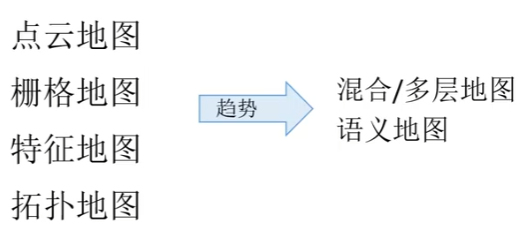
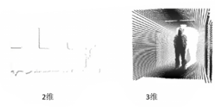
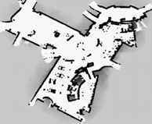
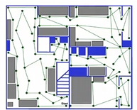

# Map 地图基本概念

## 1. 地图基本概念

地图用于表达机器人所在的环境，是进行导航的前置条件。通过实时环境感知和地图信息的匹配，定位机器人的位置。生成的地图可以用于进行路径规划。

### 点云地图

点云地图由空间中障碍物的边缘点集合构成，激光雷达，深度相机/普通相机均可构建点云地图。

通常的，激光雷达，深度相机/普通相机构建局部点云地图，结合里程计构建全局地图。

### 栅格地图

又称为占用栅格地图，将环境分解为一系列离散的栅格，每个栅格的值表示栅格被障碍物占用的情况。

一般的使用概率表示占用的可能性，写为 $p(m_i)$，$m_i = 1$ 为被占用，$m_i = 0$ 为未被占用。

栅格地图的存储空间由环境大小和栅格分辨率确定，栅格地图所需的内存和维护时间会随环境大小和栅格分辨率的增加而增长。可以用四叉树/八叉树降低存储。

- 栅格中的其他信息

  对于三维栅格地图，对存储资源和计算时间要求高，八叉树实验又十分复杂，通常用高度栅格地图：在每个栅格内存储障碍高度，通过高斯分布表示高度的不确定性。

  > - 栅格中可以存储有向欧氏距离，存储距离最近的被占用栅格的距离，可以快速实现碰撞检测，用正负号判断栅格在传感器和障碍物之间，障碍物表面还是障碍物之后。
  > - 栅格中可以存放截断距离场，只计算一定范围内的有向欧氏距离，其余截断。

### 特征地图

用抽象的特征描述环境，通过拟合障碍物的路标，线段，平面，多边形等几何特征，通过一组参数对特征建模。

特征地图简洁紧凑，更接近人类感知，对环境有高描述性。但是不能表达精确环境，也无法表示障碍情况，不能直接导航。

### 拓扑地图

把环境表示为带节点和相关连接线的拓扑结构图，节点表示重要的位置点。

不需要记录精确的坐标，更新和维护方便，可以快速进行导航。但是难以进行定位。

### 混合/多层地图

将不同类型地图进行混合，综合各个地图的功能。

### 语义地图

除了环境信息还包含已知类别的实体，可以将规划转化为面向任务的规划。
