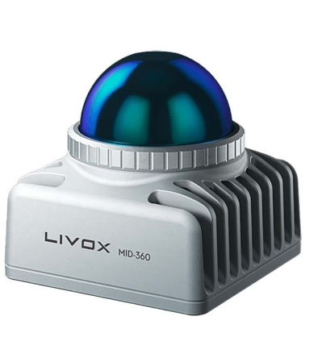
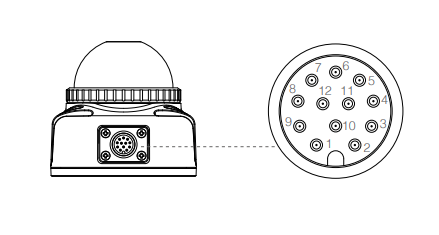
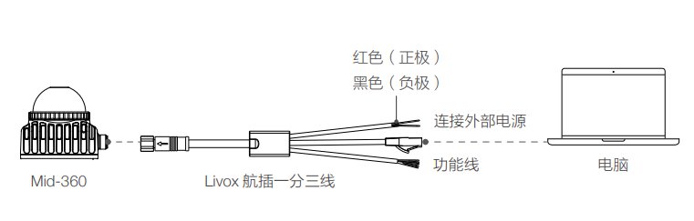
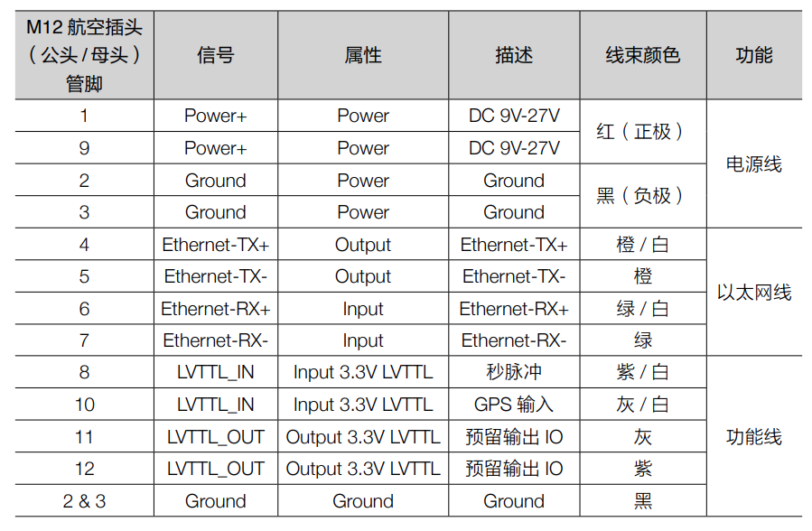
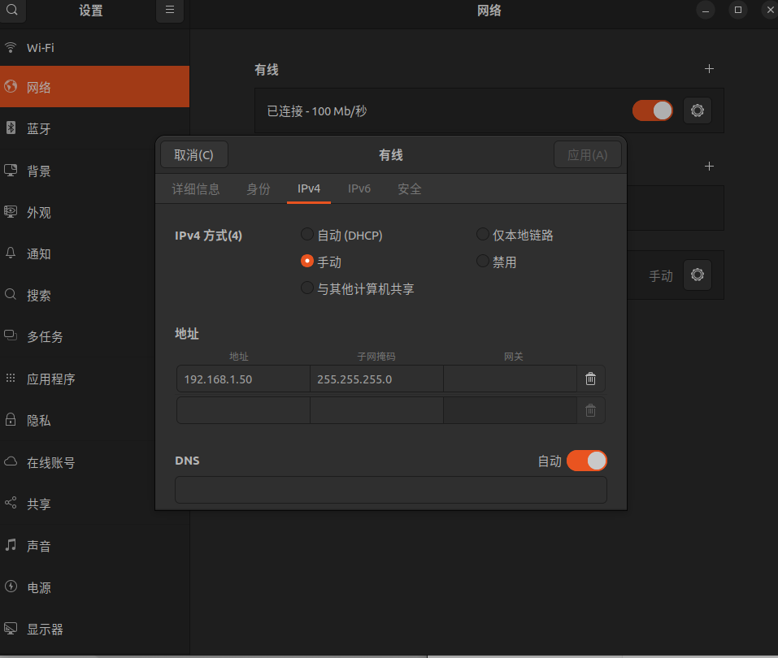

# Mid360 简介



## 1. 硬件连接



Mid360 对外的接口为 M12 接口，在官方配件中，M12 接口通过一个一分三线和PC端连接：



其中RJ45的网口接入电脑的网口，电源线接入电源（9~27V），功能线为外部同步使用。线序如图所示：



## 2. 在 Windows 上显示点云 

> 环境：
>
> - Windows 11
> - Mid360
> - Livox  Viewer - Windows: https://www.livoxtech.com/cn/mid-360/downloads

将 Mid360 的一分三线的网线插口插入机载电脑的网口中，然后给 Mid360 上电。

配置电脑的以太网：**将 PC 的 IP 类型设置为静态 IP，IP 地址为 192.168.1.2，子网掩码为 255.255.255.0，默认网关为 192.168.1.1。**

下载并解压 Livox  Viewer - Windows 文件，于解压的文件夹的根目录下打开 `LivoxViewer2.exe` 程序。此时应当能够看到雷达传回的点云图像。

## 3. Ubuntu + ROS2 配置

> 环境：
>
> - Ubuntu 22.04
> - ROS2 (Humble)
> - Mid360

### 配置网络



### 配置雷达驱动程序 (`Livox-SDK2`)

1. 新建工作空间 `livox_ws`

   ```shell
   mkdir livox_ws
   cd livox_ws
   mkdir src
   ```

2. 编译并安装 Livox-SDK2

   ```shell
   mkdir 3rd_party
   cd 3rd_party
   git clone https://github.com/Livox-SDK/Livox-SDK2.git
   cd ./Livox-SDK2/
   mkdir build
   cd build
   cmake .. && make -j
   sudo make install
   ```

3. 进入 `livox_ws/3rd_party/Livox-SDK2/samples/livox_lidar_quick_start` 文件夹，找到 `mid360_config.json`，把 `host_ip` 改成 `192.168.1.50`。

4. 运行例子：进入`livox_ws/3rd_party/Livox-SDK2/build/samples/livox_lidar_quick_start`文件夹

   ```shell
   ./livox_lidar_quick_start ../../../samples/livox_lidar_quick_start/mid360_config.json
   ```

5. 运行成功会有数据流输出（如果不是可能 IP 错误)

### 配置 ROS 驱动程序(`livox_ros_driver2`)

1. 克隆仓库(仓库本身是一个 ROS2 工作空间)

   ```shell
   git clone https://github.com/Livox-SDK/livox_ros_driver2.git ws_livox/src/livox_ros_driver2
   ```

2. 进入 `/src/livox_ros_driver2` 文件夹

   ```
   source /opt/ros/humble/setup.sh
   ./build.sh humble
   ```

3. 此时功能包已经编译完成，其中的 launch 文件如下：

   | launch file name   | Description                                                  |
   | ------------------ | ------------------------------------------------------------ |
   | rviz_HAP.launch    | Connect to HAP LiDAR device Publish pointcloud2 format  data Autoload rviz |
   | msg_HAP.launch     | Connect to HAP LiDAR device Publish livox customized pointcloud data |
   | rviz_MID360.launch | Connect to MID360 LiDAR device Publish pointcloud2 format data  Autoload rviz |
   | msg_MID360.launch  | Connect to MID360 LiDAR device Publish livox customized pointcloud data |
   | rviz_mixed.launch  | Connect to HAP and MID360 LiDAR device Publish pointcloud2 format data  Autoload rviz |
   | msg_mixed.launch   | Connect to HAP and MID360 LiDAR device Publish livox customized pointcloud data |

   > `rviz` 方式的是连接到传感器，发布 `pointcloud2` 格式的数据，并且启动 `rviz` 显示点云。
   > `msg` 方式的是连接到传感器，发布 `livox customized` 格式的点云数据。

4. 修改 config 文件

   使用官方提供的 launch 启动时，会使用 `ws_livox/install/livox_ros_driver2/share/livox_ros_driver2/config` 文件夹内的配置文件。

   ```
   {
     "lidar_summary_info" : {
       "lidar_type": 8
     },
     "MID360": {
       "lidar_net_info" : {
         "cmd_data_port": 56100,
         "push_msg_port": 56200,
         "point_data_port": 56300,
         "imu_data_port": 56400,
         "log_data_port": 56500
       },
       "host_net_info" : {
         "cmd_data_ip" : "192.168.1.50",  	# <-这里和修改后的电脑ip一致
         "cmd_data_port": 56101,
         "push_msg_ip": "192.168.1.50",  	# <-这里和修改后的电脑ip一致
         "push_msg_port": 56201,
         "point_data_ip": "192.168.1.50",  # <-这里和修改后的电脑ip一致
         "point_data_port": 56301,
         "imu_data_ip" : "192.168.1.50",  	# <-这里和修改后的电脑ip一致
         "imu_data_port": 56401,
         "log_data_ip" : "192.168.1.50",	# <-这里和修改后的电脑ip一致
         "log_data_port": 56501
       }
     },
     "lidar_configs" : [
       {
         "ip" : "192.168.1.126",		  	# <-这里是Livox mid360的ip："192.168.1.1xx"，xx 为 Mid360 序列号最后两位 
         "pcl_data_type" : 1,
         "pattern_mode" : 0,
         "extrinsic_parameter" : {
           "roll": 0.0,
           "pitch": 0.0,
           "yaw": 0.0,
           "x": 0,
           "y": 0,
           "z": 0
         }
       }
     ]
   }
   ```

5. 运行示例

   ```shell
   ros2 launch livox_ros_driver2 rviz_MID360_launch.py
   ```

   > 如果报错为端口占用，可以将配置文件修改后重新编译功能包进行尝试。或者把 `log_data_ip` 补上。

   此时可以在 rviz2 里面看到点云。