# Planner 1_路径规划基本理论

机器人导航问题分为以下几个问题：

> 1. (全局)**路径规划**：根据给定的地图和目标点，规划一条使机器人到达目标位置的路径。（只考虑环境几何约束，不考虑机器人的模型和约束）
> 2. (局部)**避障规划**：根据传感器信息，调整路径/轨迹避免发生碰撞。
> 3. **轨迹规划**：根据机器人的运动学模型和约束，将路径转换为轨迹。

> 笔者理解：
>
> 1. 路径规划+轨迹规划+运动控制适用于静态场景：Robocon比赛和工厂场景；此时可以用路径规划生成轨迹，轨迹规划生成运动学状态，运动控制下发运动控制指令；
> 2. 路径规划+避障规划+运动控制适用于动态场景：Robomaster比赛和道路场景，因为 DWA/TEB 等算法是直接下发速度/位置指令，但是某些算法仅仅对轨迹进行修正，这时需要加入轨迹规划进行后处理。
> 3. 很多时候这三类算法并没有明确的界限，通常是根据实际情况调用实际的算法。

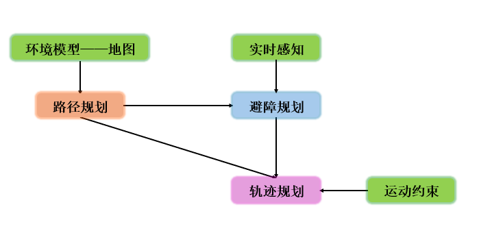

## 1. 路径规划总述

### 工作空间和位形空间

> - **工作空间**：考虑实际的障碍物大小，机器人的体积大小并采用位姿描述下，机器人上的参考点能够到达的空间集合。
> - **位形空间**：机器人成为一个可移动点，不考虑机器人位姿，体积和运动约束下，参考点能够到达的空间集合。（通常的，障碍物按照机器人半径进行膨胀以对应机器人体积的缩减）

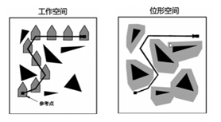

位形空间中分为障碍物空间和自由空间，目标是在自由空间中为机器人找到一条从初始位置到目标位置的路径。

### 路径规划的基本问题

路径规划主要有两个基本问题：**构建一个离散化的位形空间；在离散化的位形空间寻找最优路径**。

如果路径规划的解是存在的，规划算法可以在有限时间内找到解，生成解的时间越短越好。如果在连续空间内搜索路径，难度巨大且难以保证时间，这个时候需要对位形空间进行离散化。

离散化主要有两种路线：

1. **分辨率完备**：对位形空间进行解析性离散化，确保获得可行的解；

   > 1. **行车图法**：基于障碍物几何形状分解姿态空间，有可视图和维诺图法；
   > 2. **单元分解法**：区分空闲单元和被占据单元；
   > 3. **势场法**：根据障碍物和目标对空间各点施加虚拟力；

2. **概率完备**：对位形空间进行随机采样离散化，使得获得解的概率趋近于1；

   > 1. **PRM法**；
   > 2. **RRT法**。

离散化后需要进行最优路径搜索，目前有以下的方法：

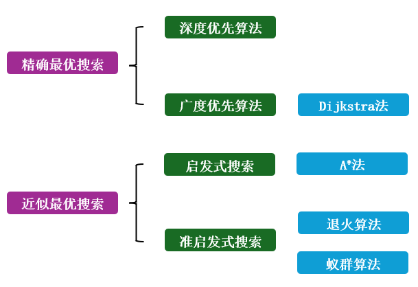

## 2. 位形空间离散化

### 基于分辨率完备的离散化

#### 行车图法

基于障碍物几何形状分解位形空间，将自由空间的连通性用一位曲线的网格表示，在加入起始点和目标点后，在该一维无向连通图中寻找一条无碰路径。

##### 可视图

所有连接可见顶点对的边构成可视图。

> 1. 初始点和目标点作为顶点，所有顶点两两连接；
> 2. 顶点连线间如果有障碍物，称为不可视。

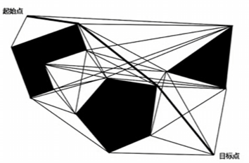

可视图的优缺点如下：

> 1. 非常简单，特别是当环境地图用多边形描述物体时；
> 2. 可以得到路径长度最优的解；
> 3. 路径靠近障碍物，不安全。（a. 膨胀障碍物使得膨胀范围远大于机器人半径，容易造成可行路径消失；b. 路径规划后修改所得路径，使得路径和障碍物保持距离）

##### 维诺图(Voronoi Diagram)

Voronoi Diagram 通过一系列的种子节点 Seed Points 将空间切分为许多子区域，每个子区域被称为一个 Cell，**每个 Cell 中的所有点到当前 Cell 中的种子节点 Seed Points 的距离小于到其它所有种子节点 Seed Points 的距离**。

Voronoi Diagram 的生成方法有分治法、扫描线算法和Delaunay三角剖分算法，这里不做详细介绍。[参考链接](https://blog.csdn.net/qq_44339029/article/details/126296997)

在路径规划中，使用障碍物边界作为 Seed Points 将空间分割为 Cell。机器人按照 Cell 的边界行驶可确保和障碍物的最大安全距离。

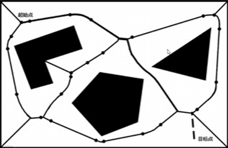

实际操作时，对于自由空间的每一个点，计算其和最近障碍物的欧氏距离，从而构建距离图。如果到多个障碍物距离相等时，距离图中会出现极值，连接这些极值点就可以划分 Cell。

> 在栅格地图中计算 Voronoi Diagram 的方法可以参考文献：《Improved updating of Euclidean distance maps and Voronoi diagrams》：[文献](https://ieeexplore.ieee.org/abstract/document/5650794)
>
> 这篇文献中提出了更新 Voronoi Diagram 的高效算法：
>
> 1. 动态更新欧几里得距离地图（EDMs）
>
>    每个单元格记录到最近障碍物的欧几里得距离，新增障碍物时触发 lower 波前，更新周围单元格的最近障碍物距离。移除障碍物时触发 raise 波前，清除依赖该障碍物的单元格，并在波前碰到障碍物后反射 lower 波前以更新距离。
>
>    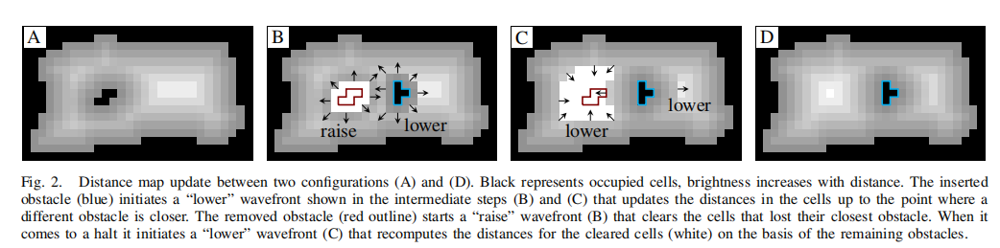
>
> 2. 生成 Voronoi Diagram 
>
>    在 lower 波前状态的扩散过程中，设栅格距离障碍物的原最近距离为 `dist`，此时距扩散源障碍的距离为 `dist∗` 。若 `dist∗<dist` ，则更新距离场 `dist←dist∗` ；若`dist∗>dist` 则 lower 波前停止；若 `dist∗=dist`，此时如果扩展节点已知，则可以将该节点记录到 Voronoi Diagram  中，如果扩展节点处于未知区域，则更新该节点为已知并重新加入lower 波前传播过程。当距离图更新完毕后，可以同时得到一系列满足 `dist∗=dist` 的节点。
>
>    在连续空间中，如果一个点到最近两个障碍物的距离相等，则该点是 Voronoi Diagram 的一部分。然而这个条件不能直接应用于离散栅格地图，受有限分辨率的限制，算法需要计算与维诺线关联的离散点作为 Voronoi Diagram 的候选栅格。接着对候选栅格进行裁剪。
>
>    

#### 单元分解法

将自由空间分为若干个小区域，每一个区域作为一个单元，以单元为顶点，单元之间的相邻关系为边构成一个连通图。在连通图中寻找包含初始点和目标点的单元，进行路径搜索，最后根据搜索得到的单元序列生成单元内部路径。

##### 精确单元分解

单元边界严格基于环境几何形状分解，得到的单元都是空闲单元。

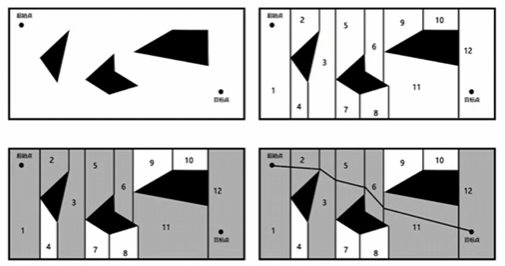

##### 近似单元分解

使用栅格地图，将环境分解为若干个大小相同的栅格(见机器人建图部分)。

使用单一大小的栅格地图占据大量的存储空间，为了降低存储空间，使用四叉树进行近似单元分解。将环境分为四个大小相等的子区域，如果内部有被占用，则递归进行分解，知道每个区域全为占用或者全为空闲。

#### 人工势场法

构建虚拟势场，目标点对机器人产生引力，障碍物对机器人产生斥力，所有力的合成构成对机器人的控制律。

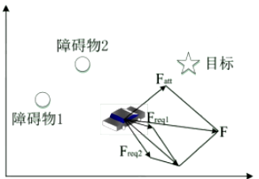

一般取引力势函数：
$$
U_g = \frac{1}{2}\lambda_g \rho^2(q,q_g)
$$
其中 $q$ 为机器人所处的位置向量，$q_g$ 为目标位置向量，$\rho(q,q_g)$ 为欧氏距离。

引力势函数的负梯度即为引力函数：
$$
F_g = -\nabla U_g = -\lambda_g \rho(q,q_g)
$$
取斥力势函数：
$$
U_d = \left\{
\begin{aligned}
\frac{1}{2}\lambda_d (\frac{1}{\rho(q,q_0)}-\frac{1}{\rho_0})^2 , 0 \le \rho(q,q_0) \le \rho_0 \\
0, \rho(q,q_0) \ge \rho_0
\end{aligned}
\right.
$$
$\rho_0$ 为斥力作用的最大半径。

斥力势函数的负梯度即为斥力函数：
$$
F_d = -\nabla U_d = \left\{
\begin{aligned}
\frac{1}{2}\lambda_d (\frac{1}{\rho(q,q_0)}-\frac{1}{\rho_0})\frac{1}{\rho(q,q_0)}^2\nabla\rho(q,q_0) , 0 \le \rho(q,q_0) \le \rho_0 \\
0, \rho(q,q_0) \ge \rho_0
\end{aligned}
\right.
$$
$\nabla\rho(q,q_0)$ 可以在连续地图中用距离函数的微分导出，栅格地图中可以用栅格代价差分近似。

机器人沿着人工势场的方向可以避开障碍物到达目标点。

### 基于概率完备的离散化

#### PRM 

通过随机采样和碰撞检测找到自由空间的路径点和无碰路径，构建连通图。

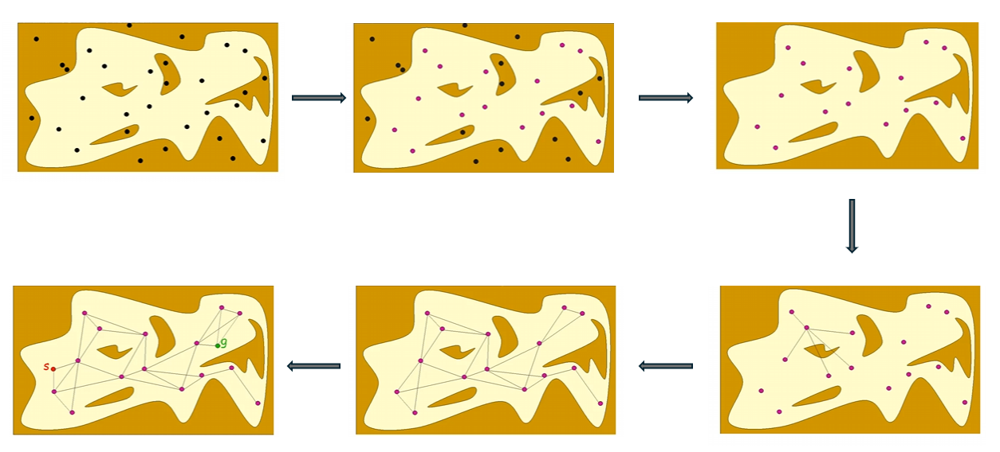

> 1. 在位形空间内随机取点，对采样得到的点进行碰撞检测，去掉在障碍物内部的点形成采样点。
>
> 2. 每个采样点和最近的 $k$ 个采样点进行连接(KNN)，对连线进行碰撞检测，删掉产生碰撞的连线：
>
>    > - 连线长度应该小于阈值 $d_{max}$，对过长的连线进行裁剪；
>    > - 连线不穿过障碍：在连线上按照一定步长进行采样，判断是否存在障碍中的采样点。
>
> 3. 加入起点和终点，重复上述操作。
>
> 4. 形成概率路图，使用搜索算法。

一般的，采样点越多，连线长度阈值越长，路径规划成功率越高，但是效率降低。

#### RRT

用一个初始点作为根节点，通过随机采样增加叶子节点的方式，生成一个随机扩展树，当随机树中的叶子节点包含了目标点或者进入目标区域，便可以从随机树中找到一条从初始点到目标点的路径。

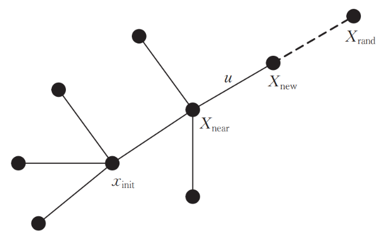

> 1. 在自由空间中采样 $x_{rand}$，并从已有的搜索树中找到 $x_{rand}$ 的最近邻 $x_{near}$；
> 2. 若 $d(x_{rand},x_{near}) < u$，则令 $x_{new} = x_{rand} $，否则从 $x_{near}$ 向 $x_{rand}$ 移动步长 $u$ 产生 $x_{new}$；
> 3. 通过碰撞检测决定是否将 $x_{new}$ 加入搜索树。

##### RRT-Connect 

在原始 RRT 算法中，终点附近的区域信息并不能得到有效利用，为了解决这个问题，可以分别以起点和终点为根节点进行双搜索树双向扩展，当两棵树建立连接时可回溯可行路径。

> 1. 在 A 树计算完成后，成功得到 A 树的新节点，此时遍历 B 树的的所有节点，判断二者是否能够满足步长限制和是否能够通过碰撞检测，如果不满足，需要进行下一轮计算；
> 2. A 树和 B 树交替生长。
> 3. 原有的 RRT 中，生长 RRT 树时，每产生一个随机点，如果能通过碰撞检测，就往该随机点的方向生长一次，然后该随机点被废弃；但是在 RRT-Connect 中，先生成一个随机点，然后，该树往该随机点的方向生长，直到碰到障碍物或则生长到该随机点，这样，一个随机点就被多次利用，是一种启发式算法，更加贪心。

RRT-Connect 和 RRT 一样，都是单查询算法，最终路径并不是最优的。

##### RRT*

RRT* 算法是一种渐近最优算法。算法流程与 RRT 算法流程基本相同，不同之处就在于最后加入将 $x_{new}$ 加入搜索树时父节点的选择策略。

RRT* 算法在选择父节点时会有一个重连过程，也就是在以 $x_{new}$ 为圆心、半径为 r 的邻域内，找到与 $x_{new}$ 连接后路径代价(从起点移动到 $x_{new}$ 的路径长度)最小的节点，并重新选择 $x_{min}$ 作为 $x_{new}$ 的父节点，而不是 $x_{near}$ 。

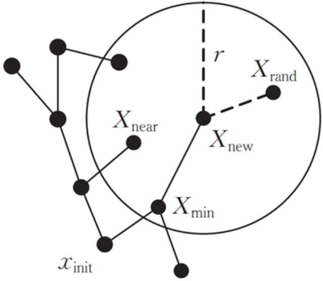

## 3. 最优路径搜索

### 精确最优搜索

#### 深度优先算法 DFS

[效果演示](https://vdn6.vzuu.com/SD/c745d0a4-6549-11eb-b674-c2e40faa64a4.mp4?pkey=AAVKec17SUNz0UtBYOycOAYlQnat0R9ODLaZCwVPN05qqI1UmWnn9HJxr2zeptn3VDFiRZ-XcV3I1G5U8ZvytyGG&bu=078babd7&c=avc.0.0&expiration=1747233835&f=mp4&pu=078babd7&v=ks6)

从起始节点开始按照深度的方式依次探索节点未被访问过的相邻节点，在一个相邻节点访问后，优先访问该节点下一个未被访问的节点，直到扩展到图的最深层后返回到上一层，探索该节点的未被访问的相邻节点。

> 1. 栅格地图中使用深度优先算法时，首先需要规定探索顺序(右/下/左/上)；
> 2. 从起点开始，按照该顺序进行探索，同时标记当前节点为已访问节点。
> 3. 如果遇到死胡同且未到终点，需要进行回溯：弹出该节点并返回到父节点进行另一个分支的探索；
> 4. 重复以上操作直到找到路径。

DFS 有不撞南墙不回头的特性，只有遇到死胡同的时候才会进行回溯，找到的路径并不是移动机器人运动规划所需要的最优路径。

如果需要找到最优路径，可以参考以下的算法：[参考](https://www.bilibili.com/video/BV1bK4y1C7W2/?spm_id_from=333.337.search-card.all.click&vd_source=2d2507d13250e2545de99f3c552af296)

> 1. 在找到终点时进行回溯；
> 2. 考虑到代码是递归调用的，回溯时可以将当前节点标为未访问后回溯到父节点，由于递归调用返回时的顺序性，父节点在探索时不会考虑这个未访问节点。

上式改进可以找到最优路径，但是花费的算力将会非常大，可以考虑添加一个路径长度标记，如果达到该长度仍然未到达终点直接开始回溯，如果到达终点仍然未达到该长度则更新最短路径。

#### 广度优先算法 BFS

[效果演示](https://vdn6.vzuu.com/SD/d5105682-6549-11eb-b74a-e65cac020e85.mp4?pkey=AAX5hayfutZNBUnGVLajIx2uy0AKoZwnQElyNGG1iVzl4sRtntVSCyiriUrVWu7umGWKm7I0EQYsWJmr9fsaq4ZK&bu=078babd7&c=avc.0.0&expiration=1747233906&f=mp4&pu=078babd7&v=ks6)

从起始节点开始访问该节点未访问的相邻节点，然后分别从相邻节点出发依次访问未访问相邻节点。通常使用队列进行搜索。

> 1. 栅格地图中使用广度优先算法时，首先需要规定扩展顺序(右/下/左/上)；
> 2. 将起点送入队列，接下来按照顺序，将队首节点扩展的点入队，如果队首节点没有可以扩展的点，将其出队，直到到达目标位置。
> 3. 每个点入队时记录是由哪个节点扩展得到的该点，在找到目标点时从终点开始通过父节点回溯找到路径。

BFS 能够保证搜索到的路径是最优的。

##### Dijkstra 算法

[效果演示](https://vdn6.vzuu.com/SD/efef11b8-654a-11eb-9922-ae5b475990f4.mp4?pkey=AAWC9eBYOXcX4W1p_EuEnvTcMq2HH2Ll80D-KejOkQWnr5kGrX_olzaDWKd2MF3pyXobawx90Otn55lCn5aCMSJA&bu=078babd7&c=avc.0.0&expiration=1747234730&f=mp4&pu=078babd7&v=ks6)

Dijkstra 算法采用了优先级定义的广度优先搜索，这里引入了代价函数 $g(n)$，表示从起点移动到当前点的移动代价（把横向和纵向移动一个节点的代价定义为10，斜向移动代价参考等腰三角形计算斜边的方式，距离为14）。

算法定义了未确定最短路径的节点集合 S 和已经确定最短路径的节点集合 T。

> 1. 初始时，将起点到自身的距离设为 0，到其他所有顶点的距离设为无穷大，集合 T 仅包含起点。
> 2. 将新加入 T 的节点作为父节点（一开始为起点），检查并更新从起点经过该点到达其他未进入 T 节点的路径长度（根据连通性）；如果通过这个父节点能得到一条更短的路径，就更新 S 集合中对应节点的距离值（并在对应节点标记父节点）。
> 3. 从 S 集合中选择距离最小的点(使用优先队列，代价越小优先级越高，高优先级的节点出队)，加入 T (作为父节点)，该顶点的最短路径由此确定；
> 4. 目标点加入到集合 T 中时，最优路径搜索结束，根据中转点来源确定最优路径；
>
> [参考](https://www.bilibili.com/video/BV1a94y157jo?spm_id_from=333.788.videopod.sections&vd_source=2d2507d13250e2545de99f3c552af296)

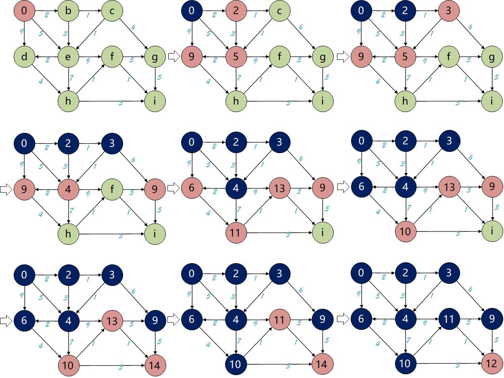

### 启发式搜索

#### GBFS 算法

[效果演示](https://picx.zhimg.com/v2-cb0c0a781dcb7bad2943c9d2cf477495_b.webp)

GBFS 算法采用了优先级定义的广度优先搜索，这里引入了代价函数 $h(n)$，表示从当前节点到终点的移动代价（计算只做横向或纵向移动的累积代价，忽略障碍）。

在 GBFS 的未考察节点队列中采用优先队列，每次选择优先级最高（代价最小）的节点作为父节点扩展未考察节点后出队（进入已考察的节点），新加入未考察节点后更新代价，重复该过程即可。在实际的地图中，常常会有很多障碍物，它就很容易陷入局部最优的陷阱。

#### A* 算法

[效果演示](https://vdn6.vzuu.com/SD/2d71c930-654c-11eb-be02-520c53d0139e.mp4?pkey=AAWtNX7FazcVuGpwXVL23vTQVGElSNoEl9kUJQSYZ4zil3QeKXKP6_NHaj6CgNtWW1kW1Jd5h4nzFMuABHZtkuvu&bu=078babd7&c=avc.0.0&expiration=1747237949&f=mp4&pu=078babd7&v=ks6)

A* 算法结合了 GBFS 和 Dijkstra 算法的特点，是目前最常用的算法（GBFS效率高，Dijkstra最优）。引入了代价函数 $f(n)= g(n) + h(n)$。

如果令 $h(n)=0$ ，A* 算法就退化为 Dijkstra 算法；如果令 $g(n)=0$ ，A* 算法就退化为 GBFS算法。

在 A* 的未考察节点队列中采用优先队列，每次选择优先级最高（代价最小）的节点作为父节点扩展未考察节点后出队（进入已考察的节点），新加入未考察节点后更新代价，重复该过程即可。在实际的地图中，常常会有很多障碍物，它就很容易陷入局部最优的陷阱。

### 准启发式搜索

#### 蚁群算法

通过蚂蚁在路径上释放的信息素进行间接通信，引导群体搜索最优路径。蚂蚁在寻找食物源时，会在其经过的路径上释放一种信息素，并能够感知其它蚂蚁释放的信息素。 信息素浓度的大小表征路径的远近，信息素浓度越高，表示对应的路径距离越短。通常，蚂蚁会以较大的概率优先选择信息素浓度较高的路径， 并释放一定量的信息素， 以增强该条路径上的信息素浓度，这样会形成一个正反馈。最终，蚂蚁能够找到一条从巢穴到食物源的最佳路径，即距离最短。

用蚂蚁的行走路径表示待优化问题的可行解， 整个蚂蚁群体的所有路径构成待优化问题的解空间。路径较短的蚂蚁释放的信息素量较多，随着时间的推进，较短的路径上累积的信息素浓度逐渐增高，选择该路径的蚂蚁个数也愈来愈多。最终，整个蚂蚁会在正反馈的作用下集中到最佳的路径上，此时对应的便是待优化问题的最优解。

> 1. 假设蚂蚁数量为 $m$，节点数量为 $n$，节点 $i$ 和节点 $j$ 之间的距离是 $d_{ij}$，$t$ 时刻节点 $i$ 和节点 $j$ 之间的信息素浓度为 $\tau_{ij}(t)$，一开始 $\tau_{ij}(t) = \tau_0$ ；
>
> 2. 蚂蚁 $k$ 根据各个路径上的信息素浓度决定下一个访问的节点，设 $P_{ij}^k(t)$ 为 $t$ 时刻蚂蚁从节点 $i$ 到节点 $j$ 的概率：
>    $$
>    P_{ij}^k(t) = \left\{
>    \begin{aligned}
>    \frac{[\tau_{ij}(t)]^\alpha[\eta_{ij}(t)]^\beta}{\sum_{s \in allow_k}[\tau_{is}(t)]^\alpha[\eta_{is}(t)]^\beta} , s \in allow_k \\
>    0,s \notin allow_k
>    \end{aligned}
>    \right.
>    $$
>    $\eta_{ij}(t)$ 为启发函数，$\eta_{ij}(t) = \frac{1}{d_{ij}}$ 表示蚂蚁从节点 $i$ 到节点 $j$ 的期望程度。$allow_k$ 表示了蚂蚁 $k$ 待访问城市的集合。开始时，$allow_k$ 中有 $n-1$ 个元素，随着时间推进，$allow_k$ 逐渐形成空集。$\alpha$ 和 $\beta$ 分别控制信息素和启发式信息的相对重要性。$α=0$ 时退化为贪心算法，$α$ 过大则依赖历史信息素，探索能力下降。$β=0$ 时仅依赖信息素，$β$ 过大则偏向短路径，可能忽略全局最优。
>
> 3. 蚂蚁释放信息素的时候，每个城市连接路径上的信息素逐渐消失，设 $ρ$ 为信息素挥发率。每次蚂蚁转移后，需要进行信息素浓度更新：
>    $$
>    \left\{
>    \begin{aligned}
>    \tau_{ij}(t+1) = (1-\rho)\tau_{ij}(t) + \Delta \tau_{ij} \\
>    \Delta \tau_{ij} = \sum_{k=1}^n \Delta\tau_{ij}^k
>    \end{aligned}
>    \right.
>    $$
>    $\Delta \tau_{ij}^k$ 表示蚂蚁 $k$ 从节点 $i$ 到节点 $j$ 释放的信息素浓度，$\Delta\tau_{ij}$ 为所有蚂蚁从节点 $i$ 到节点 $j$ 释放的信息素浓度之和。一般定义 $\Delta \tau_{ij}^k = \frac{Q}{L_k}$。$L_k$ 为第 $k$ 只蚂蚁的路径总长度。短路径的 $L_k$ 更小，因此贡献的信息素更多，引导后续蚂蚁选择更优路径。

