# Planner 2_避障规划基本理论

在 ROS2 的导航系统内，分为**全局规划器和控制器(局部规划器)**，全局规划器理论参考路径规划基本理论，而局部规划器包含两部分：

> 1. 对全局路径进行跟踪的算法(运动控制理论)；
> 2. 实时避障然后进行路径生成的算法(避障规划理论)。

通常局部规划器在接收到全局路径后，会使用运动控制算法进行航点跟踪，然后在跟踪过程中调用避障算法生成避障路径修改航点。因此，本节先介绍局部规划器内能够实现避障算法修改航点的基本理论。

## 1. Bug 算法

让机器人朝着目标前进，一旦出现障碍物，绕着障碍物轮廓移动，然后绕离。

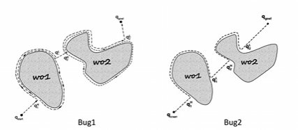

Bug1 做完整绕行，找到最靠近目标点的点（离开点），然后再次绕行到该点，从该点离开障碍物。Bug2 为减少绕路，当到达一个全局路径上接近目标点的位置时，如果该位置比最初碰到障碍物的位置更靠近目标点时，转移到全局路径上。

## 2. DWA 算法

DWA 即为 Dynamic Window Approach 动态窗口法，是 ROS/ROS2 中集成的运动控制和避障规划算法。

首先将全局路径转换到机器人坐标系下的路径(坐标转换)，得到机器人坐标系路径和当前位置后，便开始进行 DWA 算法。

> 1. 确定小车速度和位置；
>
> 2. 在速度空间内对速度进行采样：
>
>    > 1. 采样分辨率：通常设置一定的采样分辨率，得到离散化的速度(比如速度采样为4.9m/s,5m/s,5.1m/s,...)；
>    >
>    > 2. 速度空间限制：速度空间 $(v,\omega)$ 即机器人的速度范围，机器人的速度受到各种因素的限制。
>    >
>    >    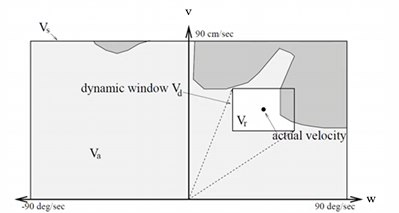
>    >
>    >    a) 移动机器人受自身最大速度最小速度的限制；
>    >    $$
>    >    v_s = \{ (v,\omega)|v\in[v_{min},v_{max}]\and w\in[\omega_{min},\omega_{max}]\}
>    >    $$
>    >    b) 移动机器人受电机性能的影响，加速度有一个范围限制，最大加速度或最大减速度一定时间内能达到的速度，才会被保留。
>    >    $$
>    >    v_d = \{ (v,\omega)|v\in[v_c - a_b \Delta t ,v_c+a_a \Delta t ]\and w\in[\omega_c-\beta_b \Delta t ,\omega_c+\beta_a \Delta t ]\}
>    >    $$
>    >    c) 移动机器人受障碍的影响，应当在碰到障碍物前停下来。$dist(v,w)$为$(v,w)$对应的轨迹上离障碍物最近的距离。
>    >    $$
>    >    v_a = \{ (v,\omega)|v\leq\sqrt{2dist(v,\omega)a_b} \and \omega\leq\sqrt{2dist(v,\omega)\beta_b}\}
>    >    $$
>    >    这三个限制形成了动态窗口，在动态窗口下采样得到一系列速度和角速度。
>
> 3. 根据机器人运动学模型进行运动轨迹模拟：（不适用于阿克曼底盘）
>    $$
>    \left[\begin{matrix}
>    x(t+\Delta t) \\
>    y(t+\Delta t) \\
>    \theta(t+\Delta t) \\
>    v_x(t+\Delta t) \\
>    v_y(t+\Delta t) \\
>    \omega(t+\Delta t) \\
>    \end{matrix}\right] =
>    \left[\begin{matrix}
>    x(t)+v_x(t)cos(\theta(t))\Delta t -v_y(t)sin(\theta(t))\Delta t\\
>    y(t)+v_x(t)sin(\theta(t))\Delta t +v_y(t)cos(\theta(t))\Delta t \\
>    \theta(t)+\omega(t)\Delta t \\
>    v_x(t)+a_x(t)\Delta t \\
>    v_y(t)+a_y(t)\Delta t \\
>    \omega(t)+\beta(t)\Delta t \\
>    \end{matrix}\right]
>    $$
>    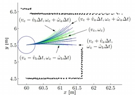
>
>    需要确定前向模拟的时间。
>
> 4. 确定最优路径
>
>    采用各个评价函数归一化加权进行最优路径评价。
>
>    `PathDist.scale` ：靠近全局路径的权重；
>
>    `GoalDist.scale` ：靠近导航目标点的权重；
>
>    `GoalAlign.scale` ：目标对齐的权重；
>
>    `PathAlign.scale` ：路径对齐的权重；
>
>    `ObstacleFootprintCritic.scale` : 避障的权重；
>
>    `OscillationCritic.scale` ：机器人振荡运动的权重；
>
>    `PreferForwardCritic.scale` ：鼓励前向移动轨迹的评分权重；
>
>    `RotateToGoalCritic.scale` ：机器人接近目标位置时旋转至目标方向的评分权重；
>
>    `TwirlingCritic.scale` ：防止机器人在到达目标前盲目旋转的评分权重。
>
> 5. 选择最优路径后，根据最优路径的速度下发速度指令。

## 3. TEB 算法

[参考](https://www.bilibili.com/video/BV1bQ4y1d7TW/?spm_id_from=333.337.search-card.all.click&vd_source=2d2507d13250e2545de99f3c552af296)

TEB (Timed Elastic Band)是 ROS/ROS2 中集成的运动控制和避障规划算法，通过连接起始点和目标点连接起来，让路径可以按照橡皮筋一样进行变形，变形的条件是将所有约束当作橡皮筋的外力。

在 ROS/ROS2 中，起始点和目标点由全局规划器直接指定，中间插入 N 个控制橡皮筋形状的控制点(也就是机器人姿态)，在点之间设置一个固定的时间差（时间分辨率）显示运动学信息。

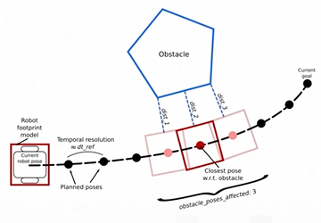

> 假设中间一个点由于障碍物约束被障碍"推向"远侧，相邻点也会由于运动学约束发生位置变化（优化过程）。
>
> 但是，每个约束（目标函数）只会和某几个连续的控制点有关，而不会影响整个路径，形成局部规划。

- 常见的约束条件：

  1. 全局路径约束和避障约束

     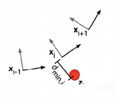

     全局路径将 Elastic Band 拉向全局路径，而避障约束将 Elastic Band 推离障碍物；

  2. 速度/加速度约束

     使用差分近似计算（点间固定时间差）计算点间的速度和加速度，需要满足速度和加速度在一定的范围内。

  3. 运动学约束

     希望生成平滑的轨迹（阿克曼底盘有最小半径），因此通常控制角度变化在一定范围内。

     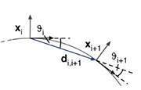

  4. 最快路径约束

     最快的路径有可能不是最短的路径（因为存在运动学约束）。

- 有约束条件后，可以看到 TEB 表述为一个多目标优化问题，大多数目标是局部的（每个约束（目标函数）只会和某几个连续的控制点有关），只和一小部分参数相关，由此优化速度得到保障。

  TEB 采用开源的 g2o 通用图优化法，将这些离散的控制点组成的轨迹满足各项约束并且达到最快，最短和避障的目标。

## 4. VFH 算法

传统的人工势场法将大量障碍物点的数据被抽象成一个排斥力的大小和方向，造成了信息损失。容易造成局部极小值；无法通过狭窄的障碍物间隙；同时由于传感器测量的不确定性、坐标和占据值的离散变化，导致运动方向易抖动。

VFH 算法的中心思想是将所有栅格的被障碍物占据情况、对运动方向的影响，通过统计直方图表示。这样的表示非常适合不准确的传感器数据，并适应多传感器读数的融合。

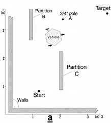

> 1. 根据传感器数据更新活动窗口中的栅格地图。
>
>    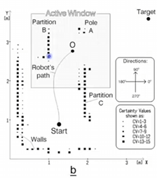
>
> 2. 将每个栅格用向量表示，方向从栅格到机器人中心，大小和栅格的障碍确定程度成正比，和到机器人中心距离为反比。
>
>    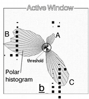
>
>
> 3. 转换为极坐标下的障碍物概率直方图，按照分辨率将 0-360° 分为 $n$ 个扇区，将同一个扇区内的障碍物向量大小叠加。（由于栅格地图的离散性质，可以进行平滑操作避免影响方向选择）
>
>    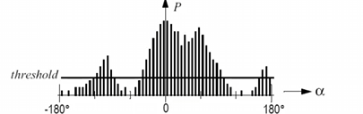
>
> 4. 根据直方图选择允许机器人通过的扇区，对每个扇区计算代价，选择最低代价的通道得到方向。
>
>    代价包括扇区和目标点的对齐量，扇区和当前机器人方向的差异量，扇区变化差异量。
>
>    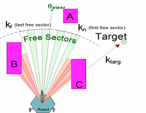
