# Controller 运动控制基本理论

运动控制一般要完成以下目标：

> 1. **路径跟踪**：使机器人尽可能准确地沿着一条预定义的几何路径（仅包含空间位置信息，如一系列点或曲线）行驶，不严格要求时间约束。（通常只使用运动学几何模型，仅考虑几何约束）
> 2. **轨迹跟踪**：使机器人/车辆严格跟踪一条带有时间信息的轨迹（包含空间位置和速度/时间戳），需同时满足位置和时序要求。（需要考虑动力学模型，满足动力学约束）
> 3. **纵向控制**：控制机器人在路径上的速度。

## 1. 路径跟踪

路径跟踪通常控制横向误差，一般不会产生纵向速度指令。

### Pure Pursuit 纯跟踪法

> 纯跟踪法只能适用于差速底盘和阿克曼底盘，AGV底盘当然也可以(视为四轮差速底盘)。

- 阿克曼底盘的纯跟踪法

  将阿克曼底盘简化为自行车模型。

  基于当前车辆的后轮中心位置，在参考路径上向 $l_d$（称为前视距离）的距离匹配一个预瞄点，车辆以一定角度和速度向预瞄点行驶。假设车辆后轮中心可以按照一定的转弯半径 $R$ 行驶至该预瞄点，然后根据前视距离 $l_d$ 、转弯半径 $R$、车辆坐标系下预瞄点的朝向角 $\alpha$ 之间的几何关系来计算前轮转角 $\delta$ 。
  
  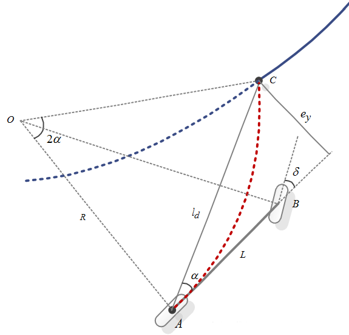
  
  三角形 OAC 中，根据正弦定理：
  
  $$
  \frac{l_d}{sin2\alpha} = \frac{R}{sin(\frac{\pi}{2}-\alpha)}
  $$
  
  再根据阿克曼底盘的运动学方程，有
  
  $$
  \delta = tan^{-1}\frac{L}{R} = tan^{-1}\frac{2Lsin\alpha}{l_d}
  $$
  定义横向误差为后轮中心位置和预瞄点在横向上的误差：
  $$
  e_y = l_dsin\alpha
  $$
  由此确定转向角度：
  $$
  \delta = \frac{2Le_y}{l_d^2}
  $$
  
  > 1. 对于离散路径，一般先取当前后轮中心 A 的路径匹配点，再在路径上寻找一个和匹配点距离近似为 $l_d$ 的点为前视点。
  >
  > 2. 纯跟踪本质上是一个P控制器。
  >
  > 3. 对于差速模型，控制量为$(v,\omega)$：
  >
  >    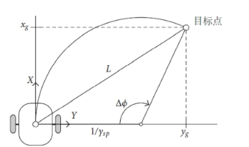
  >
  >    注意：$\omega = \frac{v}{R}$，类似上述推导（[参考](https://blog.csdn.net/chen_mp/article/details/119283187)）可以得到控制律即为将 $L$ 替换为 $v$，将 $\delta$  替换为 $\omega$。
  >
  > 4. 全向模型不建议适用该种纯跟踪，因为纯跟踪的目的是让机器人在存在约束的条件下按照圆弧路径进行路径跟踪，但是全向模型可以直接将机器人按照直线路径跟踪到目标点。（而且该法基本等同于在全向模型中使用 P 控制）
  >
  > 5. 前视距离的选取应该与机器人移动的速度相关，太大或太小都不行。一般取：
  >    $$
  >    L_d=kv+L_{min}
  >    $$
  >    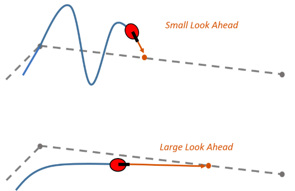
  >
  >    $L_d$ 太大会降低跟踪精度，太小会导致跟踪不稳定。（如果机器人离得太远，按照1中方法操作）。
  >
  > 6. 纯追踪更看重横向误差减小，纵向速度可以自定义。
  >
  > 7. **可以采用 PID 控制前轮转角。**

### Stanley 前轮反馈法

> Stanley法只能适用于差速底盘和阿克曼底盘。

Stanley方法是一种基于横向跟踪误差为前轴中心到最近路径点的距离的非线性反馈函数，并且能实现横向跟踪误差指数收敛于0。根据车辆位姿与给定路径的相对几何关系可以直观的获得控制车辆方向盘转角的控制变量。前轮转角控制变量由两部分构成：一部分是航向误差引起的转角，即当前车身方向与参考轨迹最近点的切线方向的夹角；另一部分是横向误差引起的转角，即前轮中心到参考轨迹最近点的横向距离。

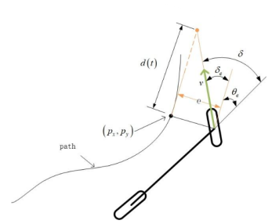

在不考虑横向跟踪误差的情况下，前轮偏角应当与给定路径参考点的切线方向一致。其中，$\theta_e$表示车辆航向与最近路径点切线方向之间的夹角，在没有任何横向误差的情况下，前轮方向与所在路径点的方向相同。
$$
\delta_\phi = \theta_e
$$
在不考虑航向跟踪偏差的情况下，横向跟踪误差越大，前轮转向角越大，假设车辆预期轨迹在距离前轮 $d(t)$ 处与给定路径上最近点切线相交，根据几何关系得出如下非线性比例函数：
$$
\delta_e = arctan\frac{e_y(t)}{d(t)} = arctan\frac{ke_y(t)}{v(t)}
$$
其中 $d(t)$ 与车速相关，用车速 $v(t)$、增益参数 $k$ 表示。

> 1. 横向误差总是收敛到0，参考这篇的推导：[参考](https://zhuanlan.zhihu.com/p/466203887)；

### PID 

这里不再赘述 PID 控制理论。

实际上，只需要规定横向误差，PID直接对有关于横向的控制量进行控制，往往效果奇佳。（特别是对于全向系统）

## 2. 纵向速度规划

> 笔者认为：速度规划实质上和轨迹规划差不多，因为轨迹规划的目标是生成带有时间信息的航点。实际上如果航点带有时间信息，自然可以推算得到各点的速度。所以这里将轨迹规划放在速度规划内介绍。
>
> 速度规划可以视为一个开环性质的规划器，机器人根据航点的规划速度直接下发速度指令值即可。如果需要引入反馈，可以使用将规划器指令修改，称为重规划。

### 多项式插值速度规划

[参考](https://www.zhihu.com/tardis/zm/art/269230598?source_id=1005)

- 一阶：给定初始位置 $q_0$，终点位置 $q_1$，初始时间 $t_0$ 和终点时间 $t_1$。
  $$
  q(t) = q_0 + \frac{q_1-q_0}{t_1-t_0} t
  $$
  生成的 $q(t)$ 是速度恒定的。

  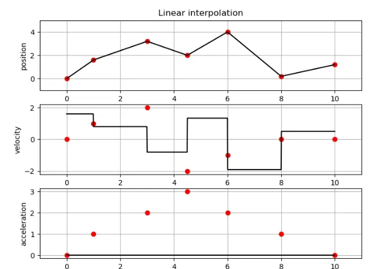

- 二阶：给定给定初始位置 $q_0$，终点位置 $q_1$，初始时间 $t_0$ ，终点时间 $t_1$，初始速度 $v_0$，终点速度 $v_1$。

  二阶速度规划只能形成分段速度规划，两个阶段的加速度恒定（不连续）。
  $$
  q_a(t) = a_0 + a_1(t-t_0) + a_2(t-t_0)^2 \\
  q_b(t) = a_3 + a_4(t-t_f) + a_5(t-t_f)^2
  $$
  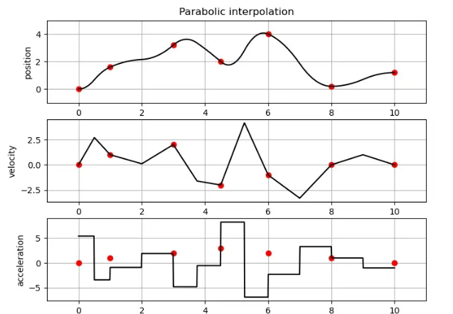

- 三阶：给定给定初始位置 $q_0$，终点位置 $q_1$，初始时间 $t_0$ ，终点时间 $t_1$，初始速度 $v_0$，终点速度 $v_1$。
  $$
  q(t) = a_0 + a_1(t-t_0) + a_2(t-t_0)^2+a_3(t-t_0)^3
  $$
  生成的 $q(t)$ 是速度连续，加速度为直线，急动度恒定的。

  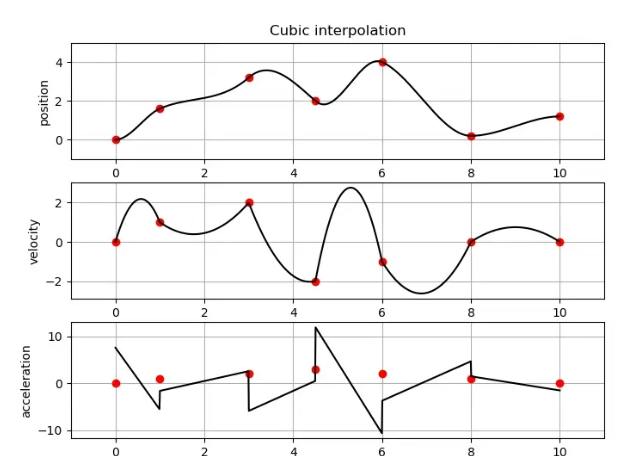

- 五阶：给定给定初始位置 $q_0$，终点位置 $q_1$，初始时间 $t_0$ ，终点时间 $t_1$，初始速度 $v_0$，终点速度 $v_1$，初始加速度 $a_0$，终点加速度 $a_1$。
  $$
  q(t) = a_0 + a_1(t-t_0) + a_2(t-t_0)^2+a_3(t-t_0)^3 + a_4(t-t_0)^4 +  a_5(t-t_0)^5
  $$
  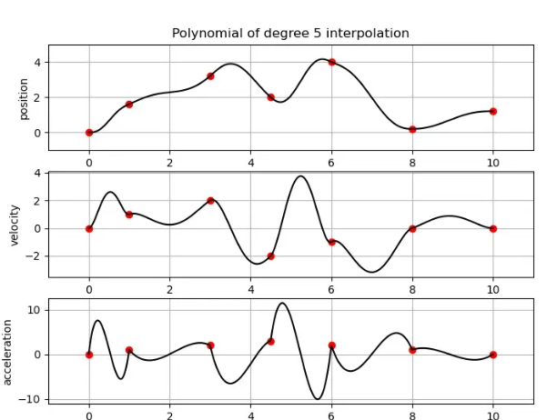

- 多项式的阶次越高，可以获得越平滑的曲线，但是同时带来的是对运算资源要求的急剧上升。

### 梯形速度规划

梯形速度规划包含匀加速、匀速、匀减速三个阶段，在变速过程中，加速度始终是人为设定的固定值。一般指定起始点位置 $q_0$，速度 $v_0$，最大速度 $v_{max}$，加速度 $a_{a}$，减速度 $a_d$，终止点位置 $q_1$，速度 $v_1$ 来计算梯形速度曲线。要确定轨迹，关键是计算出加速度段，匀速段，减速度段对应的时间 $T_a$，$T_v$，$T_d$。

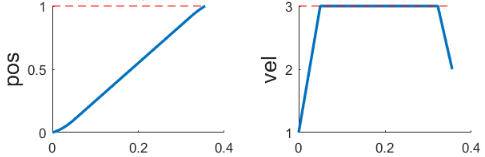

给定的起始速度，终止速度，加速度，减速度，最大速度，位移参数，不一定都能满足，若给定的参数对应的的轨迹不存在，那么需要修改最大速度参数，优先满足位移条件。

> 1. 根据 $h = q_1 - q_0$，$v_0$，$v_1$，$a_a$，$a_d$计算能够达到的最大速度，要达到最大速度，只有加速度段和减速度段，没有匀速段。
>    $$
>    h \geq \frac{v_f^2-v_0^2}{2a_a}+ \frac{v_1^2-v_f^2}{2a_d}
>    $$
>    即为：
>    $$
>    v_f = \sqrt{\frac{2a_aa_dh-a_av_1^2+a_dv_0^2}{a_d-a_a}}
>    $$
>
> 2. 根据指定最大速度 $v_{max}$ 和 $v_f$ 判断有无匀速段
>
>    若 $v_f < v_{max}$，说明不用到达最大速度即可完成起点到终点的规划，则令 $v_v = v_f$，此时速度波形没有匀速段，只有匀加速和匀减速。
>
>    若 $v_f \ge v_{max}$，说明需要匀速段的参与才能走完全部位移。但是又不允许超过最大速度，因此将匀速段速度设置为 $v_v = v_{max}$。
>
> 3. 计算加速段、匀速段、减速段的时间和位移
>    $$
>    T_a = \frac{v_v - v_0}{a_a} \\
>    L_a = v_0T_a + \frac{1}{2}a_aT_a^2
>    $$
>
>    $$
>    T_v = \frac{h-\frac{v_v^2-v_0^2}{2a_a}-\frac{v_1^2-v_v^2}{2a_d}}{v_v} \\
>    L_v = v_vT_v
>    $$
>
>    $$
>    T_d = \frac{v_1-v_v}{a_d} \\
>    L_d = v_vT_d+\frac{1}{2}a_dT_d^2
>    $$
>
> 4. 由此可推算各个阶段的位置，速度，加速度。  

### S形速度规划

S形速度曲线整个运动过程分为7个阶段，即加加速度阶段、匀加速阶段、减加速阶段、匀速段、加减速段、匀减速段、减减速段，不同阶段的速度衔接处加速度是连续的，且加速度的变化率可控，解决了梯形速度曲线加速度存在的突变问题。

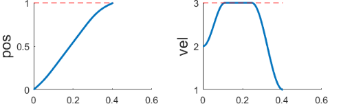

一般指定起始点位置 $q_0$，速度 $v_0$，最大速度 $v_{max}$，急动度$j$，最大加速度 $a_{max}$，终止点位置 $q_1$，速度 $v_1$ 来计算S形速度曲线。

> 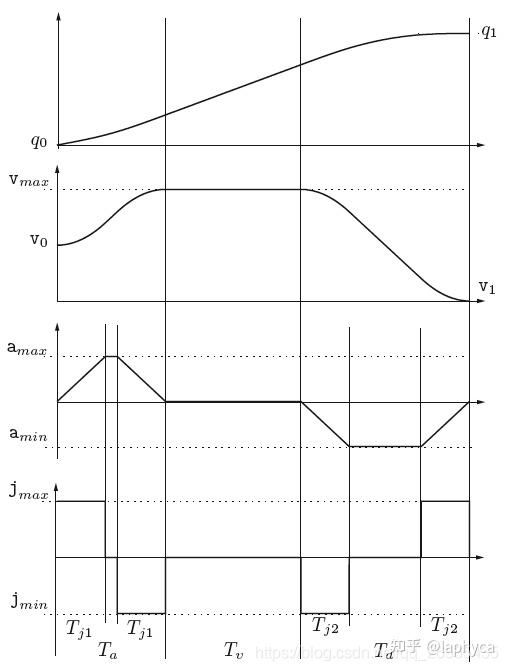
>
> 1. 判断能否达到最大速度
>    $$
>    (v_{max}-v_0)j<a_{max}^2
>    $$
>    如果满足，则不能达到 $a_{max}$。加速段时间 $T_{j1} = \sqrt{\frac{v_{max}-v_0}{j}}$，$T_a = 2T_{j1}$；
>
>    如果不满足，则能达到 $a_{max}$。加速段时间 $T_{j1} = \frac{a_{max}}{j}$，$T_a = T_{j1} + \frac{v_{max}-v_0}{a_{max}}$。
>    $$
>    (v_{max}-v_1)j<a_{max}^2
>    $$
>    如果满足，则不能达到 $a_{max}$。减速段时间 $T_{j1} = \sqrt{\frac{v_{max}-v_1}{j}}$，$T_a = 2T_{j1}$；
>
>    如果不满足，则能达到 $a_{max}$。加速段时间 $T_{j1} = \frac{a_{max}}{j}$，$T_a = T_{j1} + \frac{v_{max}-v_1}{a_{max}}$。
>
>    计算匀速段时间：$T_v = \frac{q_1-q_0}{v_{max}} - \frac{T_a}{2}(1+\frac{v_0}{v_{max}})-\frac{T_d}{2}(1+\frac{v_1}{v_{max}})$
>
> 2. 满足条件 $T_v > 0$，说明系统能够达到的最大速度与设定的最大速度相等，即 $v_{lim}$ = $v_{max}$，存在匀速时间，整理计算得到 $T_a$，$T_v$，$T_d$，$T_{j1}$，$T_{j2}$。直接计算轨迹即可。
>
> 3. 满足条件 $T_v \le 0$，说明系统不能达到指定的最大速度 $v_{lim} < v_{max}$，系统不存在匀速段。此时 $T_v = 0$。此时先假设系统能够达到最大加速度和最小加速度：
>    $$
>    T_{j1} = T_{j2} = \frac{a_{max}}{j} \\
>    T_a = \frac{\frac{a_{max}^2}{j} - 2v_0 + \sqrt{\Delta}}{2a_{max}} \\
>    T_d = \frac{\frac{a_{max}^2}{j} - 2v_1 + \sqrt{\Delta}}{2a_{max}}
>    $$
>    其中 $\Delta = \frac{a_{max}^4}{j^2} + 2(v_0^2+v_1^2)+a_{max}(4(q_1-q_0)-2\frac{a_{max}}{j}(v_0+v_1))$。
>
>    判断 $T_a < 0$ 或者 $T_d < 0$ 。
>
>    如果 $T_a < 0$，则 $T_a = 0$，则系统没有加速段，则：
>    $$
>    T_d = 2\frac{q_1-q_0}{v_0+v_1} \\
>    T_{j2} = \frac{j(q_1-q_0)-\sqrt{j(j(q_1-q_0)^2+(v_1+v_0)^2(v_1-v_0))}}{j(v_1+v_0)}
>    $$
>    此时可计算轨迹。
>
>    如果 $T_d < 0$，则 $T_d = 0$，则系统没有减速段，则：
>    $$
>    T_a = 2\frac{q_1-q_0}{v_0+v_1} \\
>    T_{j1} = \frac{j(q_1-q_0)-\sqrt{j(j(q_1-q_0)^2-(v_1+v_0)^2(v_1-v_0))}}{j(v_1+v_0)}
>    $$
>    此时可计算轨迹。
>
>    如果均不满足，进行判断：$T_a \ge 2T_j$ 和 $T_d \ge 2T_j$。
>
>    如果成立，说明系统的加速段和减速段均能达到最大加速度，此时可计算轨迹；
>
>    如果不成立，则系统加速和减速阶段至少有一段不能达到最大加速度，此时应当减小 $a_{max}$ 直到满足条件。
>
> 4. 由此可推算各个阶段的位置，速度，加速度。

### 重规划

[参考](https://zhuanlan.zhihu.com/p/523833100)

速度规划器的实质：生成一个虚拟机器人，下发指令使得机器人跟随其运行。因此可以令目标点按照规划的速度在路径上移动，设计纵向控制器以实现目标点跟随(没错，还是PID，只不过此时的速度指令是上面介绍算法中生成的指令)。一般跟随$q(t)$即可（某种意义上的开环）。

如果需要引入速度反馈，可以进行实时重规划：在规划过程中或者规划完成后，比较当前实际速度与规划速度的误差是否大于阈值，作为是否重规划的判断条件。如果大于阈值，则重新获取机器人的当前状态信息（距离、速度和加速度），进行重新规划；如果小于阈值，则进行下一步判断。

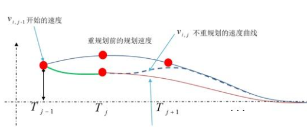

重规划需要的算力更高，一般机器人使用中使用开环规划即可。
