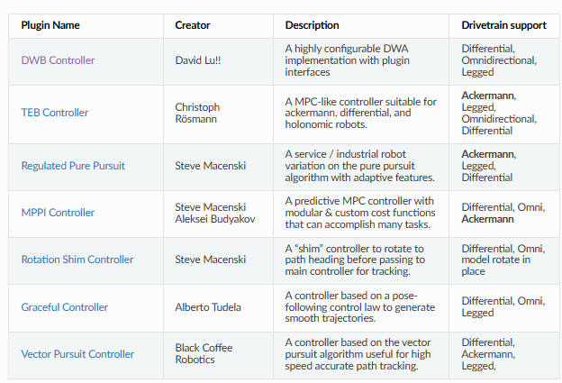
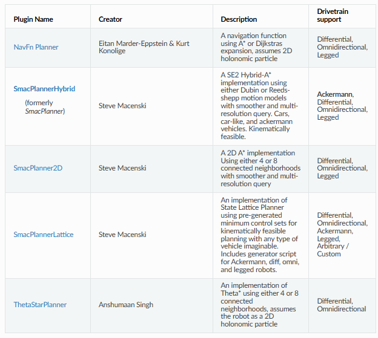

# ROS Navigation2 初步使用

## 1. Nav2 基本使用

1. 创建功能包

   ```shell
   $ ros2 pkg create fishbot_navigation2 --dependencies nav2_bringup
   ```

2. 添加地图（手动建立或者通过SLAM建立）

   ```shell
   $ cd src/fishbot_navigation2
   $ mkdir launch config map param rviz
   ```

   `map` 文件夹下添加建立的地图文件。

3. 添加配置文件

   ```shell
   $ cd src/fishbot_navigation2/param/
   $ touch fishbot_nav2.yaml
   ```

   `fishbot_nav2.yaml` 配置如下：

   ```yaml
   amcl:
     ros__parameters:
       use_sim_time: True
       alpha1: 0.2
       alpha2: 0.2
       alpha3: 0.2
       alpha4: 0.2
       alpha5: 0.2
       base_frame_id: "base_link"
       beam_skip_distance: 0.5
       beam_skip_error_threshold: 0.9
       beam_skip_threshold: 0.3
       do_beamskip: false
       global_frame_id: "map"
       lambda_short: 0.1
       laser_likelihood_max_dist: 2.0
       laser_max_range: 100.0
       laser_min_range: -1.0
       laser_model_type: "likelihood_field"
       max_beams: 60
       max_particles: 2000
       min_particles: 500
       odom_frame_id: "odom"
       pf_err: 0.05
       pf_z: 0.99
       recovery_alpha_fast: 0.0
       recovery_alpha_slow: 0.0
       resample_interval: 1
       robot_model_type: "nav2_amcl::DifferentialMotionModel"
       save_pose_rate: 0.5
       sigma_hit: 0.2
       tf_broadcast: true
       transform_tolerance: 10.0
       update_min_a: 0.2
       update_min_d: 0.25
       z_hit: 0.5
       z_max: 0.05
       z_rand: 0.5
       z_short: 0.05
       scan_topic: scan
   
   amcl_map_client:
     ros__parameters:
       use_sim_time: True
   
   amcl_rclcpp_node:
     ros__parameters:
       use_sim_time: True
   
   bt_navigator:
     ros__parameters:
       use_sim_time: True
       global_frame: map
       robot_base_frame: base_link
       odom_topic: /odom
       bt_loop_duration: 10
       default_server_timeout: 20
       # 'default_nav_through_poses_bt_xml' and 'default_nav_to_pose_bt_xml' are use defaults:
       # nav2_bt_navigator/navigate_to_pose_w_replanning_and_recovery.xml
       # nav2_bt_navigator/navigate_through_poses_w_replanning_and_recovery.xml
       # They can be set here or via a RewrittenYaml remap from a parent launch file to Nav2.
       plugin_lib_names:
       - nav2_compute_path_to_pose_action_bt_node
       - nav2_compute_path_through_poses_action_bt_node
       - nav2_smooth_path_action_bt_node
       - nav2_follow_path_action_bt_node
       - nav2_spin_action_bt_node
       - nav2_wait_action_bt_node
       - nav2_back_up_action_bt_node
       - nav2_drive_on_heading_bt_node
       - nav2_clear_costmap_service_bt_node
       - nav2_is_stuck_condition_bt_node
       - nav2_goal_reached_condition_bt_node
       - nav2_goal_updated_condition_bt_node
       - nav2_globally_updated_goal_condition_bt_node
       - nav2_is_path_valid_condition_bt_node
       - nav2_initial_pose_received_condition_bt_node
       - nav2_reinitialize_global_localization_service_bt_node
       - nav2_rate_controller_bt_node
       - nav2_distance_controller_bt_node
       - nav2_speed_controller_bt_node
       - nav2_truncate_path_action_bt_node
       - nav2_truncate_path_local_action_bt_node
       - nav2_goal_updater_node_bt_node
       - nav2_recovery_node_bt_node
       - nav2_pipeline_sequence_bt_node
       - nav2_round_robin_node_bt_node
       - nav2_transform_available_condition_bt_node
       - nav2_time_expired_condition_bt_node
       - nav2_path_expiring_timer_condition
       - nav2_distance_traveled_condition_bt_node
       - nav2_single_trigger_bt_node
       - nav2_is_battery_low_condition_bt_node
       - nav2_navigate_through_poses_action_bt_node
       - nav2_navigate_to_pose_action_bt_node
       - nav2_remove_passed_goals_action_bt_node
       - nav2_planner_selector_bt_node
       - nav2_controller_selector_bt_node
       - nav2_goal_checker_selector_bt_node
       - nav2_controller_cancel_bt_node
       - nav2_path_longer_on_approach_bt_node
       - nav2_wait_cancel_bt_node
       - nav2_spin_cancel_bt_node
       - nav2_back_up_cancel_bt_node
       - nav2_drive_on_heading_cancel_bt_node
   
   bt_navigator_rclcpp_node:
     ros__parameters:
       use_sim_time: True
   
   controller_server:
     ros__parameters:
       use_sim_time: True
       controller_frequency: 20.0
       min_x_velocity_threshold: 0.001
       min_y_velocity_threshold: 0.5
       min_theta_velocity_threshold: 0.001
       failure_tolerance: 0.3
       progress_checker_plugin: "progress_checker"
       goal_checker_plugins: ["general_goal_checker"] # "precise_goal_checker"
       controller_plugins: ["FollowPath"]
   
       # Progress checker parameters
       progress_checker:
         plugin: "nav2_controller::SimpleProgressChecker"
         required_movement_radius: 0.5
         movement_time_allowance: 10.0
       # Goal checker parameters
       #precise_goal_checker:
       #  plugin: "nav2_controller::SimpleGoalChecker"
       #  xy_goal_tolerance: 0.25
       #  yaw_goal_tolerance: 0.25
       #  stateful: True
       general_goal_checker:
         stateful: True
         plugin: "nav2_controller::SimpleGoalChecker"
         xy_goal_tolerance: 0.25
         yaw_goal_tolerance: 0.25
       # DWB parameters
       FollowPath:
         plugin: "dwb_core::DWBLocalPlanner"
         debug_trajectory_details: True
         min_vel_x: 0.0
         min_vel_y: 0.0
         max_vel_x: 0.26
         max_vel_y: 0.0
         max_vel_theta: 1.0
         min_speed_xy: 0.0
         max_speed_xy: 0.26
         min_speed_theta: 0.0
         # Add high threshold velocity for turtlebot 3 issue.
         # https://github.com/ROBOTIS-GIT/turtlebot3_simulations/issues/75
         acc_lim_x: 2.5
         acc_lim_y: 0.0
         acc_lim_theta: 3.2
         decel_lim_x: -2.5
         decel_lim_y: 0.0
         decel_lim_theta: -3.2
         vx_samples: 20
         vy_samples: 5
         vtheta_samples: 20
         sim_time: 1.7
         linear_granularity: 0.05
         angular_granularity: 0.025
         transform_tolerance: 0.2
         xy_goal_tolerance: 0.25
         trans_stopped_velocity: 0.25
         short_circuit_trajectory_evaluation: True
         stateful: True
         critics: ["RotateToGoal", "Oscillation", "BaseObstacle", "GoalAlign", "PathAlign", "PathDist", "GoalDist"]
         BaseObstacle.scale: 0.02
         PathAlign.scale: 32.0
         PathAlign.forward_point_distance: 0.1
         GoalAlign.scale: 24.0
         GoalAlign.forward_point_distance: 0.1
         PathDist.scale: 32.0
         GoalDist.scale: 24.0
         RotateToGoal.scale: 32.0
         RotateToGoal.slowing_factor: 5.0
         RotateToGoal.lookahead_time: -1.0
   
   controller_server_rclcpp_node:
     ros__parameters:
       use_sim_time: True
   
   local_costmap:
     local_costmap:
       ros__parameters:
         update_frequency: 5.0
         publish_frequency: 2.0
         global_frame: odom
         robot_base_frame: base_link
         use_sim_time: True
         rolling_window: true
         width: 3
         height: 3
         resolution: 0.05
         robot_radius: 0.22
         plugins: ["voxel_layer", "inflation_layer"]
         inflation_layer:
           plugin: "nav2_costmap_2d::InflationLayer"
           cost_scaling_factor: 3.0
           inflation_radius: 0.55
         voxel_layer:
           plugin: "nav2_costmap_2d::VoxelLayer"
           enabled: True
           publish_voxel_map: True
           origin_z: 0.0
           z_resolution: 0.05
           z_voxels: 16
           max_obstacle_height: 2.0
           mark_threshold: 0
           observation_sources: scan
           scan:
             topic: /scan
             max_obstacle_height: 2.0
             clearing: True
             marking: True
             data_type: "LaserScan"
             raytrace_max_range: 3.0
             raytrace_min_range: 0.0
             obstacle_max_range: 2.5
             obstacle_min_range: 0.0
         static_layer:
           map_subscribe_transient_local: True
         always_send_full_costmap: True
     local_costmap_client:
       ros__parameters:
         use_sim_time: True
     local_costmap_rclcpp_node:
       ros__parameters:
         use_sim_time: True
   
   global_costmap:
     global_costmap:
       ros__parameters:
         update_frequency: 1.0
         publish_frequency: 1.0
         global_frame: map
         robot_base_frame: base_link
         use_sim_time: True
         robot_radius: 0.22
         resolution: 0.05
         track_unknown_space: true
         plugins: ["static_layer", "obstacle_layer", "inflation_layer"]
         obstacle_layer:
           plugin: "nav2_costmap_2d::ObstacleLayer"
           enabled: True
           observation_sources: scan
           scan:
             topic: /scan
             max_obstacle_height: 2.0
             clearing: True
             marking: True
             data_type: "LaserScan"
             raytrace_max_range: 3.0
             raytrace_min_range: 0.0
             obstacle_max_range: 2.5
             obstacle_min_range: 0.0
         static_layer:
           plugin: "nav2_costmap_2d::StaticLayer"
           map_subscribe_transient_local: True
         inflation_layer:
           plugin: "nav2_costmap_2d::InflationLayer"
           cost_scaling_factor: 3.0
           inflation_radius: 0.55
         always_send_full_costmap: True
     global_costmap_client:
       ros__parameters:
         use_sim_time: True
     global_costmap_rclcpp_node:
       ros__parameters:
         use_sim_time: True
   
   map_server:
     ros__parameters:
       use_sim_time: True
       yaml_filename: "turtlebot3_world.yaml"
   
   map_saver:
     ros__parameters:
       use_sim_time: True
       save_map_timeout: 5.0
       free_thresh_default: 0.25
       occupied_thresh_default: 0.65
       map_subscribe_transient_local: True
   
   planner_server:
     ros__parameters:
       expected_planner_frequency: 20.0
       use_sim_time: True
       planner_plugins: ["GridBased"]
       GridBased:
         plugin: "nav2_navfn_planner/NavfnPlanner"
         tolerance: 0.5
         use_astar: false
         allow_unknown: true
   
   planner_server_rclcpp_node:
     ros__parameters:
       use_sim_time: True
   
   smoother_server:
     ros__parameters:
       use_sim_time: True
       smoother_plugins: ["simple_smoother"]
       simple_smoother:
         plugin: "nav2_smoother::SimpleSmoother"
         tolerance: 1.0e-10
         max_its: 1000
         do_refinement: True
   
   behavior_server:
     ros__parameters:
       costmap_topic: local_costmap/costmap_raw
       footprint_topic: local_costmap/published_footprint
       cycle_frequency: 10.0
       behavior_plugins: ["spin", "backup", "drive_on_heading", "wait"]
       spin:
         plugin: "nav2_behaviors/Spin"
       backup:
         plugin: "nav2_behaviors/BackUp"
       drive_on_heading:
         plugin: "nav2_behaviors/DriveOnHeading"
       wait:
         plugin: "nav2_behaviors/Wait"
       global_frame: odom
       robot_base_frame: base_link
       transform_tolerance: 0.1
       use_sim_time: true
       simulate_ahead_time: 2.0
       max_rotational_vel: 1.0
       min_rotational_vel: 0.4
       rotational_acc_lim: 3.2
   
   robot_state_publisher:
     ros__parameters:
       use_sim_time: True
   
   waypoint_follower:
     ros__parameters:
       loop_rate: 20
       stop_on_failure: false
       waypoint_task_executor_plugin: "wait_at_waypoint"
       wait_at_waypoint:
         plugin: "nav2_waypoint_follower::WaitAtWaypoint"
         enabled: True
         waypoint_pause_duration: 200
   ```

4. 编写 `launch` 文件启动功能包

   ```python
   import os
   from ament_index_python.packages import get_package_share_directory
   from launch import LaunchDescription
   from launch.actions import IncludeLaunchDescription
   from launch.launch_description_sources import PythonLaunchDescriptionSource
   from launch.substitutions import LaunchConfiguration
   from launch_ros.actions import Node
   
   
   def generate_launch_description():
       fishbot_navigation2_dir = get_package_share_directory('fishbot_navigation2')
       nav2_bringup_dir = get_package_share_directory('nav2_bringup')
       
       
       
       # use_sim_time 设置
       use_sim_time = LaunchConfiguration('use_sim_time', default='true') 
       # map 文件设置
       map_yaml_path = LaunchConfiguration('map',default=os.path.join(fishbot_navigation2_dir,'maps','fishbot_map.yaml'))
       # nav2 参数设置
       nav2_param_path = LaunchConfiguration('params_file',default=os.path.join(fishbot_navigation2_dir,'param','fishbot_nav2.yaml'))
       # rviz 参数设置
       rviz_config_dir = os.path.join(nav2_bringup_dir,'rviz','nav2_default_view.rviz')
   
       # 启动 nav2 
       nav2_bringup_launch = IncludeLaunchDescription(
               PythonLaunchDescriptionSource([nav2_bringup_dir,'/launch','/bringup_launch.py']),
               launch_arguments={
                   'map': map_yaml_path,
                   'use_sim_time': use_sim_time,
                   'params_file': nav2_param_path}.items(),
           )
       # 启动 rviz2
       rviz_node =  Node(
               package='rviz2',
               executable='rviz2',
               name='rviz2',
               arguments=['-d', rviz_config_dir],
               parameters=[{'use_sim_time': use_sim_time}],
               output='screen')
       
       return LaunchDescription([nav2_bringup_launch,rviz_node])
   ```

5. 编写 `CMakeLists.txt`

   ```cmake
   install(
     DIRECTORY launch param maps
     DESTINATION share/${PROJECT_NAME}
   )
   ```

6. `package.xml` 添加依赖

   ```xml
   <exec_depend>nav2_bringup</exec_depend>
   ```

7. 导航测试

   启动仿真环境后启动导航。一开始需要为机器人设定差不多的初始位置，然后可以进行单点和路点导航。

## 2. 配置文件

[Configuration Guide — Nav2 1.0.0 documentation](https://docs.nav2.org/configuration/index.html)

[Navigation Plugins — Nav2 1.0.0 documentation](https://docs.nav2.org/plugins/index.html#)

### AMCL 

AMCL（Adaptive Monte Carlo Localization）是一种概率定位系统，它能够在已知地图中估计机器人的位姿。

```yaml
amcl:
  ros__parameters:
    use_sim_time: True											# 是否使用仿真时间,在仿真环境中应设置为True 
    alpha1: 0.2													# 代表了里程计读数的不确定性,通常根据机器人的具体型号和传感器精度进行调整 
    alpha2: 0.2
    alpha3: 0.2
    alpha4: 0.2
    alpha5: 0.2
    base_frame_id: "base_link"									# 机器人基座的参考坐标系,通常是base_link
    beam_skip_distance: 0.5										# 在执行 beam-skip 算法时,激光束跳过的距离
    beam_skip_error_threshold: 0.9								# 当计算激光束跳过的误差时使用的阈值
    beam_skip_threshold: 0.3									# 用于确定是否跳过激光束的阈值
    do_beamskip: false											# 是否启用beam-skip算法,该算法可以加速处理,但可能会降低定位精度
    global_frame_id: "map"										# 地图的参考坐标系，通常是map
    lambda_short: 0.1											# 用于调整短距离激光读数的权重 
    laser_likelihood_max_dist: 2.0								# 计算似然场模型时的最大距离
    laser_max_range: 100.0										# 激光测距仪的最大测量范围
    laser_min_range: -1.0										# 激光测距仪的最小测量范围
    laser_model_type: "likelihood_field"						# 激光模型类型，可以是likelihood_field(似然场) 或 beam(线束)
    max_beams: 60												# 用于粒子滤波的最大激光束数
    max_particles: 2000											# 粒子滤波器的最大粒子数
    min_particles: 500											# 粒子滤波器的最小粒子数
    odom_frame_id: "odom"										# 里程计的参考坐标系,通常是 odom
    pf_err: 0.05												# 粒子滤波器的初始误差
    pf_z: 0.99													# 粒子滤波器的初始权重
    recovery_alpha_fast: 0.0									# 用于调整粒子滤波器在机器人定位丢失时的恢复速度
    recovery_alpha_slow: 0.0
    resample_interval: 1										# 粒子重采样间隔
    robot_model_type: "nav2_amcl::DifferentialMotionModel"		# 机器人运动模型类型,通常是 "nav2_amcl::DifferentialMotionModel"(差速)
    															# robot_model_type 参数的设置可以有多种选择，包括预定义的模型和自定义模型.预定义模型有nav2_amcl::DifferentialMotionModel 和 nav2_amcl::OmniMotionModel
    save_pose_rate: 0.5											# 保存机器人位姿的频率
    sigma_hit: 0.2												# 用于计算似然场模型的参数
    tf_broadcast: true											# 是否广播AMCL的变换,设置为 true 才会触发 map->odom 的坐标变换
    transform_tolerance: 10.0									# 变换容忍时间
    update_min_a: 0.2											# 更新粒子滤波器所需的最小角度和距离
    update_min_d: 0.25	
    z_hit: 0.5													# 这些参数用于调整激光模型,以计算粒子的权重
    z_max: 0.05															
    z_rand: 0.5		
    z_short: 0.05	
    scan_topic: scan											# 激光扫描数据的话题名称

amcl_map_client:
  ros__parameters:
    use_sim_time: True

amcl_rclcpp_node:
  ros__parameters:
    use_sim_time: True
```

### bt_navigator

`bt_navigator` 是 Nav2 行为树导航器的核心组件，它负责根据给定的目标位置和环境信息，选择合适的路径规划器、控制器和服务，以实现导航任务。

`bt_navigator` 和 `bt_navigator_rclcpp_node` 共同工作，通过行为树来协调和执行导航任务。行为树提供了一种灵活的方式来组合和执行导航任务，使得导航系统能够适应不同的环境和任务需求。

```yaml
bt_navigator:
  ros__parameters:
    use_sim_time: True										# 使用仿真时间
    global_frame: map										# 地图的参考坐标系,通常是map
    robot_base_frame: base_link								# 机器人基座的参考坐标系,通常是base_link
    odom_topic: /odom										# 里程计的话题名称,通常是 \odom
    bt_loop_duration: 10									# 行为树循环的持续时间
    default_server_timeout: 20								# 默认服务超时时间
    # 'default_nav_through_poses_bt_xml' and 'default_nav_to_pose_bt_xml' are use defaults:
    # nav2_bt_navigator/navigate_to_pose_w_replanning_and_recovery.xml
    # nav2_bt_navigator/navigate_through_poses_w_replanning_and_recovery.xml
    # They can be set here or via a RewrittenYaml remap from a parent launch file to Nav2.
    plugin_lib_names:										# 行为树节点插件库的名称列表,这些插件提供了各种导航行为和条件,如路径规划,控制器,服务和决策逻辑
    - nav2_compute_path_to_pose_action_bt_node
    - nav2_compute_path_through_poses_action_bt_node
    - nav2_smooth_path_action_bt_node
    - nav2_follow_path_action_bt_node
    - nav2_spin_action_bt_node
    - nav2_wait_action_bt_node
    - nav2_back_up_action_bt_node
    - nav2_drive_on_heading_bt_node
    - nav2_clear_costmap_service_bt_node
    - nav2_is_stuck_condition_bt_node
    - nav2_goal_reached_condition_bt_node
    - nav2_goal_updated_condition_bt_node
    - nav2_globally_updated_goal_condition_bt_node
    - nav2_is_path_valid_condition_bt_node
    - nav2_initial_pose_received_condition_bt_node
    - nav2_reinitialize_global_localization_service_bt_node
    - nav2_rate_controller_bt_node
    - nav2_distance_controller_bt_node
    - nav2_speed_controller_bt_node
    - nav2_truncate_path_action_bt_node
    - nav2_truncate_path_local_action_bt_node
    - nav2_goal_updater_node_bt_node
    - nav2_recovery_node_bt_node
    - nav2_pipeline_sequence_bt_node
    - nav2_round_robin_node_bt_node
    - nav2_transform_available_condition_bt_node
    - nav2_time_expired_condition_bt_node
    - nav2_path_expiring_timer_condition
    - nav2_distance_traveled_condition_bt_node
    - nav2_single_trigger_bt_node
    - nav2_is_battery_low_condition_bt_node
    - nav2_navigate_through_poses_action_bt_node
    - nav2_navigate_to_pose_action_bt_node
    - nav2_remove_passed_goals_action_bt_node
    - nav2_planner_selector_bt_node
    - nav2_controller_selector_bt_node
    - nav2_goal_checker_selector_bt_node
    - nav2_controller_cancel_bt_node
    - nav2_path_longer_on_approach_bt_node
    - nav2_wait_cancel_bt_node
    - nav2_spin_cancel_bt_node
    - nav2_back_up_cancel_bt_node
    - nav2_drive_on_heading_cancel_bt_node

bt_navigator_rclcpp_node:
  ros__parameters:
    use_sim_time: True
```

### controller_server

```yaml
controller_server:
  ros__parameters:
    use_sim_time: True															# 使用仿真时间
    controller_frequency: 20.0													# 控制器运行的频率
    min_x_velocity_threshold: 0.001												# 最小允许的x轴速度阈值												
    min_y_velocity_threshold: 0.5												# 最小允许的y轴速度阈值
    min_theta_velocity_threshold: 0.001											# 最小允许的旋转速度阈值
    failure_tolerance: 0.3														# 控制器失败容忍度
    progress_checker_plugin: "progress_checker"									# 进度检查器插件的名称
    goal_checker_plugins: ["general_goal_checker"] # "precise_goal_checker"		# 目标检查器插件的名称列表
    controller_plugins: ["FollowPath"]											# 控制器插件的名称列表

    # Progress checker parameters
    # 进度检查器：用于检查机器人是否在向目标前进
    progress_checker:
      plugin: "nav2_controller::SimpleProgressChecker"
      required_movement_radius: 0.5												# 机器人必须移动的最小半径,如果机器人在指定时间内没有达到这个半径,则认为没有进展
      movement_time_allowance: 10.0												# 机器人必须移动的时间,如果机器人在指定时间内没有达到所需的最小半径,则认为没有进展
    # Goal checker parameters
    # 目标检查器：用于检查机器人是否到达了目标位置
    #precise_goal_checker:
    #  plugin: "nav2_controller::SimpleGoalChecker"
    #  xy_goal_tolerance: 0.25
    #  yaw_goal_tolerance: 0.25
    #  stateful: True
    general_goal_checker:
      stateful: True
      plugin: "nav2_controller::SimpleGoalChecker"
      xy_goal_tolerance: 0.25													# 在XY平面上的目标位置容忍度,如果机器人的位置在XY平面上的误差小于这个值,则认为机器人已经到达目标
      yaw_goal_tolerance: 0.25													# 在Yaw方向上的目标位置容忍度,如果机器人的Yaw方向的误差小于这个值,则认为机器人已经到达目标
      
    # DWB parameters
    # DWA 局部规划器
    FollowPath:
      plugin: "dwb_core::DWBLocalPlanner"	
      debug_trajectory_details: True
      min_vel_x: 0.0															# X轴最小速度
      min_vel_y: 0.0															# Y轴最小速度																	
      max_vel_x: 0.26															# X轴最大速度		
      max_vel_y: 0.0															# Y轴最大速度
      max_vel_theta: 1.0														# θ轴最大速度
      min_speed_xy: 0.0															# 最小平移速度
      max_speed_xy: 0.26														# 最大平移速度
      min_speed_theta: 0.0														# 最小角速度
      # Add high threshold velocity for turtlebot 3 issue.
      # https://github.com/ROBOTIS-GIT/turtlebot3_simulations/issues/75
      acc_lim_x: 2.5															# X轴加速度限制
      acc_lim_y: 0.0															# Y轴加速度限制
      acc_lim_theta: 3.2														# θ轴加速度限制
      decel_lim_x: -2.5															# X轴减速度限制
      decel_lim_y: 0.0															# Y轴减速度限制
      decel_lim_theta: -3.2														# θ轴减速度限制
      vx_samples: 20															# X轴速度样本数
      vy_samples: 5																# Y轴速度样本数
      vtheta_samples: 20														# θ轴速度样本数
      sim_time: 1.7																# 动态窗口时间
      linear_granularity: 0.05													# 线性速度分辨率
      angular_granularity: 0.025												# 角速度分辨率
      transform_tolerance: 0.2													# 变换容忍度
      xy_goal_tolerance: 0.25													# XY方向目标容忍度
      trans_stopped_velocity: 0.25												# 变换停止时的速度
      short_circuit_trajectory_evaluation: True									# 是否提前评估轨迹
      stateful: True				
      critics: ["RotateToGoal", "Oscillation", "BaseObstacle", "GoalAlign", "PathAlign", "PathDist", "GoalDist"]											# 用于评估轨迹的代价列表,以下为各个代价的参数
      BaseObstacle.scale: 0.02
      PathAlign.scale: 32.0
      PathAlign.forward_point_distance: 0.1
      GoalAlign.scale: 24.0
      GoalAlign.forward_point_distance: 0.1
      PathDist.scale: 32.0
      GoalDist.scale: 24.0
      RotateToGoal.scale: 32.0
      RotateToGoal.slowing_factor: 5.0
      RotateToGoal.lookahead_time: -1.0

controller_server_rclcpp_node:
  ros__parameters:
    use_sim_time: True
```

其余的控制器列表：



### local_costmap

生成和维护机器人当前所处区域的局部代价地图。代价地图是导航系统中用于表示环境的障碍物和可通行区域的数据结构。

```yaml
local_costmap:
  local_costmap:
    ros__parameters:
      update_frequency: 5.0														# 局部代价地图更新的频率
      publish_frequency: 2.0													# 局部代价地图发布的频率
      global_frame: odom														# 局部代价地图的参考坐标系,通常为 odom
      robot_base_frame: base_link												# 机器人基座的参考坐标系，通常为 base_link
      use_sim_time: True														# 使用仿真时间	
      rolling_window: true														# 是否使用滚动窗口,滚动窗口允许局部代价地图在机器人的移动过程中不断更新
      width: 3																	# 局部代价地图的尺寸
      height: 3
      resolution: 0.05															# 局部代价地图的分辨率 
      robot_radius: 0.22														# 机器人的半径
      plugins: ["voxel_layer", "inflation_layer"]								# 局部代价地图插件的名称列表.这些插件提供了额外的功能,如膨胀层和体素层
      inflation_layer:
      # 膨胀层: 膨胀层将代价地图中的障碍物向外扩展,形成一个更大的安全区域,使得机器人可以在这个区域内安全地移动
        plugin: "nav2_costmap_2d::InflationLayer"
        cost_scaling_factor: 3.0												# 膨胀层中的成本缩放因子
        inflation_radius: 0.55													# 膨胀层的膨胀半径
      voxel_layer:
      # 体素层：用于处理激光扫描数据,以生成体素地图.体素地图是一种用于表示环境的地图,其中每个体素代表一个立方体单元,可以包含关于环境的信息.如障碍物的位置和高度
        plugin: "nav2_costmap_2d::VoxelLayer"
        enabled: True
        publish_voxel_map: True													# 是否发布体素地图
        origin_z: 0.0															# 体素地图的Z轴原点
        z_resolution: 0.05														# 体素地图的Z轴分辨率
        z_voxels: 16															# 体素地图的Z轴尺寸
        max_obstacle_height: 2.0												# 体素地图中障碍物的最大高度
        mark_threshold: 0														# 体素地图中标记的阈值
        observation_sources: scan												# 体素层观察源的名称列表
        scan:
          topic: /scan															# 数据的话题
          max_obstacle_height: 2.0												# 添加到占用栅格的最大高度
          clearing: True														# 是否在代价地图中进行光线追踪清除
          marking: True															# 是否在代价地图中标记来源
          data_type: "LaserScan"												# 输入数据的类型,可以是LaserScan或PointCloud2
          raytrace_max_range: 3.0												# 从体素中射线跟踪清除障碍物的最大距离
          raytrace_min_range: 0.0												# 从体素中射线跟踪清除障碍物的最小距离
          obstacle_max_range: 2.5												# 从体素中射线跟踪标记障碍物的最大距离
          obstacle_min_range: 0.0												# 从体素中射线跟踪标记障碍物的最小距离
      static_layer:
      # 静态层
        map_subscribe_transient_local: True										# 是否订阅临时局部地图
      always_send_full_costmap: True											# 是否总是发送完整的局部代价地图
  local_costmap_client:
    ros__parameters:
      use_sim_time: True
  local_costmap_rclcpp_node:
    ros__parameters:
      use_sim_time: True
```

### global_costmap

生成和维护全局代价地图。全局代价地图是导航系统中用于表示环境的全局障碍物和可通行区域的数据结构。

```yaml
global_costmap:
  global_costmap:
    ros__parameters:
      update_frequency: 1.0
      publish_frequency: 1.0
      global_frame: map
      robot_base_frame: base_link
      use_sim_time: True
      robot_radius: 0.22
      resolution: 0.05
      track_unknown_space: true													# 是否跟踪未知空间
      plugins: ["static_layer", "obstacle_layer", "inflation_layer"]			# 全局代价地图插件的名称列表,这些插件提供了额外的功能,如静态层、障碍物层和膨胀层
      obstacle_layer:
      # 障碍物层
        plugin: "nav2_costmap_2d::ObstacleLayer"
        enabled: True
        observation_sources: scan												# 障碍物层观察源的名称列表
        scan:
          topic: /scan
          max_obstacle_height: 2.0
          clearing: True
          marking: True
          data_type: "LaserScan"
          raytrace_max_range: 3.0
          raytrace_min_range: 0.0
          obstacle_max_range: 2.5
          obstacle_min_range: 0.0
      static_layer:
      # 静态层
        plugin: "nav2_costmap_2d::StaticLayer"
        map_subscribe_transient_local: True
      inflation_layer:
      # 膨胀层
        plugin: "nav2_costmap_2d::InflationLayer"
        cost_scaling_factor: 3.0
        inflation_radius: 0.55
      always_send_full_costmap: True
  global_costmap_client:
    ros__parameters:
      use_sim_time: True
  global_costmap_rclcpp_node:
    ros__parameters:
      use_sim_time: True
```

### map_server/map_saver

```yaml
map_server:
  ros__parameters:
    use_sim_time: True
    yaml_filename: "turtlebot3_world.yaml"

map_saver:
  ros__parameters:
    use_sim_time: True	
    save_map_timeout: 5.0														# 保存地图的超时时间,如果在这个时间内没有保存地图,则保存操作会取消
    free_thresh_default: 0.25													# 用于定义代价地图中空闲空间的阈值.当代价值低于这个阈值时,该区域被视为空闲
    occupied_thresh_default: 0.65												#  用于定义代价地图中被占据空间的阈值.当代价值高于这个阈值时,该区域被视为被占据
    map_subscribe_transient_local: True											# 是否订阅临时局部地图.如果设置为True,地图订阅将只持续一个ROS会话.并且不会持久化
```

### planner

```yaml
planner_server:
  ros__parameters:
    expected_planner_frequency: 20.0											# 路径规划器期望的频率
    use_sim_time: True	
    planner_plugins: ["GridBased"]												# 路径规划器插件的名称列表
    GridBased:
      plugin: "nav2_navfn_planner/NavfnPlanner"
      tolerance: 0.5															# 路径规划器在计算路径时允许的最大误差
      use_astar: false															# 使用 A* 算法
      allow_unknown: true														# 是否允许规划器处理未知区域
```



### smoother_server

用于选择和启动适当的路径平滑器。路径平滑器用于对机器人路径进行平滑处理，以减少振动和提高路径的舒适性。

```yaml
smoother_server:
  ros__parameters:
    use_sim_time: True
    smoother_plugins: ["simple_smoother"]
    simple_smoother:
      plugin: "nav2_smoother::SimpleSmoother"
      tolerance: 1.0e-10														# 平滑器在迭代过程中允许的最大误差
      max_its: 1000																# 平滑器进行迭代的次数上限
      do_refinement: True														# 是否进行路径平滑的细化.细化可以进一步提高路径的平滑度,但可能会增加计算时间
```

### behavior_server

用于选择和启动各种导航行为。这些行为包括自旋、后退、沿航向驱动和等待等，它们可以被组合起来形成复杂的导航任务。

```yaml
behavior_server:
  ros__parameters:
    costmap_topic: local_costmap/costmap_raw
    footprint_topic: local_costmap/published_footprint
    cycle_frequency: 10.0
    behavior_plugins: ["spin", "backup", "drive_on_heading", "wait"]
    spin:
      plugin: "nav2_behaviors/Spin"
    backup:
      plugin: "nav2_behaviors/BackUp"
    drive_on_heading:
      plugin: "nav2_behaviors/DriveOnHeading"
    wait:
      plugin: "nav2_behaviors/Wait"
    global_frame: odom
    robot_base_frame: base_link
    transform_tolerance: 0.1
    use_sim_time: true
    simulate_ahead_time: 2.0
    max_rotational_vel: 1.0
    min_rotational_vel: 0.4
    rotational_acc_lim: 3.2
```

### waypoint_follower

用于根据预设的航点（waypoints）来控制机器人的运动。航点是导航过程中定义的关键位置，机器人需要在这些位置执行特定的操作或等待一段时间。

```yaml
waypoint_follower:
  ros__parameters:
    loop_rate: 20																# 循环频率，即每秒执行的次数
    stop_on_failure: false														# 是否在任务失败时停止
    waypoint_task_executor_plugin: "wait_at_waypoint"							# 航点任务执行器的插件名称
    wait_at_waypoint:															# 用于在航点处等待的插件参数
      plugin: "nav2_waypoint_follower::WaitAtWaypoint"
      enabled: True
      waypoint_pause_duration: 200												# 在航点处等待的时间长度
```

