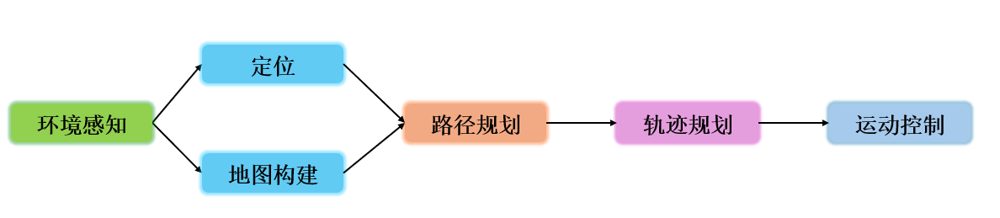

# Robot
## 1. 本库说明

本库是上位机和机器人理论学习所做的学习记录，可以用于 WTR 上位机培训参考。

机器人理论主要包含以下几个部分，在 Robocon 比赛中，主要用到机器人的建模，路径/轨迹规划/里程计定位/机器人运动控制。

本库在算法部署上使用 ROS2 机器人操作系统。ROS（Robot Operating System）是一个适用于机器人的开源框架，这个框架把原本松散的零部件耦合在了一起，为它们提供了通信架构。ROS虽然叫做操作系统，但是它却要安装在如Linux这种操作系统上才能运行。它的作用只是连接真正的操作系统（如Linux）和使用者自己开发的ROS应用程序（比如自动驾驶的感知、规划、决策等模块），所以它也算是个中间件，在基于ROS的应用程序之间建立起了沟通的桥梁。ROS 主要分为 ROS1 和 ROS2 两大版本，ROS2 相比与 ROS1 改进了系统架构，同时延续了 ROS1 的基本概念。

