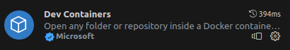
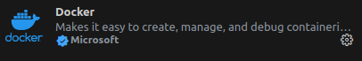

# ROS2 1_环境配置

## 1. ROS2 + Docker 环境(Ubuntu)

### 安装Docker
```shell
sudo apt install docker
```
(安装之前可以使用 `sudo apt update & sudo apt upgrade`)
### 拉取容器
```shell
docker pull osrf/ros:humble-desktop
```
下载插件：





### 开启可视化界面
```shell
xhost(参数)
//+：关闭访问控制，允许任何主机访问本地的X服务器；
//-：打开访问控制，仅允许授权清单中的主机访问本地的X服务器。
```
### 开启容器
```shell
sudo docker run -it -v ~/d/docker/humble_container_data_1:/data -v /dev:/dev --privileged --group-add video --volume=/tmp/.X11-unix:/tmp/.X11-unix  --env="DISPLAY=$DISPLAY" --env="QT_X11_NO_MITSHM=1" --name=humble_ros_2 osrf/ros:humble-desktop  /bin/bash 
```
`~/d/docker/humble_container_data_1`为本地卷；

`/data`为容器卷;

`--name=humble_ros_2`为容器起名。

### 容器换源

首先安装vim：
```shell
sudo apt install vim
```
vim打开`sources.list`换源：
```shell
vim /etc/apt/sources.list

# 默认注释了源码镜像以提高 apt update 速度，如有需要可自行取消注释
deb https://mirrors.tuna.tsinghua.edu.cn/ubuntu/ jammy main restricted universe multiverse
deb-src https://mirrors.tuna.tsinghua.edu.cn/ubuntu/ jammy main restricted universe multiverse
deb https://mirrors.tuna.tsinghua.edu.cn/ubuntu/ jammy-updates main restricted universe multiverse
deb-src https://mirrors.tuna.tsinghua.edu.cn/ubuntu/ jammy-updates main restricted universe multiverse
deb https://mirrors.tuna.tsinghua.edu.cn/ubuntu/ jammy-backports main restricted universe multiverse
deb-src https://mirrors.tuna.tsinghua.edu.cn/ubuntu/ jammy-backports main restricted universe multiverse

deb https://mirrors.tuna.tsinghua.edu.cn/ubuntu/ jammy-security main restricted universe multiverse
deb-src https://mirrors.tuna.tsinghua.edu.cn/ubuntu/ jammy-security main restricted universe multiverse

# deb http://security.ubuntu.com/ubuntu/ jammy-security main restricted universe multiverse
# deb-src http://security.ubuntu.com/ubuntu/ jammy-security main restricted universe multiverse

# 预发布软件源，不建议启用
# deb https://mirrors.tuna.tsinghua.edu.cn/ubuntu/ jammy-proposed main restricted universe multiverse
# deb-src https://mirrors.tuna.tsinghua.edu.cn/ubuntu/ jammy-proposed main restricted universe multiverse
```
### 下载必要的组件
```shell
sudo apt update & sudo apt upgrade

echo 'source /opt/ros/humble/setup.bash'>> ~/.bashrc
sudo apt install gazebo
apt-get install -y python3-pip openssh-server gdb gdbserver
apt-get update && \
apt-get install -y \
build-essential \
libgl1-mesa-dev \
libglew-dev \
libsdl2-dev \
libsdl2-image-dev \
libglm-dev \
libfreetype6-dev \
libglfw3-dev \
libglfw3 \
libglu1-mesa-dev \
freeglut3-dev \
vim 
pip install rosdepc
rosdepc init && rosdepc update
```


