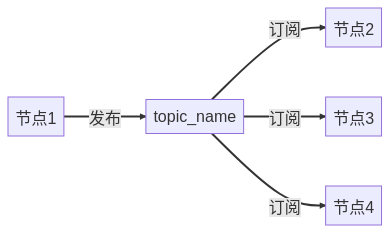
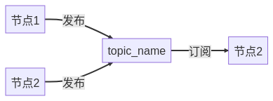
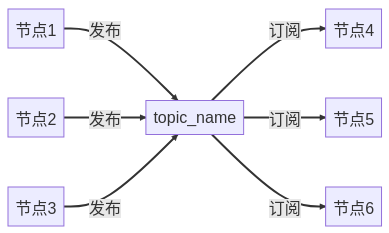
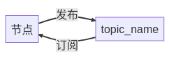
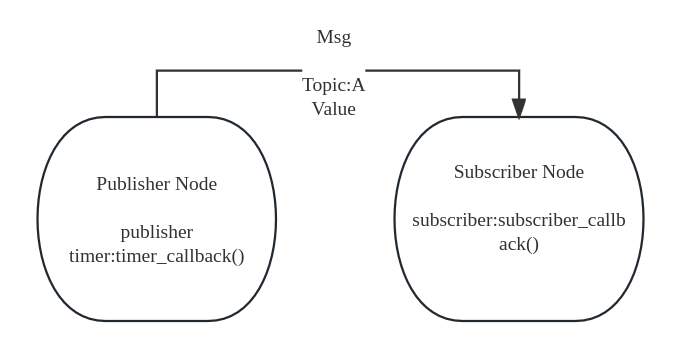
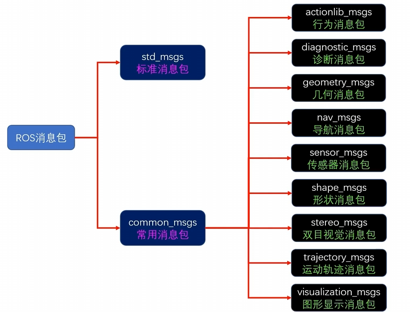
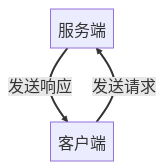
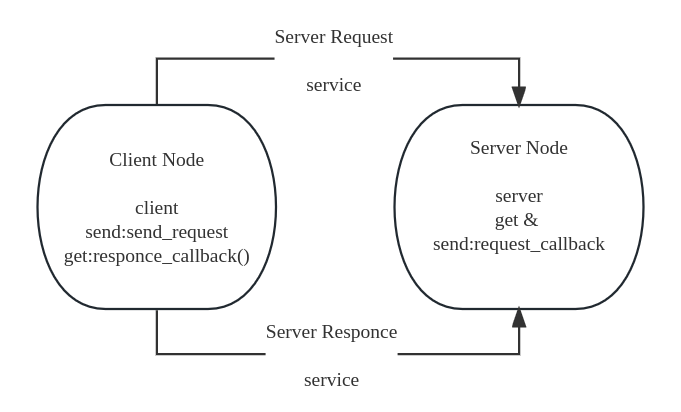

# ROS2 3_节点通信

## 1. 话题通信（Topic）

### 1.1 话题通信原理

#### 话题通信模型

话题通信采取的是**订阅发布**模型。










话题通信可以是`1对1`的，还可以是`1对n`，`n对1`，`n对n`的。

#### 消息接口

为了方便发送者和接收者进行数据的交换，ROS2在数据传递时做好了消息的序列化和反序列化，而且ROS2的消息序列化与反序列化通信是可以做到跨编程语言、跨平台和跨设备之间的。

定义好消息接口后，ROS2会根据消息接口内容生成不同语言的接口类，在不同编程语言中调用相同的类即可实现无感的消息序列化和反序列化。

**同一个话题，所有的发布者和接收者必须使用相同消息接口**。

#### 话题CLI

```shell
# 列举出当前的活动话题
ros2 topic list

# 打印话题内的内容
ros2 topic echo <topic_name>

# 查看主题信息
ros2 topic info <topic_name>

# 查看话题内的消息类型
ros2 interface show <msg_type>

# 手动命令发布
ros2 topic pub <topic_name> <msg_type> <msg_value>
```

### 1.2 话题通信实现

#### 发布方（Publisher）实现

> 1. 创建发布者
>
> ```python
> """
> 	发布者创建函数
> 	第一个参数：消息数据类型
> 	第二个参数：消息话题Topic
> 	第三个参数：消息缓冲区个数，如果溢出直接舍弃
> """
> create_publisher()
> ```
>
> 2. 创建定时器实现定时发布
>
> ```python
> """
> 	定时器创建函数
> 	第一个参数：定时器延时数（s）
> 	第二个参数：定时器回调函数
> """
> create_timer()
> ```
>
> 3. 在定时器回调函数内实现消息的创建（使用数据类型类创建），打包（实例化对象中有`data`成员），发送
>
> ```python
> """
> 	消息发送函数（为publisher的成员函数）
> 	参数：消息对象
> """
> publish()
> ```

```python
import rclpy
from rclpy.node import Node
# 导入发布者需要的消息接口
from std_msgs.msg import String


class Publisher(Node):
    def __init__(self,name):
        super().__init__(name)
        # 创建发布者 publisher
        self.publisher = self.create_publisher(String,"command",10)
        # 创建定时器以定时发布
        self.timer = self.create_timer(10,self.timer_callback)
    
    # 发布方本身无需回调函数，但是可以通过定时器定时发布
    def timer_callback(self):
        # 消息构建
        msg = String()
        msg.data = "Hello Listener"
        # 发布消息
        self.publisher.publish(msg)
        self.get_logger().info(f'Send Command:{msg.data}')

    

    
def main(args = None):
    rclpy.init()
    publisher = Publisher("Publisher")
    rclpy.spin(publisher)
    rclpy.shutdown()
```

#### 接收方（Subscriber）实现

> 1. 创建接收者
> ```python
> """
> 	接收者创建函数
> 	第一个参数：消息数据类型
> 	第二个参数：消息话题Topic
> 	第三个参数：接受回调函数
> 	第四个参数：消息缓存区
> """
> create_subscriber()
> ```
> 2. 创建接受回调函数：接受回调函数中需要接受参数`msg`用于进行消息处理。

```python
import rclpy
from rclpy.node import Node
# 导入订阅者需要的消息接口
from std_msgs.msg import String


class Listener(Node):
    def __init__(self,name):
        super().__init__(name)
        # 创建订阅者，由于为触发式接收，无需定时器
        self.listener = self.create_subscription(String,"command",self.command_callback,10)
    
    def command_callback(self,msg):
        t = 0.0
        if msg.data == "Hello Listener":
            t = t + 1.0
        self.get_logger().info(f'{t}:Get Msg:{msg.data}')
    
def main(args = None):
    rclpy.init()
    listener = Listener("Listener")
    rclpy.spin(listener)
    rclpy.shutdown()
```

#### 总结



### 1.3 话题通信接口



#### `std_msgs`消息


|消息类型	|说明|
|---|---|
|`std_msgs/Bool`|	布尔类型消息（true 或 false）|
|`std_msgs/Byte`|	单字节消息|
|`std_msgs/ByteMultiArray`|	多字节数组|
|`std_msgs/Char`|	单字符消息|
|`std_msgs/ColorRGBA`|	表示颜色的消息，包含红、绿、蓝、透明度|
|`std_msgs/Empty`	|空消息，不包含任何数据|
|`std_msgs/Float32`|	单精度浮点数消息|
|`std_msgs/Float32MultiArray`|	单精度浮点数组消息|
|`std_msgs/Float64`|	双精度浮点数消息|
|`std_msgs/Float64MultiArray`	|双精度浮点数组消息|
|`std_msgs/Header`	|消息头，包括时间戳和帧 ID|
|`std_msgs/Int16`	|16位有符号整型消息|
|`std_msgs/Int16MultiArray`|	16位有符号整型数组消息|
|`std_msgs/Int32`|	32位有符号整型消息|
|`std_msgs/Int32MultiArray`|	32位有符号整型数组消息|
|`std_msgs/Int64`|	64位有符号整型消息|
|`std_msgs/Int64MultiArray`	|64位有符号整型数组消息|
|`std_msgs/Int8`	|8位有符号整型消息|
|`std_msgs/Int8MultiArray`|	8位有符号整型数组消息|
|`std_msgs/MultiArrayDimension`|	多维数组中的维度信息|
|`std_msgs/MultiArrayLayout`|	多维数组的布局信息，包括尺寸和步幅|
|`std_msgs/String`	|字符串消息|
|`std_msgs/UInt16`|	16位无符号整型消息|
|`std_msgs/UInt16MultiArray`|	16位无符号整型数组消息|
|`std_msgs/UInt32`|	32位无符号整型消息|
|`std_msgs/UInt32MultiArray`|	32位无符号整型数组消息|
|`std_msgs/UInt64`|	64位无符号整型消息|
|`std_msgs/UInt64MultiArray`|	64位无符号整型数组消息|
|`std_msgs/UInt8`|	8位无符号整型消息|
|`std_msgs/UInt8MultiArray`|	8位无符号整型数组消息|

> - `std_msgs/Header` 消息结构
>
> ```
> std_msgs/Header:
>   uint32 seq
>   builtin_interfaces/Time stamp
>   string frame_id
> ```
>
> > **`seq`（无符号 32 位整型）：**
> >
> > - 描述：序列号。
> > - 用法：这个字段主要用于标识消息的序号，通常是递增的。ROS2 在很多情况下已经不再强制使用 `seq`，但它有时仍可以用于追踪消息的顺序。
>
> > **`stamp`（`builtin_interfaces/Time`）：**
> >
> > - 描述：时间戳。
> >
> > - 用法：`stamp`包含两个字段：
> >
> >    - `sec`（秒）：表示从 UNIX 时间（1970-01-01 00:00:00 UTC）开始经过的秒数。
> >  - `nanosec`（纳秒）：秒后面的纳秒部分。
> >   
> > - 作用：时间戳通常用于标识传感器数据的采集时间点、操作时间或其他时间相关的事件。时间戳在消息传输时非常有用，尤其是在同步多个传感器或处理实时数据时。
>
> > **`frame_id`（字符串）：**
> >
> > - 描述：坐标系 ID。
> > - 用法：`frame_id` 通常用于表示消息数据所在的参考坐标系。比如在传感器数据中，`frame_id` 可以表示某个传感器的坐标系，或者全局参考坐标系。
> > - 作用：通过 `frame_id`，可以明确知道消息中的数据是在哪个坐标系下进行测量的，方便在不同的坐标系之间进行转换。

#### `sensor_msgs`消息

|消息类型|	说明|
|---|---|
|`sensor_msgs/BatteryState`|	电池状态信息，包括电压、电流、充电状态等。|
|`sensor_msgs/CameraInfo`	|相机的校准信息和图像尺寸。|
|`sensor_msgs/ChannelFloat32`|	单一浮点数通道信息，通常用于点云数据的额外通道。|
|`sensor_msgs/CompressedImage`|	压缩的图像数据。|
|`sensor_msgs/FluidPressure`|	流体压力传感器的输出数据。|
|`sensor_msgs/Illuminance`	|光照度传感器的输出数据。|
|`sensor_msgs/Image`	|未压缩的图像数据。|
|`sensor_msgs/Imu`|	惯性测量单元（IMU）的数据，包括加速度、角速度和方向。|
|`sensor_msgs/JointState`|	关节的角度、速度和力矩数据。|
|`sensor_msgs/Joy`|	游戏手柄的按键和轴数据。|
|`sensor_msgs/JoyFeedback`|	游戏手柄的反馈信息。|
|`sensor_msgs/JoyFeedbackArray`|	游戏手柄的多个反馈信息。|
|`sensor_msgs/LaserEcho`|	激光回波数据。|
|`sensor_msgs/LaserScan`	|激光扫描数据，包括角度范围、距离测量值等。|
|`sensor_msgs/MagneticField`	|磁场传感器的数据，通常用于电子罗盘。|
|`sensor_msgs/MultiDOFJointState`	|多自由度关节的状态数据。|
|`sensor_msgs/MultiEchoLaserScan`	|多回波激光扫描数据。|
|`sensor_msgs/NavSatFix`	|GPS 数据，包含经度、纬度和高度信息。|
|`sensor_msgs/NavSatStatus`	|GPS 状态信息。|
|`sensor_msgs/PointCloud`	|点云数据（较简单的点云表示）。|
|`sensor_msgs/PointCloud2`|	点云数据（较复杂的点云表示，包含多个字段）。|
|`sensor_msgs/Range`|	距离传感器的数据，例如超声波传感器。|
|`sensor_msgs/RelativeHumidity`|	相对湿度传感器的数据。|
|`sensor_msgs/RegionOfInterest`|	图像中的感兴趣区域，通常用于目标检测。|
|`sensor_msgs/Temperature`|	温度传感器的数据。|
|`sensor_msgs/TimeReference`|	外部时间参考，比如 GPS 时间或其他时间源。|

#### `geometry_msgs`消息

|消息类型	|说明|
|---|---|
|`geometry_msgs/Accel`|	表示加速度，包括线加速度和角加速度。|
|`geometry_msgs/AccelStamped`	|带有时间戳的加速度数据（包含消息头）。|
|`geometry_msgs/AccelWithCovariance`|	包含协方差的加速度信息，通常用于传感器数据的精度估计。|
|`geometry_msgs/AccelWithCovarianceStamped`	|带有时间戳和协方差的加速度数据（包含消息头）。|
|`geometry_msgs/Inertia`	|表示刚体的惯性属性，包括质量和惯性矩阵。|
|`geometry_msgs/InertiaStamped`	|带有时间戳的惯性属性（包含消息头）。|
|`geometry_msgs/Point`	|表示三维空间中的一个点，包含 x, y, z 坐标。|
|`geometry_msgs/Point32`|	使用 32 位浮点数表示的三维点（通常用于节省空间）。|
|`geometry_msgs/PointStamped`|	带有时间戳的三维点数据（包含消息头）。|
|`geometry_msgs/Polygon`	|表示一组有序的二维点，构成一个多边形。|
|`geometry_msgs/PolygonStamped`|	带有时间戳的多边形数据（包含消息头）。|
|`geometry_msgs/Pose`|	表示位置和方向，包括三维坐标和四元数姿态。|
|`geometry_msgs/Pose2D`|	表示二维平面上的位置和方向，包含 x, y 和 theta（角度）。|
|`geometry_msgs/PoseArray`	|包含多个位置和方向（Pose），用于描述多个姿态。|
|`geometry_msgs/PoseStamped`|	带有时间戳的姿态数据（包含消息头）。|
|`geometry_msgs/PoseWithCovariance`|	包含协方差的姿态数据，通常用于姿态估计中的不确定性信息。|
|`geometry_msgs/PoseWithCovarianceStamped`	|带有时间戳和协方差的姿态数据（包含消息头）。|
|`geometry_msgs/Quaternion`	|用四元数表示的方向或旋转。|
|`geometry_msgs/QuaternionStamped`	|带有时间戳的四元数数据（包含消息头）。|
|`geometry_msgs/Transform`	|表示三维空间中的变换，包含平移和旋转。|
|`geometry_msgs/TransformStamped`	|带有时间戳的变换数据（包含消息头），常用于坐标系的变换关系。|
|`geometry_msgs/Twist`	|表示线速度和角速度。|
|`geometry_msgs/TwistStamped`	|带有时间戳的速度数据（包含消息头）。|
|`geometry_msgs/TwistWithCovariance`	|包含协方差的速度数据，通常用于速度估计中的不确定性信息。|
|`geometry_msgs/TwistWithCovarianceStamped`	|带有时间戳和协方差的速度数据（包含消息头）。|
|`geometry_msgs/Vector3`	|表示三维向量，包含 x, y, z 分量，通常用于描述速度或力等向量。|
|`geometry_msgs/Vector3Stamped`	|带有时间戳的三维向量数据（包含消息头）。|
|`geometry_msgs/Wrench`	|表示作用在刚体上的力和力矩。|
|`geometry_msgs/WrenchStamped`	|带有时间戳的力和力矩数据（包含消息头）。|

## 2. 服务通信（Service）

### 2.1 服务通信原理

#### 服务通信模型

服务通信采取**请求响应模型。**



客户端发送请求给服务端，服务端可以根据客户端的请求做一些处理，然后返回结果给客户端。

- **同一个服务（名称相同）有且只能有一个节点来提供**。
- **同一个服务可以被多个客户端调用**。

即服务通信是多对一的。

#### 服务通信CLI

```shell
# 查看服务列表
ros2 service list

# 作为客户端向服务端发送请求
## service_type 为服务数据类型名
## service_value 为发送请求数据
ros2 service call <service_name> <service_type> <service_value>

# 查看服务数据类型
ros2 service type <service_name> 

# 查找使用该接口的服务
ros2 service find <service_type>
```

### 2.2 服务通信实现

#### 客户端（Client）实现

客户端要完成两个任务：发送请求和解析响应。

> 1. 创建客户端
>
> ```python
> """
> 	客户端创建函数
> 	第一个参数：服务通信消息接口
> 	第二个参数：服务名称service
> """
> create_client()
> ```
>
> 2. 创建请求发送函数
>
> 请求发送函数应该有请求中需要的所有数据作为形参；
>
> 首先需要确认节点是否运行和***服务端是否启动***：
>
> ```python
> """
> 	等待服务端启动函数（客户端成员函数）
> 	第一个参数：等待时间
> """
> wait_for_service()
> ```
>
> 然后进行请求数据的组织，在服务消息接口中有`Request`类，使用此类进行实例化。
>
> 最后发送请求并等待响应：
>
> ```python
> self.client.call_async(request).add_done_callback(self.responce_callback)
> # 第一个函数用于发送请求，第二个函数用于等待响应的回调
> ```
> 3. 创建接受回调函数
> 
> 应使用接受数据作为形参，注意，接收数据下有result类，这个类真正包含响应数据。


```python
import rclpy
from rclpy.node import Node
# 导入服务通信的数据类型
from example_interfaces.srv import AddTwoInts

class Client(Node):
    def __init__(self,name):
        super().__init__(name)
        self.client = self.create_client(AddTwoInts,"request")
        self.send_request(3,6)

    # 由于为触发式返回，使用接受回调函数
    def responce_callback(self,result_future):
        responce = result_future.result()
        self.get_logger().info(f"Responce:{responce.sum}")

    def send_request(self,num1,num2):
        # 等待节点和服务端开始运行
        while rclpy.ok() and self.client.wait_for_service(1) == False:
            self.get_logger().info("Wait for service...")

        # 组织请求数据
        request = AddTwoInts.Request()
        request.a = num1
        request.b = num2
        # 发送请求并等待回调
        self.client.call_async(request).add_done_callback(self.responce_callback)

def main(args = None):
    rclpy.init(args=args)
    node = Client("client")
    rclpy.spin(node)
    rclpy.shutdown()
```

#### 服务端（Server）实现

> 服务端主要实现接受请求并进行响应的任务
>
> 1. 创建服务端
>
> ```python
> """
> 	服务端创建函数
> 	第一个参数：服务数据类型
> 	第二个参数：服务名service
> 	第三个参数：接受回调函数
> """
> create_service()
> ```
>
> 2. 创建接受回调函数
>
> 接受回调函数应有请求和响应两部分作为形参
>
> 响应作为返回值。

```python
import rclpy
from rclpy.node import Node
# 导入服务通信消息接口
from example_interfaces.srv import AddTwoInts

class Server(Node):
    def __init__(self,name):
        super().__init__(name)
        self.server = self.create_service(AddTwoInts,"request",self.request_callback)

    # 由于为触发式响应，使用接受请求回调函数
    def request_callback(self,request,responce):
        self.get_logger().info(f"Get request:{request.a},{request.b}")
        responce.sum = request.a + request.b
        return responce
    
def main(args = None):
    rclpy.init(args=args)
    node = Server("Server")
    rclpy.spin(node)
    rclpy.shutdown()
```

#### 总结



### 2.3 服务通信接口

|服务类型|	描述|
|---|---|
|`std_srvs/srv/Empty`|	不包含任何数据的请求和响应，常用于简单的触发操作。|
|`std_srvs/srv/SetBool`|	包含一个布尔值的请求和响应，通常用于启用/禁用或开始/停止操作。|
|`std_srvs/srv/Trigger`	|无请求参数，响应包含一个布尔值（成功与否）和一个字符串（详细信息），常用于执行动作。|

### 2.4 自定义消息接口（Interface）

**接口是一种消息规范。**

ROS2 中有**动作接口，话题接口和服务接口。**

#### 接口的基本数据类型

```shell
bool
byte
char
float32,float64
int8,uint8
int16,uint16
int32,uint32
int64,uint64
string
```

#### 通过接口生成代码

ROS2 的 IDL 模块可以通过接口生成代码，产生头文件（模块），从而在程序里导入并使用。


#### 接口的定义

- 话题接口

```
<type> <name>
<type> <name>
...
```

- 服务接口

```
# request
<type> <name>
---
# responce
<type> <name>
```

#### 接口CLI

```shell
# 接口列表查看
ros2 interface list

# 查看接口内容
ros2 interface show <interface_type>
```

#### 接口包的创建

```shell
# 依赖于 rosidl 创建接口包
ros2 pkg create <self_interface> --build-type ament_cmake --dependencies rosidl_default_generators geometry_msgs
```

在创建的接口包中，新建接口文件夹`msg`，`srv`，`action`，在接口文件夹下建立接口文件`xxx.msg`，`xxx.srv`，`xxx.action`（注意，首字母必须大写）。

- 修改`CMakeLists.txt`

```cmake
find_package(rosidl_default_generators REQUIRED)
find_package(geometry_msgs REQUIRED)
# 添加下面的内容
rosidl_generate_interfaces(${PROJECT_NAME}
  "msg/RobotStatus.msg"
  "srv/RobotMove.srv"
  DEPENDENCIES geometry_msgs
)
```

- 修改`package.xml`

```xml
  <buildtool_depend>ament_cmake</buildtool_depend>

  <depend>rosidl_default_generators</depend>
  <depend>geometry_msgs</depend>
  
  <member_of_group>rosidl_interface_packages</member_of_group> #添加这一行

  <test_depend>ament_lint_auto</test_depend>
  <test_depend>ament_lint_common</test_depend>
```

- 编译接口包，在`<ws_name>/<install>/<interface_name>/local/lib/python3.10/`下看到Python模块文件。
- 在另一个功能包中即可调用刚刚生成的接口包。

```python
"""
    客户端有两个任务：
    1. 机器人运动指令的发布
    2. 机器人实时状态接受
"""
import rclpy
from rclpy.node import Node
# 导入话题通信接口
from self_interface.msg import RobotStatus
# 导入服务通信接口
from self_interface.srv import RobotCommand

class User_Node(Node):
    def __init__(self,name):
        super().__init__(name)
        # 创建订阅方
        self.robotstatus_subscriber = self.create_subscription(RobotStatus,"robotstatus",self.robotstatus_get_callback,10)
        # 创建客户端
        self.robotmove_client = self.create_client(RobotCommand,"robotmove")

    # 订阅接受回调函数
    def robotstatus_get_callback(self,msg):
        self.get_logger().info(f"Robot Status:{msg.status};Pose:{msg.pose}")

    # 服务端响应回调函数
    def robotmove_command_callback(self,result_future):
        responce = result_future.result()
        self.get_logger().info(f"Moving Done!Consquence:{responce.pose}")

    # 服务端发送函数
    def robotmove_send_command(self,distance):
        while rclpy.ok() and self.robotmove_client.wait_for_service(1) == False:
            self.get_logger().info("Wait for service...")
        
        request = RobotCommand.Request()
        request.distance = distance
        self.get_logger().info(f"Command to move:{distance}")
        self.robotmove_client.call_async(request).add_done_callback(self.robotmove_command_callback)
    
def main(args = None):
    rclpy.init(args=args)
    node = User_Node("user")
    node.robotmove_send_command(5.0)
    rclpy.spin(node)
    rclpy.shutdown()
```

```python
"""
    机器人端有两个任务：
    1. 机器人状态消息的发布(Publisher)
    2. 接受移动请求并回传当前位置
"""
import rclpy
from rclpy.node import Node
# 消息需要的数据类型
from self_interface.msg import RobotStatus
# 服务需要的数据类型
from self_interface.srv import RobotCommand
# 导入机器人类
from self_interface_test.robot import Robot

class Robot_Node(Node):
    def __init__(self,name):
        super().__init__(name)
        # 创建机器人
        self.robot = Robot()
        # 创建服务端
        self.robotmove_server = self.create_service(RobotCommand,"robotmove",self.move_request_callback)
        # 创建发布者
        self.robotstatus_publisher = self.create_publisher(RobotStatus,"robotstatus",10)
        # 定时消息发布定时器
        self.robotstatus_timer = self.create_timer(1,self.robotstatus_timmer_callback)

    # 定时器回调函数
    def robotstatus_timmer_callback(self):
        status_msg = RobotStatus()
        status_msg.status = self.robot.get_status()
        status_msg.pose = self.robot.get_current_pose()

        self.robotstatus_publisher.publish(status_msg)

    # 服务端回调函数
    def move_request_callback(self,request,responce):
        self.robot.move_robot(request.distance)
        responce.pose = self.robot.get_current_pose()
        return responce
        
def main(args = None):
    rclpy.init(args=args)
    node = Robot_Node("robot")
    rclpy.spin(node)
    rclpy.shutdown()
```

## 3. 参数通信（Param）

### 参数CLI

```shell
# 查看参数
ros2 param list


# 查看参数详细信息
ros2 param describe <node_name> <param_name>

# 查看参数值
ros2 param get <node_name> <param_name>

# 设置参数
ros2 param set <node_name> <param_name>
```

### 参数通信原理

ROS2 的参数由键值对构成。

ROS2 参数类型支持以下几种：

> 1. bool 和bool[]，布尔类型用来表示开关
>
> 2. int64 和int64[]，整形表示一个数字
>
> 3. float64 和float64[]，浮点型，可以表示小数类型的参数值
>
> 4. string 和string[]，字符串
> 5. byte[]，字节数组，用来表示图片，点云数据等信息

```python
import rclpy
from rclpy.node import Node

class Param_Node(Node):
    def __init__(self,name):
        super().__init__(name)
        # 声明参数
        self.declare_parameter("log_value",0)
        # 获取参数
        log_value = self.get_parameter("log_value").value
        # 设置参数
        self.get_logger().set_level(log_value)
        # 定时修改
        self.timer = self.create_timer(1,self.timer_callback)

    def timer_callback(self):
        # 获取参数
        log_value = self.get_parameter("log_value").value
        # 设置参数
        self.get_logger().set_level(log_value)
        print(
            f"========================{log_value}=============================")
        self.get_logger().debug("我是DEBUG级别的日志，我被打印出来了!")
        self.get_logger().info("我是INFO级别的日志，我被打印出来了!")
        self.get_logger().warn("我是WARN级别的日志，我被打印出来了!")
        self.get_logger().error("我是ERROR级别的日志，我被打印出来了!")
        self.get_logger().fatal("我是FATAL级别的日志，我被打印出来了!")

def main(args = None):
    rclpy.init(args=args)
    node = Param_Node("param_node")
    rclpy.spin(node)
    rclpy.shutdown()
```

