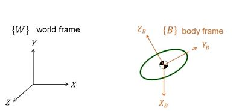
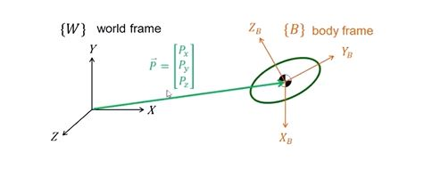
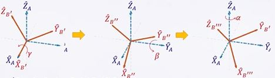
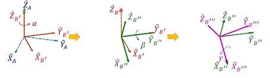
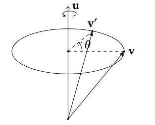
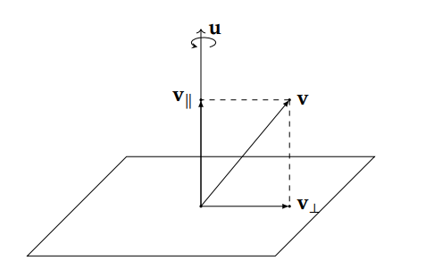
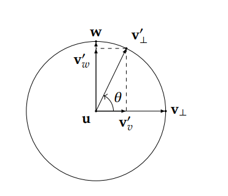

# ROS2 4_坐标转换

## 1. 位姿的描述

### 刚体位姿的描述

对于平面上的刚体，可以使用3个平动自由度和1个转动自由度描述；对于空间中的刚体，可以使用3个平动自由度和1个转动自由度描述。

通常的，确定一个**世界坐标系**(world frame，记为$\{W\}$)，对于机器人上的刚体，通常以质心为原点确定一个固连于刚体上的**刚体坐标系**(body frame，记为$\{B\}$)。



$\{W\}$和$\{B\}$之间的关系即为平动和转动的位姿关系，平动由原点关系确定，转动由旋转关系确定。

通过各个自由度的微分，可以得到速度和加速度信息。

### 平动的描述



通过向量$\overrightarrow{P}$描述$\{B\}$的原点相对于$\{A\}$的位置$^A P_B$：
$$
\overrightarrow{P} = \left[\begin{matrix} 
p_x \\
p_y \\
p_z
\end{matrix}\right]
$$

### 转动的描述

#### 旋转矩阵

- 线性变换

方阵可以描述同一维度空间内的线性变换。

二维空间中，假设有一个方阵：
$$
\left[\begin{matrix} 
a & b \\
c & d
\end{matrix}\right]
$$
如果该方阵作用于原空间，相当于将基向量$\hat{i}$转换为$(a,c)$，将$\hat{j}$转换为$(b,d)$，从而实现空间的线性变换，也可视为坐标系框架进行了变换。

[线性代数的本质](https://www.bilibili.com/video/BV1Ys411k7yQ/?spm_id_from=333.337.search-card.all.click&vd_source=2d2507d13250e2545de99f3c552af296)

- 三维空间的旋转

对于三维空间的旋转，其线性变换矩阵为：
$$
R(x,\theta) = 
\left[\begin{matrix} 
1 & 0 & 0 \\
0 & cos\theta & -sin\theta \\
0 & sin\theta & cos\theta
\end{matrix}\right] \\
R(y,\theta) = 
\left[\begin{matrix} 
cos\theta & 0 & -sin\theta \\
0 & 1 & 0 \\
sin\theta & 0 & cos\theta
\end{matrix}\right] \\
R(z,\theta) = 
\left[\begin{matrix} 
cos\theta & -sin\theta & 0 \\
sin\theta & cos\theta & 0 \\
0 & 0 & 1
\end{matrix}\right]
$$
旋转矩阵有以下特性：

- $R$是正交矩阵：$RR^T = E$；
- $|R| = 1$；
- $R$的每一个列向量总是单位向量，且三个分量互相正交。

因此，$R$仅有3个自由度。

- 坐标关系

根据投影关系，任何一个向量在$\{B\}$坐标系坐标均可使用$\{B\}$对$\{A\}$的旋转矩阵转换为在$\{A\}$坐标系坐标：
$$
^A P = ^A _BR ^B P
$$

- 旋转角度

1. 旋转矩阵变换是不可交换的（矩阵乘法不具有交换律）。因此需要明确旋转的先后顺序。
2. 旋转转轴是对固定转轴旋转，还是对当下坐标系转轴旋转。

#### 欧拉角

- 固定转轴欧拉角（Fix angle）————	X-Y-Z Fix angle



$\{B\}$对$\{A\}$的旋转矩阵为：
$$
^A _BR = R(z,\alpha)R(y,\beta)R(x,\gamma) \\
= \left[\begin{matrix} 
cos\alpha cos\beta & cos\alpha sin\beta sin\gamma - sin\alpha cos\gamma & cos\alpha sin\beta cos\gamma + sin\alpha sin\gamma \\
sin\alpha cos\beta & sin\alpha sin\beta sin\gamma + cos\alpha cos\gamma & sin\alpha sin\beta cos\gamma - cos\alpha sin\gamma \\
-sin\beta & cos\beta sin\gamma & cos\beta cos\gamma
\end{matrix}\right]
$$
固定转轴角是左乘旋转矩阵（用线性变换的方法思考）；根据旋转顺序不同，固定转轴角有12种旋转方式。

- 非固定转轴欧拉角（Euler angle）————	Z-Y-X Euler angle



$\{B\}$对$\{A\}$的旋转矩阵为：
$$
^A _BR = ^A_{B_{,}} R ^{B_{,}}_{B_{,,}} R ^{B_{,,}}_{B_{,,,}} R \\
= \left[\begin{matrix} 
cos\alpha cos\beta & cos\alpha sin\beta sin\gamma - sin\alpha cos\gamma & cos\alpha sin\beta cos\gamma + sin\alpha sin\gamma \\
sin\alpha cos\beta & sin\alpha sin\beta sin\gamma + cos\alpha cos\gamma & sin\alpha sin\beta cos\gamma - cos\alpha sin\gamma \\
-sin\beta & cos\beta sin\gamma & cos\beta cos\gamma
\end{matrix}\right]
$$

非固定转轴角是右乘旋转矩阵（用旋转的相对性思考）。

- 死锁问题

如果按照特定的顺序进行旋转（如 Z-Y-X 非固定式），先绕自身X旋转一定角度，再绕自身Y旋转90°，此时Z和X重合，无论对Z进行何种操作，都缺失一个自由度，无法操纵第三个轴的旋转。可能考虑的解决方法是增加一次旋转，但是在欧拉角的限制下，这是无法做到的。

#### 轴角

- 轴角和旋转

有一个经过原点的（如果旋转轴不经过原点我们可以先将旋转轴 平移到原点，进行旋转，再平移回原处）旋转轴$\overrightarrow{u}$，将一个向量$\overrightarrow{v}$，沿着这个旋转轴旋转$\theta$度，变换到$\overrightarrow{v^,}$。



为了减少自由度，定义$\overrightarrow{u}$为单位向量。

首先，将可以将$\overrightarrow{v}$分解为平行于旋转轴$\overrightarrow{u}$ 以及正交（垂直）于$\overrightarrow{u}$ 的两个分量，$\overrightarrow{v_∥}$ 和$\overrightarrow{v_⊥}$，即：
$$
\overrightarrow{v} = \overrightarrow{v_∥} + \overrightarrow{v_⊥}
$$
可以分别旋转这两个分向量，再将它们旋转的结果相加获得旋转后的向量：
$$
\overrightarrow{v^,} = \overrightarrow{v_∥^,} + \overrightarrow{v_⊥^,}
$$

$$
\overrightarrow{v_∥} = (\overrightarrow{u} \cdot \overrightarrow{v})\overrightarrow{u} \\
\overrightarrow{v_⊥} = \overrightarrow{v} - (\overrightarrow{u} \cdot \overrightarrow{v})\overrightarrow{u}
$$
对于旋转而言，$\overrightarrow{v_∥}$不发生变化，
$$
\overrightarrow{v_∥} = \overrightarrow{v_∥^,}
$$


$\overrightarrow{w}$为通过叉乘得出的向量，用于表述$\overrightarrow{v_⊥}$的旋转，可以得到
$$
\overrightarrow{v_⊥^,} = \overrightarrow{v_v^,} + \overrightarrow{v_w^,} \\
= cos\theta \overrightarrow{v_⊥} + sin\theta \overrightarrow{w} \\
= (cos\theta) \overrightarrow{v_⊥} + (sin\theta) \overrightarrow{u} \times \overrightarrow{v_⊥}
$$
上述结果可以得到：
$$
\overrightarrow{v^,} = (cos\theta)\overrightarrow{v} + (1 − cos\theta)(\overrightarrow{u} \cdot \overrightarrow{v})\overrightarrow{u} + (sin\theta) \overrightarrow{u} \times \overrightarrow{v}
$$

- 轴角与旋转矩阵

任何姿态都可以通过选择适当的轴和角度得到，换句话说，两个坐标系之间的任何姿态都可以通过绕某一个特定的轴(矢量)旋转特定的角度得到。

通过上述公式，轴角对应的旋转矩阵为：
$$
^P_AR = \left[\begin{matrix} 
k_xk_x(1-cos\theta)+cos\theta & k_xk_y(1-cos\theta)-k_zsin\theta & k_xk_z(1-cos\theta) + k_ysin\theta \\
k_xk_y(1-cos\theta)+k_zsin\theta & k_yk_y(1-cos\theta)+cos\theta & k_yk_z(1-cos\theta)-k_xsin\theta \\ 
k_xk_z(1-cos\theta)-k_ysin\theta & k_yk_z(1-cos\theta)+k_xsin\theta &
k_zk_z(1-cos\theta)+cos\theta

\end{matrix}\right]
$$
$K = \left[\begin{matrix} k_x & k_y & k_z \end{matrix}\right]$为轴单位矢量（$\{A\}$中坐标），$\theta$为旋转角度。

#### 四元数

[理解四元数](https://krasjet.github.io/quaternion/quaternion.pdf)

- 四元数的四个数字由一个实部和三个虚部组成。

$$
q = w + xi + yj +zk
$$
其中$i^2=j^2=k^2=ijk=-1$。

单位四元数满足$w^2 + i^2 + j^2 + k^2 = 1$，即四维空间中的一个超球体，但由于有上式约束，实际有三个自由度。

四元数也可以表示为$q = [s, \overrightarrow{v}]$；

> 四元数的运算：
>
> 1. 范数：$||q|| = \sqrt{s^2 + \overrightarrow{v} \cdot \overrightarrow{v}} = \sqrt{w^2 + x^2 + y^2 + z^2}$ 
> 2. 加法：$q_1 + q_2 = [s_1 + s_2, \overrightarrow{v_1} + \overrightarrow{v_2}]$
> 3. 数乘：$aq = [as, a\overrightarrow{v_1}]$
> 4. 乘法：
>
> $$
> q_1q_2 = \left[\begin{matrix} 
> w_1 & -x_1 & -y_1 & -z_1 \\
> x_1 & w_1 & -z_1 & y_1 \\
> y_1 & z_1 & w_1 & -x_1 \\
> z_1 & -y_1 & x_1 & w_1 \\
> \end{matrix}\right]
> \left[\begin{matrix} 
> w_2 \\
> x_2 \\
> y_2 \\
> z_2
> \end{matrix}\right]
> $$
>
> 四元数乘法不符合交换律。
>
> 用向量表示四元数乘法：
> $$
> 𝑞_1𝑞_2 = [𝑠𝑡 − \overrightarrow{v} \cdot \overrightarrow{u}, 𝑠\overrightarrow{u} + 𝑡\overrightarrow{v} + \overrightarrow{v} \times \overrightarrow{u}]
> $$

- 四元数和旋转

两个纯四元数乘法公式如下：
$$
𝑞_1𝑞_2 = [-\overrightarrow{v} \cdot \overrightarrow{u}, \overrightarrow{v} \times \overrightarrow{u}]
$$
讨论$\overrightarrow{v_⊥}$；由于$\overrightarrow{v_⊥^,} = (cos\theta) \overrightarrow{v_⊥} + (sin\theta) \overrightarrow{u} \times \overrightarrow{v_⊥}$，且$\overrightarrow{u} \cdot \overrightarrow{v_⊥} = 0$，则用纯四元数表述为：
$$
v_⊥^, = (cos\theta) v_⊥ + (sin\theta) u v_⊥ \\
= ( cos\theta + sin\theta u )v_⊥
$$
令$q = cos\theta + sin\theta u$，则变换如下：
$$
q = cos\theta + sin\theta u \\
= [cos\theta,sin\theta \overrightarrow{u}]
$$
$q$亦为单位四元数。

故旋转可以表示为：
$$
v^, = v_{||} + qv_{⊥}
$$
经过一系列变换消去分量（不加证明），可得：
$$
v^, = qvq^{-1} \\
q = [cos(\frac{1}{2}\theta),sin(\frac{1}{2}\theta)\overrightarrow{u}]
$$
表示为旋转ju'zhen
$$
^A_PR = \left[\begin{matrix} 
1-2y^2-2z^2 & 2(xy-zw) & 2(xz+yw) \\
2(xy+zw) & 1-2x^2-2z^2 &  2(yz-xw) \\ 
2(xz-yw) & 2(yz+xw) & 1-2x^2-2y^2
\end{matrix}\right]
$$

### 代码实现姿态表示方法的转换

```python
import transforms3d as tfs

# 四元角模块 quaternions
# 欧拉角模块 euler
# 轴角模块 axangles
```

### 齐次变换矩阵

$$
T = \left[\begin{matrix} 
^P_AR & ^P_AP \\ 
0 & 1

\end{matrix}\right]
$$

为齐次变换矩阵，此时，旋转矩阵和平移变换可合并为齐次变换矩阵。

矩阵的**左上角标明参考坐标系**，矩阵**左下角标明目标坐标系**。比如$^A_BT$表示B坐标系到A坐标系的变换关系。

齐次变换矩阵是可逆的，$^A_BT^{-1} = ^B_AT$。

> - 齐次矩阵与平移向量相乘，即可求出某个向量在另一坐标系下的表示。
> - 齐次矩阵与齐次矩阵相乘，可以转换不同坐标系之间的关系。

```python
tfs.affines.compose(T,R,[1,1,1]) # 合成齐次变换矩阵

tfs.euler.mat2euler(T[0:3,0:3]),T[:3,3:4] # 分解为固定轴欧拉角和平移向量
tfs.quaternions.mat2quat(T[0:3,0:3]),T[:3,3:4] #  分解为四元数和平移向量
```

## 2. ROS2 TF坐标变换

### TF2 的 CLI 命令

```shell
# x y z 平移矩阵，frame_id 父坐标系（参考坐标系） child_frame_id 子坐标系（目标坐标系）

# 静态坐标广播（四元数方式）
ros2 run tf2_ros static_transform_publisher x y z qx qy qz qw frame_id child_frame_id
# 静态坐标广播（欧拉角方式）
ros2 run tf2_ros static_transform_publisher x y z yaw pitch roll frame_id child_frame_id 

# 监听坐标关系
ros2 run tf2_ros tf2_echo frame_id child_frame_id 

# 查找所有发布者和发布频率
ros2 run tf2_ros tf2_monitor 
```

### 广播发布器实现

> 1. 使用`StaticTransformBroadcaster()`函数构建坐标广播器；
> 2. 使用`TransformStamped()`实例化TF帧；
> 3. 编写TF帧：
>
> > 1. `header.stamp`：TF时间；
> > 2. `header.frame_id`：父坐标系；
> > 3. `child_frame_id`：子坐标系；
> > 4. `transform.translation`：平移坐标；
> > 5. `transform.rotation`：旋转，四元数表示。
>
> 4. 使用`sendTransform()`方法发布TF帧。

```python
import rclpy 
from rclpy.node import Node
# 导入TF帧
from geometry_msgs.msg import TransformStamped
# 导入TF静态坐标发布器
from tf2_ros import StaticTransformBroadcaster
import transforms3d as tfs
import numpy as np

class TF_StaticBroadcaster_Node(Node):
    def __init__(self,name):
        global pitch_degree
        super().__init__(name)
        pitch_degree = 0.0
        # 构造静态坐标广播发布器
        self.tf_publisher = StaticTransformBroadcaster(self)
        self.tf_timer = self.create_timer(1.0,self.timer_callback)

    def timer_callback(self):
        global pitch_degree
        # 构造TF帧
        tf_frame = TransformStamped()
        tf_frame.header.stamp = self.get_clock().now().to_msg()
        ## 父坐标系
        tf_frame.header.frame_id = "base"
        ## 子坐标系
        tf_frame.child_frame_id = "camera"
        ## 坐标变换数据
        tf_frame.transform.translation.x = 2.0
        tf_frame.transform.translation.y = 5.0
        tf_frame.transform.translation.z = 4.0

        pitch_degree = pitch_degree + 1.0

        pitch = float(pitch_degree * (np.pi) / 180)
        roll = float(5 * (np.pi) / 180)
        yaw = float(35 * (np.pi) / 180)

        ## 转换为四元数
        q = tfs.euler.euler2quat(pitch,roll,yaw,"sxyz")
        w = q[0]
        x = q[1]
        y = q[2]
        z = q[3]
        tf_frame.transform.rotation.w = w
        tf_frame.transform.rotation.y = y
        tf_frame.transform.rotation.z = z
        tf_frame.transform.rotation.x = x

        self.tf_publisher.sendTransform(tf_frame)


def main(args=None):
    rclpy.init(args=args)
    node = TF_StaticBroadcaster_Node("TF_StaticBroadcaster_Node")
    rclpy.spin(node)
    rclpy.shutdown()
```

### 广播监听器实现

> 1. `Buffer()`函数创建数据缓冲区；
> 2. `TransformListener()`函数建立广播监听器；
>
> ```python
> """
> 	广播监听器创建函数：
> 	第一个参数：数据缓冲区
> 	第二个参数：节点
> """
> TransformListener()
> ```
>
> 3. 使用`rclpy`的时间创建时间数据。
> 4. 使用数据缓冲区的`lookup_transform()`方法接收坐标变换数据。
>
> ```python
> """
> 	坐标变换数据接收函数
> 	第一个参数：父坐标系
> 	第二个参数：子坐标系
> 	第三个参数：时间
> """
> lookup_transform()
> ```
>
> 5. 判别异常并打印日志。

```python
import rclpy
from rclpy.node import Node
# 导入坐标变换监听器
from tf2_ros import TransformException
from tf2_ros.buffer import Buffer
from tf2_ros.transform_listener import TransformListener

class TF_Listener_Node(Node):
    def __init__(self,name):
        super().__init__(name)
        # 创建缓冲区和监听器
        self.tf_buffer = Buffer()
        self.tf_listener = TransformListener(self.tf_buffer,self)
        self.timer = self.create_timer(1.0,self.timer_callback)
    
    def timer_callback(self):
        try:
            now = rclpy.time.Time()
            trans = self.tf_buffer.lookup_transform('base','camera',now)
            print(trans)
        except TransformException as ex:
            print(f'Not found transform:{ex}')


def main(args=None):
    rclpy.init(args=args)
    node = TF_Listener_Node('TF_Listerner')
    rclpy.spin(node)
    rclpy.shutdown()
```


