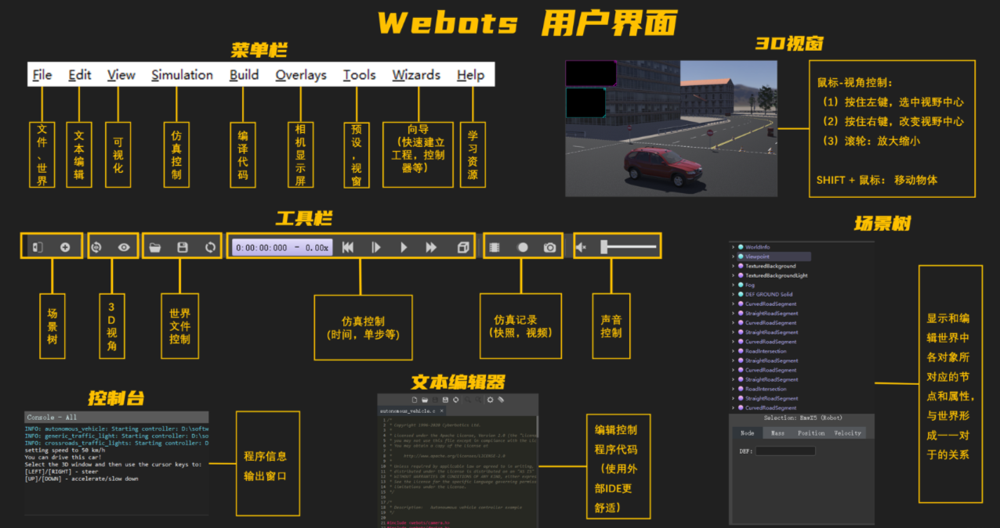

# ROS2 7_Webots 仿真平台

机器人仿真其实就是通过软件来模仿硬件的特性，用于验证机器人算法、架构等。

> 1. 仿真可以解决真机资源不足;
> 2. 仿真可以保证环境的一致和稳定;
> 3. 仿真场景可以更加灵活，在测试机器人算法时可以通过仿真软件快速更改仿真环境，验证算法。
> 4. 仿真的主要缺陷就是仿不全，现实世界中的环境非常复杂，光线、材质、电磁干扰等等，仿真平台无法做到100%的仿真。

常用仿真平台：`Gazebo`，`WeBots`，`Ignition`，`Unity`

## 1. Webots 简介

Webots 是一个开源的三维移动机器人模拟器，它与gazebo类似都是ROS2中仿真环境，但是对于gazebo而言，需要比较复杂的配置，尤其是涉及到使用GPU的时候，对初学者并不友好。Webots在2018年以前是一款商业软件，商业软件的好处就是安装简单，在windows和Ubuntu上都可以实现一键安装，对用户很友好，Webots从2018年以后Webots进行了开源。

Webots支持C/C++、Python、MATLAB、Java、ROS和TCP/IP等多种方式实现模型的仿真控制。Webots内置了接近100种机器人模型，包括轮式机器人、人形机器人、爬行移动机器人、单臂移动机器人、双臂移动机器人、无人机、狗、飞艇等等。

## 2. Webots 安装

[Webots 软件安装官方文档](https://cyberbotics.com/doc/guide/installation-procedure#installing-the-debian-package-with-the-advanced-packaging-tool-apt)

[Webots-ROS2官方文档](https://docs.ros.org/en/iron/Tutorials/Advanced/Simulators/Webots/Installation-Ubuntu.html)

> Webots 在 2021a 版本后使用在线Github下载的方式进行环境导入，通常会导致导入环境时卡死。
>
> 使用 Webots 2021a ：[Webots 老版本下载](https://github.com/cyberbotics/webots/releases)
>
> ```shell
> sudo apt install ./webots_2021a_amd64.deb
> ```
>
> 此版本仅支持Ubuntu 20.04和18.04。
>
> > 此方法仍然存在问题：Webots - ROS2 接口是按照 Webots 最新版本安装的，使用示例时会产生版本不兼容问题。

1. Webots 软件安装（2023a）

首先，Webots 应该使用 `Cyberbotics.asc` 签名文件进行身份验证。使用以下命令安装 `Cyberbotics.asc` 签名文件：

```shell
sudo mkdir -p /etc/apt/keyrings
cd /etc/apt/keyrings
sudo wget -q https://cyberbotics.com/Cyberbotics.asc
```

然后，通过添加 `Cyberbotics` 存储库来配置 APT 包管理器。

```shell
echo "deb [arch=amd64 signed-by=/etc/apt/keyrings/Cyberbotics.asc] https://cyberbotics.com/debian binary-amd64/" | sudo tee /etc/apt/sources.list.d/Cyberbotics.list
sudo apt update
```

最后，安装Webots：

```shell
sudo apt install webots
```

2. Webots - ROS2 接口安装

使用以下命令行安装`webots_ros2`：

```shell
sudo apt-get install ros-<ROS_DISTRO>-webots-ros2
```

3. 示例运行

```shell
source /opt/ros/$ROS_DISTRO/setup.bash
export WEBOTS_HOME=/usr/local/webots
ros2 launch webots_ros2_universal_robot multirobot_launch.py
```

> 示例运行使用在线Github下载的方式进行环境导入，通常会导致导入环境时卡死。建议科学上网，多多等待，等待网络环境较好时运行示例。

## 3. Webots 入门

[Webots 官方手册](https://cyberbotics.com/doc/guide/introduction-to-webots)

### Webots 仿真基本概念

Webots 仿真工程由以下部分组成：

> 1. 定义一个或多个机器人及其环境的 Webots 世界文件 （`.wbt`）。 `.wbt` 文件有时依赖于外部 `PROTO` 文件 （`.proto`） 和纹理。
> 2. 用于上述机器人的一个或多个控制器程序（C/C++/Java/Python/MATLAB）。
> 3. 一个可选的物理插件，可用于修改 Webots 的常规物理行为（在 C/C++ 中）。

1. 世界文件

在 Webots 中，**世界是对机器人属性及其环境的3D描述。** 

它包含对每个对象的描述：位置、方向、几何形状、外观（如颜色或亮度）、物理属性、对象类型等。 世界被组织为分层结构，其中对象可以包含其他对象。 

例如，机器人可以包含两个轮子、一个距离传感器和一个本身包含摄像头的关节等。 

**世界文件不包含机器人的控制器代码；它仅指定每个机器人所需的控制器名称。**

世界保存在`.wbt`文件中。 `.wbt`文件存储在每个 Webots 项目的`worlds`子目录中。

2. 控制器文件

**控制器文件是控制世界文件中指定的机器人的计算机程序。 **

控制器文件可以用Webots支持的任何编程语言编写。 当仿真开始时，Webots 会启动指定的控制器，每个控制器都是一个单独的进程，并将控制器进程与机器人相关联。 请注意，多个机器人可以使用相同的控制器代码，但是将为每个机器人启动不同的进程。

每个控制器的源文件和二进制文件一起存储在控制器目录中。 控制器目录位于每个 Webots 项目的`controllers`子目录中。

> **Supervisor控制器**
>
> Supervisor控制器可以执行通常只能由人类操作员执行的操作，而不能由真正的机器人执行。 Supervisor控制器可以用支持的任何一种编程语言编写。 但是与常规控制器相比，Supervisor控制器将有权访问特权操作。 
>
> 特权操作包括模拟控制，例如将机器人移动到随机位置，对模拟进行视频捕获等。

### Webots 窗口介绍



> **工具栏**
>
> 1. 场景树的第一个图标是隐藏/显示场景树模块，第二个图标是添加场景树的节点。
> 2. 3D视角第一个图标是返回初始视角，第二个图标是跳到一些常用视角，如俯视，正视等。
> 3. 世界文件控制的第一个图标是打开一个已有的世界，第二个是保存当前世界，第三个是从新加载这个世界。
> 4. 仿真控制的第一块是显示仿真世界的时间以及仿真世界的时间与现实世界的比例，后面的图标分别是初始化、单步前进，开始/暂停，加速，显示渲染/关闭渲染。
> 5. 仿真记录第一个图标是记录仿真视频，第二个是生成一个HTML5的animation，第三个是快照。

> **场景树**
>
> 场景树就体现了 Webots 文件的基本构成逻辑——树状结构，场景树中的每一个文件都叫一个节点`Node`，节点下可能还有子节点。节点可以嵌套，还拥有属性`Field`。
>
> **场景树中的节点和物体，是一一对应的关系。**

### Webots 新建世界和控制器

<font color=LightGreen>1. 新建世界</font>

世界是一个包含物体信息的文件，例如物体的位置、它们的外观、它们如何相互作用、天空的颜色以及重力、摩擦力、物体质量等的定义。 它定义了仿真的初始状态。 

不同的物体称为节点，并在场景树中按层次结构组织。 因此，一个节点可以包含子节点。

> 1. 通过单击工具栏的按钮暂停当前仿真。
> 2. 从`File / New / New Project Directory...`中新建项目：
>
> > 1. 命名项目目录
> > 2. 命名世界文件
> > 3. 单击所有复选框，包括默认情况下未勾选的`Add a rectangle arena`
> > 
>
> 


存储在世界文件中的 Webots 节点以称为场景树的树结构进行组织。 

可以在主窗口的两个子窗口中查看场景树：3D 视图（位于主窗口的中心）是场景树的 3D 表示，场景树视图（左侧）是场景树的分层表示。 场景树视图是可以修改节点和字段的地方。

> 新建世界后应当存在以下的节点：
>
> - `WorldInfo`：包含仿真的全局参数。
> - `ViewPoints`：定义主视点相机参数。
> - `TexturedBackground`：定义场景的背景。
> - `TexturedBackgroundLight`：定义与上述背景关联的光源。

通过添加场景树节点图标以添加障碍物：


用鼠标选中地图中的障碍物，会出现三个颜色的的箭头，用鼠标点中箭头可实现障碍物的拖动，也可以通过左侧的节点属性栏设置障碍物的尺寸、位置、质量等参数。


<font color=LightGreen>2. 添加机器人</font>

首先以自带的e-puck电子冰球机器人为例，e-puck是一个小型机器人，具有差速器轮，10个LED和多个传感器，包括8个距离传感器和一个摄像头。

当一个 Webots 世界被修改以保存时，首先暂停仿真并重新加载到其初始状态是必不可少的，即主工具栏上的虚拟时间计数器应显示 `0：00：00：000`。 否则，在每次保存时，每个 3D 对象的位置都会累积错误。 因此，对世界的任何修改都应按以下顺序执行：**暂停、重置、修改和保存仿真**。

<font color=LightGreen>3. 控制器创建</font>

**控制器是定义机器人行为的程序。** Webots控制器可以用以下编程语言编写：C，C++，Java，Python，MATLAB，ROS等。 C、C++ 和 Java 控制器需要先编译，然后才能作为机器人控制器运行。 Python 和 MATLAB 控制器是解释型语言，因此它们无需编译即可运行。

> 1. 首先创建控制器`File / New / New Robot Controller...`
> 2. 选择编程语言。
> 3. 如果选择C、C++ 和 Java，编写文件完成后必须进行**保存->编译->保存->运行仿真**，其余语言无需编译。
> 4. 运行仿真前**将机器人的控制器与编写的控制器相关联**。（`controller`属性）

示例程序，将机器人运动到固定位置：

```c
#include <webots/robot.h>

// Added a new include file
#include <webots/motor.h>

#define TIME_STEP 64

int main(int argc, char **argv) {
 wb_robot_init();

 // get the motor devices
 WbDeviceTag left_motor = wb_robot_get_device("left wheel motor");
 WbDeviceTag right_motor = wb_robot_get_device("right wheel motor");
 // set the target position of the motors
 wb_motor_set_position(left_motor, 10.0);
 wb_motor_set_position(right_motor, 10.0);

 while (wb_robot_step(TIME_STEP) != -1);

 wb_robot_cleanup();

 return 0;
}
```

### Webots 世界

<font color=LightGreen>1. Solid 节点</font>

Solid 节点表示刚体。 Webots 的物理引擎仅用于模拟刚体。 在设计仿真时，一个重要的步骤是将各种实体分解为单独的刚体。


要定义刚体，必须创建一个 Solid 节点。在该节点内，可以根据刚体的特性设置不同的子节点。Solid 节点的图形描述由 children 列表的 Shape 节点定义。碰撞边界在`boundingObject` 字段中定义。图形描述和碰撞边界通常但不一定相同。最后，物理属性定义对象属于动态环境还是静态环境。定义物理属性时，需要定义`boundingObject`属性。Geometry 代表任何类型的几何形状。如果物理属性为NULL，刚体将被冻结。

> **创建一个刚体**
>
> 1. 在世界的地板上添加一个 Solid 节点；
>
> 
>
> 2. 向children列表中加入Shape节点，添加刚体的纹理和形状：
>
> 
>
> 3. 添加碰撞边界和物理属性
>
> 
>
> 4. 更多的属性请参考 Webots 参考手册。

**`DEF-USE`机制**

`DEF-USE` 机制允许在一个地方定义一个节点，然后在场景树的其他地方重复使用该定义。这对于避免在世界文件中重复相同的节点很有用。此外，它还允许用户同时修改多个对象。

首先用 `DEF` 字符串标记一个节点。然后可以使用 `USE` 关键字在其他地方重复使用此节点的副本。只有 `DEF` 节点的字段可以编辑，`USE` 的字段从 `DEF` 节点继承，不能更改。此机制取决于世界文件中节点的顺序。`DEF` 节点应在任何相应的 `USE` 节点之前定义。


> 尽可能在 Shape 级别而不是 Geometry 级别使用 `DEF-USE` 机制。实际上，在Solid 节点字段中添加中间 Shape 节点更为方便。

<font color=LightGreen>2. 物理属性</font>

- 质量属性

Solid 节点的质量由其 `density` 或 `mass` 字段给出。一次只能指定这两个字段中的一个（另一个应设置为-1）。

默认情况下，Solid 节点的质心设置在其原点（由`translation`字段定义）。可以使用Physics 节点的 `centerOfMass` 字段修改质心。质心是相对于固体的原点指定的。

- 碰撞属性

当两个实体发生碰撞时，在碰撞点处会产生接触。ContactProperties 节点可用于指定所需的接触行为（例如两个实体之间的摩擦）。

每个 Solid 节点都属于其`contactMaterial`字段引用的材料类别。WorldInfo 节点有一个字段`contactProperties`，用于存储 ContactProperties 节点列表。这些节点允许定义两个类别的固体之间的接触属性。

<font color=LightGreen>3. 复合实体</font>

事实上，Solid 节点的物理和图形属性都可以由多个 Shape 节点组成。此外，每个 Shape 节点都可以放置在 Pose 节点中，以更改其相对位置和方向。 

Group 节点也可用于对多个子节点进行分组。


### Webots 控制器

<font color=LightGreen>1. 基本结构</font>

```c
#include <webots/robot.h>
#include <stdio.h>

int main() {
  wb_robot_init();

  while(wb_robot_step(32) != -1)
    printf("Hello World!\n");

  wb_robot_cleanup();
  return 0;
}
```

> 1. 对于所有 Webots 支持语言，标准输出和错误流都会自动重定向到 Webots 控制台。
> 2. Webots C API 由常规 C 头文件提供。必须使用类似这样的语句包含这些头文件，`#include <webots/xyz.h>`其中`xyz`代表小写的 Webots 节点名称。
> 3. 在调用任何其他 C API 函数之前，需要调用初始化`wb_robot_init`函数。此函数初始化控制器和 Webots 之间的通信。`wb_robot_cleanup`则是关闭控制器和 Webots 之间的通信以顺利终止控制器。`wb_robot_init`和`wb_robot_cleanup`函数仅存在于 C API 中，它们在其他受支持的编程语言中没有任何等效函数。
> 4. `while`循环内会调用`wb_robot_step`函数。该函数将控制器的数据与仿真同步。`wb_robot_step`函数需要存在于每个控制器中，并且必须定期调用，因此通常将其放在主循环中。此函数的参数指定控制步骤的持续时间。此持续时间指定模拟时间量，而不是实际时间，具体取决于模拟世界的复杂性。

<font color=LightGreen>2. 读取传感器值</font>

```c
#include <webots/robot.h>
#include <webots/distance_sensor.h>
#include <stdio.h>

#define TIME_STEP 32

int main() {
  wb_robot_init();

  WbDeviceTag sensor = wb_robot_get_device("my_distance_sensor");
  wb_distance_sensor_enable(sensor, TIME_STEP);

  while (wb_robot_step(TIME_STEP) != -1) {
    const double value = wb_distance_sensor_get_value(sensor);
    printf("Sensor value is %f\n", value);
  }

  wb_robot_cleanup();
  return 0;
}
```

> 1. 在使用设备之前，需要获取相应的设备标签（`WbDeviceTag`）；这可以通过使用函数`wb_robot_get_device`完成。`WbDeviceTag`是一种不透明类型，用于在控制器代码中标识设备。请注意，传递给此函数的字符串指的是机器人描述（`.wbt` \ `.proto`）文件中指定的设备名称。如果机器人没有具有指定名称的设备，则此函数返回 0。
> 1. 每个传感器必须先启用才能使用。如果未启用传感器，它将返回未定义的值。启用传感器是通过使用相应的`wb_*_enable`函数来实现的，其中星号`*`代表传感器类型。每个`wb_*_enable`函数都允许指定以毫秒为单位的更新延迟。更新延迟指定传感器数据两次更新之间的所需间隔。在通常情况下，更新延迟被选择为与控制步长（`TIME_STEP`）相似，因此传感器将在每次`wb_robot_step`函数调用时更新。
> 1. 调用`wb_*_get_value`函数会检索传感器最新值。
> 1. 某些设备返回矢量值而不是标量值：
>
> ```c
> const double *wb_gps_get_values(WbDeviceTag tag);
> 
> // 应当采用下述方法读取，因为返回的是数组指针
> const double *values = wb_gps_get_values(gps);
> 
> printf("MY_ROBOT is at position: %g %g %g\n", values[0], values[1], values[2]);
> ```

<font color=LightGreen>3. 使用执行器</font>

```c
#include <webots/robot.h>
#include <webots/motor.h>
#include <math.h>

#define TIME_STEP 32

int main() {
  wb_robot_init();

  WbDeviceTag motor = wb_robot_get_device("my_motor");

  const double F = 2.0;   // frequency 2 Hz
  double t = 0.0;         // elapsed simulation time

  while (wb_robot_step(TIME_STEP) != -1) {
    const double position = sin(t * 2.0 * M_PI * F);
    wb_motor_set_position(motor, position);
    t += (double)TIME_STEP / 1000.0;
  }

  wb_robot_cleanup();
  return 0;
}
```

> 1. 在使用设备之前，需要获取相应的设备标签（`WbDeviceTag`）；
> 2. 为了控制运动，通常将运动分解为与控制步骤相对应的离散步骤。每次迭代时，计算新的目标位置。`wb_motor_set_position`函数存储相应旋转电机的新位置请求。`wb_motor_set_position`函数存储新位置，但不会立即启动电机。有效驱动从下一行开始，即在调用`wb_robot_step`函数时。`wb_robot_step`函数将驱动命令发送到电机，但它不会等待电机完成运动（即达到指定的目标位置）；它只是在指定的毫秒数内模拟电机的运动。

<font color=LightGreen>4. 仿真步长和控制步长</font>

Webots 使用两个不同的时间步长：

1. 仿真步长（在场景树中指定`WorldInfo.basicTimeStep`）
2. 控制步长（指定为每个机器人`wb_robot_step`的函数参数）

- 仿真步长是指定的值`WorldInfo.basicTimeStep`（以毫秒为单位）。它表示模拟一个步骤的持续时间，即对每个模拟对象的位置、速度、碰撞等进行两次计算之间的时间间隔。
- 控制步长是控制回路迭代的持续时间。

- **仿真步骤的执行是一个原子操作，它不能被中断。**因此，传感器测量或电机驱动只能在两个模拟步骤之间进行。因此，**每个`wb_robot_step`函数调用指定的控制步长必须是模拟步长的倍数**。


<font color=LightGreen>5. 同时使用传感器和执行器</font>

通常推荐的方法是在主控制循环中进行单个`wb_robot_step`函数调用，并使用它来同时更新所有传感器和执行器。

```c
while (wb_robot_step(40) != -1) {
  readSensors();
  actuateMotors();
}
```

循环开始时调用`wb_robot_step`函数很重要，以确保读取之前传感器已经具有有效值。否则，传感器在循环的第一次迭代期间将具有未定义的值。

### 创建机器人

创建机器人模型的一些定义和规则：

> - 包含 Solid 节点和其派生的所有节点的集合称为 solid 节点。
> - 大多数传感器和执行器同时是 Solid 节点和 Device 节点。
> - 机器人模型是一个由多个 Solid 节点相互链接而成的树状结构。这棵树的 root 节点应该是 Robot 节点。
> - Solid 节点通过 Joint 节点连接在一起。Device 节点应为 Robot 节点、Solid 节点或 Joint 节点的直接子节点。
> - Joint 节点用于在其父节点和子节点之间添加自由度。Joint 节点的直接父节点和子节点都是 Solid 节点。
> - 从 Joint 连接的节点允许在链接的 Solid 节点之间创建不同类型的约束。机器人中最常用的是`HingeJoint`约束。
> - 位置传感器和电机可以控制 Joint 节点。
