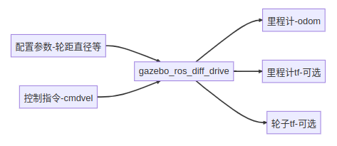

# ROS2 7_机器人仿真

机器人仿真其实就是通过软件来模仿硬件的特性，用于验证机器人算法、架构等。

> 1. 仿真可以解决真机资源不足;
> 2. 仿真可以保证环境的一致和稳定;
> 3. 仿真场景可以更加灵活，在测试机器人算法时可以通过仿真软件快速更改仿真环境，验证算法。
> 4. 仿真的主要缺陷就是仿不全，现实世界中的环境非常复杂，光线、材质、电磁干扰等等，仿真平台无法做到100%的仿真。

常用仿真平台：`Gazebo`，`WeBots`，`Ignition`，`Unity`

## 1. URDF 物理建模参数

### 碰撞参数 `collosion`

| 子标签       | 标签属性 | 含义                       |
| ------------ | -------- | -------------------------- |
| `<origin>`   |          | 碰撞体的中心位姿           |
|              | `xyz`    | 原点平移点                 |
|              | `rpy`    | 原点旋转点                 |
| `<geometry>` |          | 表示用于碰撞检测的几何形状 |
| `<material>` |          | 描述碰撞几何体的材料       |

### 旋转惯量 `inertial`

| 子标签      | 标签属性                            | 含义               |
| ----------- | ----------------------------------- | ------------------ |
| `<mass>`    |                                     | 连杆质量           |
|             | `value`                             | 质量值             |
| `<inertia>` |                                     | 连杆的转动惯量矩阵 |
|             | `ixx`,`ixy`,`ixz`,`iyy`,`iyz`,`izz` | 转动惯量矩阵值     |

- 惯性参数：[设置方法](https://mp.weixin.qq.com/s/3L8Lilesy2W_WY5qup0gmA)

## 2. Gazebo 仿真

使用以下代码下载Gazebo:

```shell
$ sudo apt install ros-humble-gazebo-ros
```

### 加载机器人模型

机器人模型中需要添加用于Gazebo仿真的参数和插件，插件包含两种类型：

> 1. **用于控制的插件**，通过插件可以控制机器人关节运动，可以进行位置、速度、力的控制，比如我们这节课的两轮差速控制器。
> 2. **用于数据采集的插件**，比如`IMU`传感器用于采集机器人的惯性，激光雷达用于采集机器人周围的点云信息。

使用`launch`文件加载机器人模型:

```python
import os
from launch import LaunchDescription
from launch.actions import ExecuteProcess
from launch_ros.actions import Node
from launch_ros.substitutions import FindPackageShare


def generate_launch_description():
    robot_name_in_model = 'bot'
    package_name = 'robot_simulation'
    urdf_name = "robot_model.urdf"

    ld = LaunchDescription()
    pkg_share = FindPackageShare(package=package_name).find(package_name) 
    urdf_model_path = os.path.join(pkg_share, f'urdf/{urdf_name}')
    # 未使用Rviz2显示机器人模型

    # 启动Gazebo服务器
    start_gazebo_cmd =  ExecuteProcess(
        cmd=['gazebo', '--verbose','-s', 'libgazebo_ros_init.so', '-s', 'libgazebo_ros_factory.so'],
        output='screen')

    # 加载机器人模型
    spawn_entity_cmd = Node(
        package='gazebo_ros', 
        executable='spawn_entity.py',
        arguments=['-entity', robot_name_in_model,  '-file', urdf_model_path ], output='screen')

    ld.add_action(start_gazebo_cmd)
    ld.add_action(spawn_entity_cmd)


    return ld
```

### 两轮差速机器人插件`gazebo_ros_diff_drive`

两轮差速插件用于控制机器人轮子关节的位置变化，同时该插件还会获取轮子的位置以及速度的信息的反馈，根据反馈的位置信息结合运动学模型即可计算出当前机器人的位姿（里程计）。



#### 参数配置

| 配置项                   | 含义                                     |
| ------------------------ | ---------------------------------------- |
| `ros`                    | ros 相关配置，包含命名空间和话题重映射等 |
| `update_rate`            | 数据更新速率                             |
| `left_joint`             | 左轮关节名称                             |
| `right_joint`            | 右轮关节名称                             |
| `wheel_separation`       | 左右轮子的间距                           |
| `wheel_diameter`         | 轮子的直径                               |
| `max_wheel_torque`       | 轮子最大的力矩                           |
| `max_wheel_acceleration` | 轮子最大的加速度                         |
| `publish_odom`           | 是否发布里程计                           |
| `publish_odom_tf`        | 是否发布里程计的 tf 开关                 |
| `publish_wheel_tf`       | 是否发布轮子的 tf 数据开关               |
| `odometry_frame`         | 里程计的framed ID，最终体现在话题和TF上  |
| `robot_base_frame`       | 机器人的基础frame的ID                    |

#### 控制话题

两轮差速控制器默认通过订阅话题`cmd_vel`来获取目标线速度和角速度。

消息类型：`geometry_msgs/msg/Twist`

```shell
# This expresses velocity in free space broken into its linear and angular parts.

Vector3  linear
Vector3  angular
```

#### 输出话题——里程计

里程计信息输出话题为`odom`。

消息类型：`nav_msgs/msg/Odometry`

```shell
# This represents an estimate of a position and velocity in free space.
# The pose in this message should be specified in the coordinate frame given by header.frame_id
# The twist in this message should be specified in the coordinate frame given by the child_frame_id

# Includes the frame id of the pose parent.
std_msgs/Header header

# Frame id the pose points to. The twist is in this coordinate frame.
string child_frame_id

# Estimated pose that is typically relative to a fixed world frame.
geometry_msgs/PoseWithCovariance pose

# Estimated linear and angular velocity relative to child_frame_id.
geometry_msgs/TwistWithCovariance twist
```

#### 插件的URDF配置

````xml
<!-- Gazebo 两轮差速插件 -->
<plugin name='diff_drive' filename='libgazebo_ros_diff_drive.so'>
	<ros>
		<namespace>/</namespace>
			<remapping>cmd_vel:=cmd_vel</remapping>
            <remapping>odom:=odom</remapping>
    </ros>
       	<update_rate>30</update_rate>
        <!-- wheels -->
        <!-- <left_joint>left_wheel_joint</left_joint> -->
        <!-- <right_joint>right_wheel_joint</right_joint> -->
        <left_joint>left_wheel_joint</left_joint>
        <right_joint>right_wheel_joint</right_joint>
        <!-- kinematics -->
        <wheel_separation>0.2</wheel_separation>
        <wheel_diameter>0.065</wheel_diameter>
        <!-- limits -->
        <max_wheel_torque>20</max_wheel_torque>
        <max_wheel_acceleration>1.0</max_wheel_acceleration>
        <!-- output -->
        <publish_odom>true</publish_odom>
        <publish_odom_tf>true</publish_odom_tf>
        <publish_wheel_tf>false</publish_wheel_tf>
        <odometry_frame>odom</odometry_frame>
        <robot_base_frame>base_footprint</robot_base_frame>
</plugin>
````

### IMU 插件`libgazebo_ros_imu_sensor`

#### 输出话题——IMU

里程计信息输出话题为`imu`。

消息类型：`sensor_msgs/msg/Imu`

```shell
# This is a message to hold data from an IMU (Inertial Measurement Unit)
#
# Accelerations should be in m/s^2 (not in g's), and rotational velocity should be in rad/sec
#
# If the covariance of the measurement is known, it should be filled in (if all you know is the
# variance of each measurement, e.g. from the datasheet, just put those along the diagonal)
# A covariance matrix of all zeros will be interpreted as "covariance unknown", and to use the
# data a covariance will have to be assumed or gotten from some other source
#
# If you have no estimate for one of the data elements (e.g. your IMU doesn't produce an
# orientation estimate), please set element 0 of the associated covariance matrix to -1
# If you are interpreting this message, please check for a value of -1 in the first element of each
# covariance matrix, and disregard the associated estimate.

std_msgs/Header header

geometry_msgs/Quaternion orientation
float64[9] orientation_covariance # Row major about x, y, z axes

geometry_msgs/Vector3 angular_velocity
float64[9] angular_velocity_covariance # Row major about x, y, z axes

geometry_msgs/Vector3 linear_acceleration
float64[9] linear_acceleration_covariance # Row major x, y z

```

#### 插件的URDF配置

```xml
<gazebo reference="imu_link">
	<!-- imu 传感器配置 -->
	<sensor name="imu_sensor" type="imu">
    <plugin filename="libgazebo_ros_imu_sensor.so" name="imu_plugin">
		<ros>
			<namespace>/</namespace>
            <remapping>~/out:=imu</remapping>
        </ros>    					<initial_orientation_as_reference>false</initial_orientation_as_reference>
    </plugin>
    <always_on>true</always_on>
    <update_rate>100</update_rate>
    <visualize>true</visualize>
        <imu>
        <angular_velocity>
			<x>
            	<noise type="gaussian">
                	<mean>0.0</mean>
                    <stddev>2e-4</stddev>
                    <bias_mean>0.0000075</bias_mean>
                    <bias_stddev>0.0000008</bias_stddev>
                </noise>
            </x>
            <y>
                <noise type="gaussian">
                	<mean>0.0</mean>
                    <stddev>2e-4</stddev>
                    <bias_mean>0.0000075</bias_mean>
                    <bias_stddev>0.0000008</bias_stddev>
                </noise>
            </y>
            <z>
                <noise type="gaussian">
                   <mean>0.0</mean>
                   <stddev>2e-4</stddev>                     						   <bias_mean>0.0000075</bias_mean>
                   <bias_stddev>0.0000008</bias_stddev>
                </noise>
           	</z>
            </angular_velocity>
                <linear_acceleration>
                    <x>
                    <noise type="gaussian">
                        <mean>0.0</mean>
                        <stddev>1.7e-2</stddev>
                        <bias_mean>0.1</bias_mean>
                        <bias_stddev>0.001</bias_stddev>
                    </noise>
                    </x>
                    <y>
                    <noise type="gaussian">
                        <mean>0.0</mean>
                        <stddev>1.7e-2</stddev>
                        <bias_mean>0.1</bias_mean>
                        <bias_stddev>0.001</bias_stddev>
                    </noise>
                    </y>
                    <z>
                    <noise type="gaussian">
                        <mean>0.0</mean>
                        <stddev>1.7e-2</stddev>
                        <bias_mean>0.1</bias_mean>
                        <bias_stddev>0.001</bias_stddev>
                    </noise>
                    </z>
                </linear_acceleration>
          </imu>
	</sensor>
</gazebo>
```

### 激光雷达插件`libgazebo_ros_ray_sensor`

#### 输出话题——激光雷达

里程计信息输出话题为`scan`。

消息类型：`sensor_msgs/msg/LaserScan`

```shell
# Single scan from a planar laser range-finder
#
# If you have another ranging device with different behavior (e.g. a sonar
# array), please find or create a different message, since applications
# will make fairly laser-specific assumptions about this data

std_msgs/Header header # timestamp in the header is the acquisition time of
                             # the first ray in the scan.
                             #
                             # in frame frame_id, angles are measured around
                             # the positive Z axis (counterclockwise, if Z is up)
                             # with zero angle being forward along the x axis

float32 angle_min            # start angle of the scan [rad]
float32 angle_max            # end angle of the scan [rad]
float32 angle_increment      # angular distance between measurements [rad]

float32 time_increment       # time between measurements [seconds] - if your scanner
                             # is moving, this will be used in interpolating position
                             # of 3d points
float32 scan_time            # time between scans [seconds]

float32 range_min            # minimum range value [m]
float32 range_max            # maximum range value [m]

float32[] ranges             # range data [m]
                             # (Note: values < range_min or > range_max should be discarded)
float32[] intensities        # intensity data [device-specific units].  If your
                             # device does not provide intensities, please leave
                             # the array empty.
```

#### 插件的URDF配置

```xml
<gazebo reference="laser_link">
    <!-- laser 传感器配置 -->
    <sensor name="laser_sensor" type="ray">
       	<always_on>true</always_on>
        <visualize>true</visualize>
        <update_rate>5</update_rate>
        <pose>0 0 0.075 0 0 0</pose>
        <ray>
            <scan>
               	<horizontal>
                	<samples>360</samples>
                	<resolution>1.000000</resolution>
                    <min_angle>0.000000</min_angle>
                    <max_angle>6.280000</max_angle>
                </horizontal>
           	</scan>
            <range>
                <min>0.120000</min>
                <max>3.5</max>
                <resolution>0.015000</resolution>
            </range>
            <noise>
                <type>gaussian</type>
                <mean>0.0</mean>
                <stddev>0.01</stddev>
            </noise>
            </ray>
	<plugin name="laserscan" filename="libgazebo_ros_ray_sensor.so">
            <ros>
            <!-- <namespace>/tb3</namespace> -->
                <remapping>~/out:=scan</remapping>
            </ros>
            <output_type>sensor_msgs/LaserScan</output_type>
            <frame_name>laser_link</frame_name>
     </plugin>
  	</sensor>
</gazebo>
```

## 3. 仿真环境搭建

 首先导入`.world`文件，存放在功能包的`world`文件夹中。

在`.launch.py`文件中加入：

```python
    gazebo_world_path = os.path.join(pkg_share, 'world/robot.world')

    # Start Gazebo server
    start_gazebo_cmd =  ExecuteProcess(
        cmd=['gazebo', '--verbose','-s', 'libgazebo_ros_init.so', '-s', 'libgazebo_ros_factory.so', gazebo_world_path],
        output='screen')
```

在`setup.py`中加入：

```python
        (os.path.join('share', package_name, 'world'), glob('world/**')),
```

即可。
