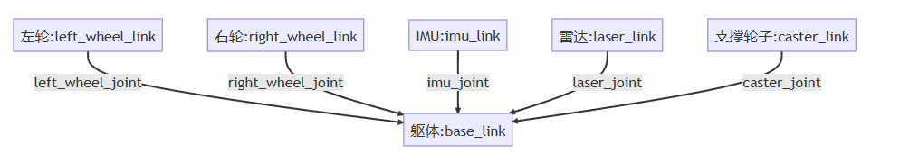
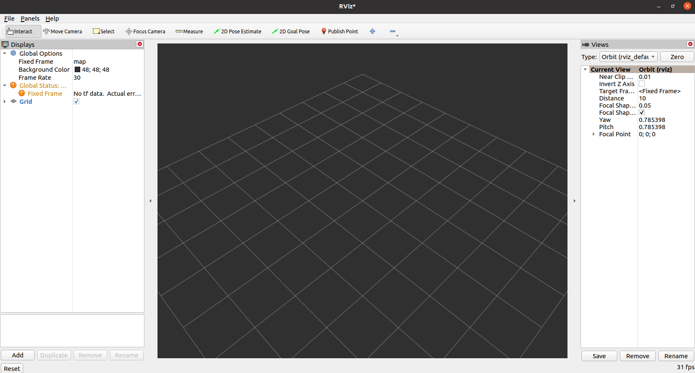

# ROS2 8_Rviz可视化

## 1. URDF 统一机器人建模语言

URDF（Unified Robot Description Format）统一机器人描述格式，URDF使用XML格式描述机器人文件。

XML是**被设计用来传输和存储数据的可扩展标记语言**。

### URDF 内容组成

一般情况下，URDF由**声明信息**和两种**关键组件**(`Joint`和`Link`)共同组成。

```xml
<?xml version="1.0"?>
<robot name="robot">
     <link></link>
     <joint></joint>
  ......
</robot>
```

机器人的组件（模块）为连杆`Link`，连杆连接部分称为关节`Joint`。



#### Link 连杆

- 描述机器人某个刚体部分的外观和物理属性；
- 尺寸（`size`）、颜色（`color`）、形状（`shape`）、惯性矩阵（`inertial matrix`）、碰撞属性（`collision properties`）等。


```xml
  <link name="link">

  </link>
```

`Link`的标签定义

| 一级子标签    | 二级子标签   | 三级子标签   | 标签属性   | 标签含义               |
| ------------- | ------------ | ------------ | ---------- | ---------------------- |
| `<visual>`    |              |              |            | 显示形状               |
|               | `<geometry>` |              |            | 几何形状               |
|               |              | `<box>`      |            | 长方体                 |
|               |              |              | `size`     | 长宽高                 |
|               |              | `<cylinder>` |            | 圆柱体                 |
|               |              |              | `radius`   | 半径                   |
|               |              |              | `length`   | 高度                   |
|               |              | `<sphere>`   |            | 球体                   |
|               |              |              | `radius`   | 半径                   |
|               |              | `<mesh>`     |            | 第三方模型文件         |
|               |              |              | `filename` | 文件名                 |
|               | `<origin>`   |              |            | 连杆原点               |
|               |              |              | `xyz`      | 平移量                 |
|               |              |              | `rpy`      | 翻滚角，俯仰角，偏航角 |
|               | `<material>` |              |            | 材质                   |
|               |              | `<name>`     |            | 名字                   |
|               |              | `<color>`    | `rgba`     | 颜色                   |
| `<collision>` |              |              |            | 碰撞属性               |
| `<inertial>`  |              |              |            | 惯性参数               |

#### Joint 关节


`Joint`的标签定义

| 属性   | 子标签     | 标签属性 | 含义                                                         |
| ------ | ---------- | -------- | ------------------------------------------------------------ |
| `name` |            |          | 关节名称                                                     |
| `type` |            |          | 关节类型：  <br>`revolute`: 旋转关节，绕单轴旋转,角度有上下限,比如舵机;<br>`continuous`: 旋转关节，可以绕单轴无限旋转,比如自行车的前后轮;<br>`fixed`: 固定关节，不允许运动的特殊关节;<br>`prismatic`: 滑动关节，沿某一轴线移动的关节，有位置极限;<br>`planer`: 平面关节，允许在xyz，rxryrz六个方向运动;<br>`floating`: 浮动关节，允许进行平移、旋转运动 |
|        | `<parent>` | `link`   | 父连杆名称                                                   |
|        | `<child>`  | `link`   | 子连杆名称                                                   |
|        | `<origin>` | `xyz`    | 原点关系（平移）                                             |
|        | `<axis>`   | `xyz`    | 旋转轴                                                       |

### 在 ROS2 功能包中导入 URDF 模型

功能包内创建文件夹：

> `config`：保存`rviz`的配置文件、功能包的配置文件
>
> `urdf`：存放机器人模型的URDF或xacro文件
>
> `meshes`：放置URDF中引用的模型渲染文件，机器人外观纹理，让外观和实际更相似，通过三维设计软件导出，放置此文件夹下

<font color=LightGreen>1. 创建并编写URDF文件</font>

在功能包下创建`urdf`文件夹，创建`.urdf`文件。

```xml
<?xml version = "1.0"?>
<!-- Create a robot model --> 
<robot name = "bot">
    <!-- Create Link -->

    <!-- Robot Footprint: 用于计算机器人运动时的地面坐标 -->
    <link name = "base_footprint" />

    <!-- Base Link: 机器人物理意义上的原点 -->
    <link name = "base_link" >
        <visual>
            <origin xyz = "0 0 0" rpy="0 0 0"/>
            <geometry>
                <cylinder length = "0.12" radius = "0.1"/>
            </geometry>    
            <material name = "blue"> 
                <color rgba = "0.1 0.1 1.0 0.5"/>
            </material>
        </visual>
    </link>

    <!-- laser link: 激光雷达 -->
    <link name="laser_link">
        <visual>
            <origin xyz="0 0 0" rpy="0 0 0"/>
            <geometry>
                <cylinder length="0.02" radius="0.02"/>
            </geometry>
            <material name="black">
                <color rgba="0.0 0.0 0.0 0.8" /> 
        </material>
        </visual>
    </link>

    <!-- imu link: IMU -->
    <link name="imu_link">
        <visual>
            <origin xyz="0 0 0" rpy="0 0 0"/>
            <geometry>
                <box size="0.02 0.02 0.02"/>
            </geometry>
        </visual>
    </link>

    <!-- left wheel link -->
    <link name="left_wheel_link">
        <visual>
            <origin xyz="0 0 0" rpy="1.57079 0 0"/>
            <geometry>
                <cylinder length="0.04" radius="0.032"/>
            </geometry>
            <material name="black">
                <color rgba="0.0 0.0 0.0 0.5" /> 
            </material>
        </visual>
    </link>

    <!-- right wheel link -->
    <link name="right_wheel_link">
        <visual>
            <origin xyz="0 0 0" rpy="1.57079 0 0"/>
            <geometry>
                <cylinder length="0.04" radius="0.032"/>
            </geometry>
            <material name="black">
                <color rgba="0.0 0.0 0.0 0.5" /> 
            </material>
        </visual>
    </link>

    <!-- caster link -->
    <link name="caster_link">
        <visual>
        <origin xyz="0 0 0" rpy="0 0 0"/>
        <geometry>
            <sphere radius="0.016"/>
        </geometry>
            <material name="black">
            <color rgba="0.0 0.0 0.0 0.5" /> 
            </material>
        </visual>
    </link>

    <!-- Create Joint -->
    
    <!-- laser joint -->
    <joint name="laser_joint" type="fixed">
        <parent link="base_link" />
        <child link="laser_link" />
        <origin xyz="0 0 0.075" />
    </joint>

    <!-- imu joint -->
    <joint name="imu_joint" type="fixed">
        <parent link="base_link" />
        <child link="imu_link" />
        <origin xyz="0 0 0.02" />
    </joint>

    <!-- left wheel joint -->
    <joint name="left_wheel_joint" type="continuous">
        <parent link="base_link" />
        <child link="left_wheel_link" />
        <origin xyz="-0.02 0.10 -0.06" />
        <axis xyz="0 1 0" />    
    </joint>

    <!-- right wheel joint -->
    <joint name="right_wheel_joint" type="continuous">
        <parent link="base_link" />
        <child link="right_wheel_link" />
        <origin xyz="-0.02 -0.10 -0.06" />
        <axis xyz="0 1 0" />    
    </joint>

    <!-- Caster joint -->
    <joint name="caster_joint" type="fixed">
        <parent link="base_link" />
        <child link="caster_link" />
        <origin xyz="0.06 0.0 -0.076" />
    </joint>

    <!-- footprint joint: 建立base_footprint和base_link间的关系（通常为垂直投影） -->
    <joint name="base_joint" type="fixed">
        <parent link="base_footprint"/>
        <child link="base_link"/>
        <origin xyz="0.0 0.0 0.076" rpy="0 0 0"/>
    </joint>
</robot>
```

<font color=LightGreen>2. 创建Launch文件</font>

```python
import os
from launch import LaunchDescription
from launch.substitutions import LaunchConfiguration
from launch_ros.actions import Node
from launch_ros.substitutions import FindPackageShare


def generate_launch_description():
    package_name = 'robot_model'
    urdf_name = "robot_model.urdf"

    ld = LaunchDescription()
    # FindPackageShare 类是 ROS 2 中用于查找包共享文件夹路径的工具。在 ROS 2 中，一个包可以包含可供其他包使用的共享资源，例如配置文件、URDF 模型、启动文件等。这些共享资源通常存储在包的 share 文件夹中。
    # 搜索指定包的共享文件夹路径，并返回找到的路径。
    pkg_share = FindPackageShare(package=package_name).find(package_name) 
    # pkg_share 是找到的包的共享文件夹路径，而 urdf_name 是定义的 URDF 模型文件的名称。通过使用 os.path.join() 方法，将这两部分连接起来，形成了 URDF 模型文件的完整路径。
    urdf_model_path = os.path.join(pkg_share, f'urdf/{urdf_name}')
	# 模型发布节点
    robot_state_publisher_node = Node(
        package='robot_state_publisher',
        executable='robot_state_publisher',
        arguments=[urdf_model_path]
        )
	# 关节数据发布节点
    joint_state_publisher_node = Node(
        package='joint_state_publisher_gui',
        executable='joint_state_publisher_gui',
        name='joint_state_publisher_gui',
        arguments=[urdf_model_path]
        )
	# rviz2 节点
    rviz2_node = Node(
        package='rviz2',
        executable='rviz2',
        name='rviz2',
        output='screen',
        )

    ld.add_action(robot_state_publisher_node)
    ld.add_action(joint_state_publisher_node)
    ld.add_action(rviz2_node)

    return ld
```

可视化模型需要三个节点参与:

- `joint_state_publisher_gui` 负责发布机器人关节数据信息，通过`joint_states`话题发布。
- `robot_state_publisher_node`负责发布机器人模型信息，`robot_description`，并将`joint_states`数据转换`tf`信息发布。
- `rviz2_node`负责显示机器人的信息。

> 如果未能安装，使用以下命令：
>
> ```shell
> sudo apt install ros-$ROS_DISTRO-joint-state-publisher-gui ros-$ROS_DISTRO-robot-state-publisher
> ```
>
> 如果无法打开可视化界面，使用以下命令：
>
> ```shell
> xhost +
> ```


<font color=LightGreen>3. 编写`setup.py`文件</font>

```python
from setuptools import find_packages, setup
from glob import glob
import os


package_name = 'robot_model'

setup(
    name=package_name,
    version='0.0.0',
    packages=find_packages(exclude=['test']),
    data_files=[
        ('share/ament_index/resource_index/packages',
            ['resource/' + package_name]),
        ('share/' + package_name, ['package.xml']),
        # 添加以下代码
        # 添加Launch路径
        (os.path.join('share', package_name, 'launch'), glob('launch/*.launch.py')),
        # 添加URDF路径
        (os.path.join('share', package_name, 'urdf'), glob('urdf/**')),
    ],
    install_requires=['setuptools'],
    zip_safe=True,
    maintainer='root',
    maintainer_email='e22750706642022@163.com',
    description='TODO: Package description',
    license='TODO: License declaration',
    tests_require=['pytest'],
    entry_points={
        'console_scripts': [
        ],
    },
)
```

<font color=LightGreen>4. 关节消息的发布</font>

可以自行编写节点，取代`joint_state_publisher`发送关节位姿给`robot_state_publisher`。

消息类型为`sensor_msgs/msg/JointState`，话题名称为`joint_states`。

消息格式如下：

```
std_msgs/Header header # 头部规定了记录关节状态的时间

string[] name		# 关节名称数组
float64[] position 	# 关节位置数组，表示关节转动的角度值
float64[] velocity	# 关节速度数组，轮子转动的角度 = （当前时刻-上一时刻）* 两个时刻之间的轮子转速
float64[] effort	# 扭矩数据
```

## 2. Rviz 可视化

Rviz 是一款针对ROS框架的3D可视化工具。

可以使用`rviz2`启动 Rviz。



> 1. 上部为工具栏：包括视角控制、预估位姿设置、目标设置等，还可以添加自定义插件；
> 2. 左侧为插件显示区：包括添加、删除、复制、重命名插件，显示插件，以及设置插件属性等功能；
> 3. 中间为3D视图显示区：以可视化的方式显示添加的插件信息；
> 4. 右侧为观测视角设置区：可以设置不同的观测视角；
> 5. 下侧为时间显示区：包括系统时间和ROS时间。

> 左侧插件显示区默认有两个插件：
>
> - Global Options：该插件用于设置全局显示相关的参数，一般情况下，需要自行设置的是 Fixed Frame 选项，该选项是其他所有数据在可视化显示时所参考的全局坐标系；
> - Global Status：该插件用于显示在 Global Options 设置完毕 Fixed Frame 之后，所有的坐标变换是否正常。

### Rviz 插件

在 rviz2 中已经预定义了一些插件，这些插件名称、功能以及订阅的消息类型如下：

| 名称              | 功能                                                         | 消息类型                                                     |
| ----------------- | ------------------------------------------------------------ | ------------------------------------------------------------ |
| Axes              | 显示 rviz2 默认的坐标系。                                    |                                                              |
| Camera            | 显示相机图像，必须需要使用消息：CameraInfo。                 | `sensor_msgs/msg/Image`，`sensor_msgs/msg/CameraInfo`        |
| Grid              | 显示以参考坐标系原点为中心的网格。                           |                                                              |
| Grid Cells        | 从网格中绘制单元格，通常是导航堆栈中成本地图中的障碍物。     | `nav_msgs/msg/GridCells`                                     |
| Image             | 显示相机图像，但是和Camera插件不同，它不需要使用 CameraInfo 消息。 | `sensor_msgs/msg/Image`                                      |
| InteractiveMarker | 显示来自一个或多个交互式标记服务器的 3D 对象，并允许与它们进行鼠标交互。 | `visualization_msgs/msg/InteractiveMarker`                   |
| Laser Scan        | 显示激光雷达数据。                                           | `sensor_msgs/msg/LaserScan`                                  |
| Map               | 显示地图数据。                                               | `nav_msgs/msg/OccupancyGrid`                                 |
| Markers           | 允许开发者通过主题显示任意原始形状的几何体。                 | `visualization_msgs/msg/Marker`，`visualization_msgs/msg/MarkerArray` |
| Path              | 显示机器人导航中的路径相关数据。                             | `nav_msgs/msg/Path`                                          |
| PointStamped      | 以小球的形式绘制一个点。                                     | `geometry_msgs/msg/PointStamped`                             |
| Pose              | 以箭头或坐标轴的方式绘制位姿。                               | `geometry_msgs/msg/PoseStamped`                              |
| Pose Array        | 绘制一组 Pose。                                              | `geometry_msgs/msg/PoseArray`                                |
| Point Cloud2      | 绘制点云数据。                                               | `sensor_msgs/msg/PointCloud`，`sensor_msgs/msg/PointCloud2`  |
| Polygon           | 将多边形的轮廓绘制为线。                                     | `geometry_msgs/msg/Polygon`                                  |
| Odometry          | 显示随着时间推移累积的里程计消息。                           | `nav_msgs/msg/Odometry`                                      |
| Range             | 显示表示来自声纳或红外距离传感器的距离测量值的圆锥。         | `sensor_msgs/msg/Range`                                      |
| RobotModel        | 显示机器人模型。                                             |                                                              |
| TF                | 显示 tf 变换层次结构。                                       |                                                              |
| Wrench            | 将`geometry_msgs /WrenchStamped`消息显示为表示力的箭头和表示扭矩的箭头加圆圈。 | `geometry_msgs/msg/WrenchStamped`                            |
| Oculus            | 将 RViz 场景渲染到 Oculus 头戴设备。                         |                                                              |

> 1. Global Options 中的 Fixed Frame 设置为 `base_link`（和 urdf 文件中 link 标签的 name 一致）；
> 2. 添加机器人模型插件，并将参数 Description Topic 的值设置为 `/robot_description`，即可显示机器人模型。