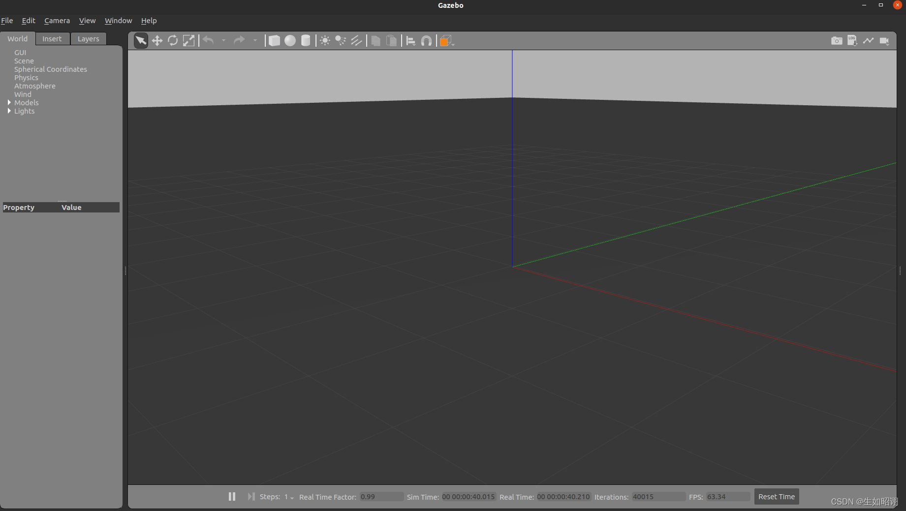
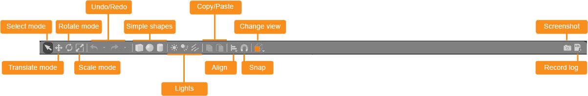
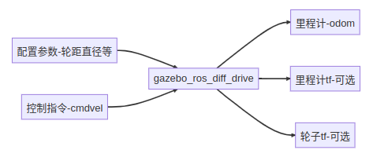

# ROS2 9_Gazebo 仿真平台

机器人仿真其实就是通过软件来模仿硬件的特性，用于验证机器人算法、架构等。

> 1. 仿真可以解决真机资源不足;
> 2. 仿真可以保证环境的一致和稳定;
> 3. 仿真场景可以更加灵活，在测试机器人算法时可以通过仿真软件快速更改仿真环境，验证算法。
> 4. 仿真的主要缺陷就是仿不全，现实世界中的环境非常复杂，光线、材质、电磁干扰等等，仿真平台无法做到100%的仿真。

常用仿真平台：`Gazebo`，`WeBots`，`Ignition`，`Unity`

## 1. Gazebo 简介和安装

Gazebo 是 ROS 系统中最为常用的三维物理仿真平台，支持动力学引擎，可以实现高质量的图形渲染，不仅可以模拟机器人及周边环境，还可以加入摩擦力、弹性系数等物理属性。

通过以下命令可以直接安装和 Gazebo 相关的功能包：

```shell
$ sudo apt install ros-<ROS_DISTRO>-gazebo-*
```

通过此命令可以运行 Gazebo：

```shell
$ ros2 launch gazebo_ros gazebo.launch.py
```

## 2. Gazebo 窗口介绍

1. 场景

  

  场景是模拟器的主要部分，用于显示仿真模型，操作仿真对象与环境进行交互。

2.  左右面板

	
	
	> - 左面板：
	>
	>   1. `WORLD`：世界选项卡，显示当前在场景中的模型，并允许你查看和修改模型参数，例如它们的姿势。你还可以通过展开“GUI”选项并调整相机姿势来更改摄像机视角。
	>
	>   2. `INSERT`：插入选项卡，向模拟添加新对象（模型）。要查看模型列表，您可能需要单击箭头以展开文件夹。在要插入的模型上单击（和释放），然后在场景中再次单击以添加它。
	>
	>   3. `LAYERS`：图层选项卡可组织和显示模拟中可用的不同可视化组（如果有）。图层可以包含一个或多个模型。打开或关闭图层将显示或隐藏该图层中的模型。大多数情况下都是空的，现在可以无视掉
	>
	>  - 右面板：
	>      默认情况下 Gazebo 界面隐藏右侧面板。单击并拖动栏以将其打开。右侧面板可用于与所选模型（joint）的移动部件进行交互。如果未在场景中选择任何模型，则面板不会显示任何信息。

3. 上下工具栏与菜单栏

	
	
	- 顶部工具栏：包含与模拟器交互时的选项。
	
	> 1. 选择模型（Select mode）：在场景中做标注；
	> 2. 转换模式（Translate mode）：选择要移动的模型，可以沿x轴，y轴，z轴，或任意方向移动模型；
	> 3. 旋转模式（Rotate mode）：选择要旋转的模型，可以沿x轴，y轴，z轴进行旋转模型；
	> 4. 缩放模式（Scale mode）：选择要缩放的模型，可以沿x轴，y轴，z轴进行缩小或放大模型；
	> 5. 撤消/重做（Undo/Redo）：撤消/重做场景中的操作；
	> 6. 简单物体（Simple shapes）：放置一个长方体/球体/圆柱体
	> 7. 灯光（Lights）：将灯光添加到场景，点光源 (球状点光源)/聚光灯 (从上而下，金字塔状向下照射)/方向性光源 (平行光)；
	> 8. 复制/粘贴（Copy/Paste）：复制/粘贴场景中的模型；
	> 9. 对齐（Align）：将模型彼此对齐；
	> 10. 捕捉（Snap）：将一个模型捕捉到另一个模型；
	> 11. 更改视图（Change view）：从不同角度查看场景。
	> 

	
	
	- 底部工具栏：显示仿真有关数据。
	
	> 1. 播放/暂停：根据你的程序，运行仿真或暂停
	> 2. 以步长播放：按照规定的时长，一步一步运行仿真，默认步长1ms
	> 3. 实时因子：模拟时间与真实时间的比率，1代表实时模拟
	> 4. 仿真时间（Simulation time）：当仿真运行时，时间在仿真环境中过得有多快。仿真可以比真实时间慢或快，具体取决于运行仿真所需的计算量；
	> 5. 真实时间（Real time）：在仿真环境中运行时实际经过的时间。仿真时间和真实时间的比率称为实时因子。
	> 6. 迭代次数：世界状态每迭代一次就更新一次。您可以在底部工具栏的右侧看到迭代次数。每次迭代都会将仿真推进一个固定的秒数，称为步长。

4. 鼠标操作

	

## 3. Gazebo 建模简介

### 机器人建模

对于 Gazebo 仿真，可以使用 URDF 和 SDF 两种文件建模。

> **URDF文件**：统一机器人描述格式，是ROS用于描述机器人的所有元素的XML文件格式。
>
> > 1. 在 Gazebo 中使用 URDF 文件，必须添加一些特定用于仿真的标签才能与 Gazebo 一起正常使用；
> > 2. 缺少许多功能，并且尚未进行更新以应对机器人技术的不断发展的需求。URDF 只能单独指定单个机器人的运动学和动力学特性，无法指定世界中机器人本身的姿势；
> > 3. 不是通用的描述格式，因为它不能指定关节环（平行连接），并且缺乏摩擦和其他特性;
> > 4. 不能指定非机器人，例如灯光，高度图等;
> > 5. 语法大量使用 XML 属性破坏了正确的格式设置，这反过来又使 URDF 更加不灵活。
>
> **SDF文件**：仿真描述格式，是从世界级到机器人级的所有内容的完整描述，能够描述机器人、静态和动态物体、照明、地形甚至物理学的各方面的信息。
>
> > 1. 可以精确描述机器人的各类性质，除了传统的运动学特性之外，还可以为机器人定义传感器、表面属性、纹理、关节摩擦等；
> > 2. 提供了定义各种环境的方法。包括环境光照、地形等；
> > 3. 使用 XML 格式进行描述，能够更好的描述真实的模拟条件；
>
> 必须使用 URDF 文件：
>
> 1. 要使用 Rviz 进行可视化操作、要尽快做出仿真用以演示效果；
>
> 2. 使用 Solidworks 建模，想方便地导出ROS三维模型。
>
> 必须使用 SDF 文件：
>
> 1. 研究并联机器人，或机器人中存在封闭链结构；
> 2. 想深入研究 ROS-gazebo 仿真，使仿真的动力学特性更加真实；想开发自己专用的 Gazebo 仿真插件。

#### URDF 建模

<font color=LightGreen>1. URDF 机器人模型</font>

在基础几何属性上，URDF文件需要添加渲染属性和物理属性。物理属性包括碰撞参数`<collosion>`和旋转惯量`<inertial>`。

- 碰撞参数

	| 子标签       | 标签属性 | 含义                       |
	| ------------ | -------- | -------------------------- |
	| `<origin>`   |          | 碰撞体的中心位姿           |
	|              | `xyz`    | 原点平移点                 |
	|              | `rpy`    | 原点旋转点                 |
	| `<geometry>` |          | 表示用于碰撞检测的几何形状 |
	| `<material>` |          | 描述碰撞几何体的材料       |

- 旋转惯量

	| 子标签      | 标签属性                            | 含义               |
	| ----------- | ----------------------------------- | ------------------ |
	| `<mass>`    |                                     | 连杆质量           |
	|             | `value`                             | 质量值             |
	| `<inertia>` |                                     | 连杆的转动惯量矩阵 |
	|             | `ixx`,`ixy`,`ixz`,`iyy`,`iyz`,`izz` | 转动惯量矩阵值     |

	> 惯性参数：[设置方法](https://mp.weixin.qq.com/s/3L8Lilesy2W_WY5qup0gmA)

<font color=LightGreen>2. Gazebo 仿真标签</font>

- 渲染标签

	为每一个 `link` 添加 Gazebo 标签，主要是为了可以在 Gazebo 中渲染每一个 `link` 的颜色，因为 URDF 中的颜色系统和 Gazebo 中的不同，所以得做一步这样的冗余配置。

	```xml
	<gazebo reference="laser_link">
		<material>Gazebo/Black</material>
	</gazebo>
	```

- 摩擦力和刚性系数标签

	`<mu1>`和`<mu2>`可以配置摩擦力，`<kp>`，`<kd>`代表刚性系数。
	
	```xml
	<gazebo reference="caster_link">
    <mu1 value="0.0"/>
    <mu2 value="0.0"/>
    <kp value="1000000.0" />
    <kd value="10.0" />
  </gazebo>
	```

#### SDF 建模

（略）

## 4. Gazebo 插件

Gazebo是一个独立于ROS的软件，对外提供了丰富的API可以使用，gazebo的插件按照用途大致可以分为两种：

1. **用于控制的插件**，通过插件可以控制机器人关节运动，可以进行位置、速度、力的控制。
2. **用于数据采集的插件**，比如 IMU 传感器用于采集机器人的惯性，激光雷达用于采集机器人周围的点云信息。

<font color=LightGreen>1. 两轮差速插件 `gazebo_ros_diff_drive`</font>

两轮差速插件用于控制机器人轮子关节的位置变化，同时该插件还会获取轮子的位置以及速度的信息的反馈，根据反馈的位置信息结合运动学模型即可计算出当前机器人的位姿（里程计）。



- 参数配置

	| 配置项                   | 含义                                     |
	| ------------------------ | ---------------------------------------- |
	| `ros`                    | ros 相关配置，包含命名空间和话题重映射等 |
	| `update_rate`            | 数据更新速率                             |
	| `left_joint`             | 左轮关节名称                             |
	| `right_joint`            | 右轮关节名称                             |
	| `wheel_separation`       | 左右轮子的间距                           |
	| `wheel_diameter`         | 轮子的直径                               |
	| `max_wheel_torque`       | 轮子最大的力矩                           |
	| `max_wheel_acceleration` | 轮子最大的加速度                         |
	| `publish_odom`           | 是否发布里程计                           |
	| `publish_odom_tf`        | 是否发布里程计的 tf 开关                 |
	| `publish_wheel_tf`       | 是否发布轮子的 tf 数据开关               |
	| `odometry_frame`         | 里程计的framed ID，最终体现在话题和TF上  |
	| `robot_base_frame`       | 机器人的基础frame的ID                    |

- 控制消息

	两轮差速控制器默认通过订阅话题`cmd_vel`来获取目标线速度和角速度。消息类型：`geometry_msgs/msg/Twist`。
	
	```shell
	# This expresses velocity in free space broken into its linear and angular parts.
	
	Vector3  linear
	Vector3  angular
	```
	
- 输出消息

  里程计信息输出话题为`odom`。消息类型：`nav_msgs/msg/Odometry`

  ```shell
  # This represents an estimate of a position and velocity in free space.
  # The pose in this message should be specified in the coordinate frame given by header.frame_id
  # The twist in this message should be specified in the coordinate frame given by the child_frame_id
  
  # Includes the frame id of the pose parent.
  std_msgs/Header header
  
  # Frame id the pose points to. The twist is in this coordinate frame.
  string child_frame_id
  
  # Estimated pose that is typically relative to a fixed world frame.
  geometry_msgs/PoseWithCovariance pose
  
  # Estimated linear and angular velocity relative to child_frame_id.
  geometry_msgs/TwistWithCovariance twist
  ```

- 插件的URDF配置

  ```xml
  <!-- Gazebo 两轮差速插件 -->
  <plugin name='diff_drive' filename='libgazebo_ros_diff_drive.so'>
  	<ros>
  		<namespace>/</namespace>
  			<remapping>cmd_vel:=cmd_vel</remapping>
              <remapping>odom:=odom</remapping>
      </ros>
         	<update_rate>30</update_rate>
          <!-- wheels -->
          <!-- <left_joint>left_wheel_joint</left_joint> -->
          <!-- <right_joint>right_wheel_joint</right_joint> -->
          <left_joint>left_wheel_joint</left_joint>
          <right_joint>right_wheel_joint</right_joint>
          <!-- kinematics -->
          <wheel_separation>0.2</wheel_separation>
          <wheel_diameter>0.065</wheel_diameter>
          <!-- limits -->
          <max_wheel_torque>20</max_wheel_torque>
          <max_wheel_acceleration>1.0</max_wheel_acceleration>
          <!-- output -->
          <publish_odom>true</publish_odom>
          <publish_odom_tf>true</publish_odom_tf>
          <publish_wheel_tf>false</publish_wheel_tf>
          <odometry_frame>odom</odometry_frame>
          <robot_base_frame>base_footprint</robot_base_frame>
  </plugin>
  ```

<font color=LightGreen>2. IMU 插件`libgazebo_ros_imu_sensor`</font>

- 输出消息

  里程计信息输出话题为`imu`。消息类型：`sensor_msgs/msg/Imu`。

  ```shell
  # This is a message to hold data from an IMU (Inertial Measurement Unit)
  #
  # Accelerations should be in m/s^2 (not in g's), and rotational velocity should be in rad/sec
  #
  # If the covariance of the measurement is known, it should be filled in (if all you know is the
  # variance of each measurement, e.g. from the datasheet, just put those along the diagonal)
  # A covariance matrix of all zeros will be interpreted as "covariance unknown", and to use the
  # data a covariance will have to be assumed or gotten from some other source
  #
  # If you have no estimate for one of the data elements (e.g. your IMU doesn't produce an
  # orientation estimate), please set element 0 of the associated covariance matrix to -1
  # If you are interpreting this message, please check for a value of -1 in the first element of each
  # covariance matrix, and disregard the associated estimate.
  
  std_msgs/Header header
  
  geometry_msgs/Quaternion orientation
  float64[9] orientation_covariance # Row major about x, y, z axes
  
  geometry_msgs/Vector3 angular_velocity
  float64[9] angular_velocity_covariance # Row major about x, y, z axes
  
  geometry_msgs/Vector3 linear_acceleration
  float64[9] linear_acceleration_covariance # Row major x, y z
  ```

- 插件的URDF配置

  ```xml
  <gazebo reference="imu_link">
  	<!-- imu 传感器配置 -->
  	<sensor name="imu_sensor" type="imu">
      <plugin filename="libgazebo_ros_imu_sensor.so" name="imu_plugin">
  		<ros>
  			<namespace>/</namespace>
              <remapping>~/out:=imu</remapping>
          </ros>    					<initial_orientation_as_reference>false</initial_orientation_as_reference>
      </plugin>
      <always_on>true</always_on>
      <update_rate>100</update_rate>
      <visualize>true</visualize>
          <imu>
          <angular_velocity>
  			<x>
              	<noise type="gaussian">
                  	<mean>0.0</mean>
                      <stddev>2e-4</stddev>
                      <bias_mean>0.0000075</bias_mean>
                      <bias_stddev>0.0000008</bias_stddev>
                  </noise>
              </x>
              <y>
                  <noise type="gaussian">
                  	<mean>0.0</mean>
                      <stddev>2e-4</stddev>
                      <bias_mean>0.0000075</bias_mean>
                      <bias_stddev>0.0000008</bias_stddev>
                  </noise>
              </y>
              <z>
                  <noise type="gaussian">
                     <mean>0.0</mean>
                     <stddev>2e-4</stddev>                     						   <bias_mean>0.0000075</bias_mean>
                     <bias_stddev>0.0000008</bias_stddev>
                  </noise>
             	</z>
              </angular_velocity>
                  <linear_acceleration>
                      <x>
                      <noise type="gaussian">
                          <mean>0.0</mean>
                          <stddev>1.7e-2</stddev>
                          <bias_mean>0.1</bias_mean>
                          <bias_stddev>0.001</bias_stddev>
                      </noise>
                      </x>
                      <y>
                      <noise type="gaussian">
                          <mean>0.0</mean>
                          <stddev>1.7e-2</stddev>
                          <bias_mean>0.1</bias_mean>
                          <bias_stddev>0.001</bias_stddev>
                      </noise>
                      </y>
                      <z>
                      <noise type="gaussian">
                          <mean>0.0</mean>
                          <stddev>1.7e-2</stddev>
                          <bias_mean>0.1</bias_mean>
                          <bias_stddev>0.001</bias_stddev>
                      </noise>
                      </z>
                  </linear_acceleration>
            </imu>
  	</sensor>
  </gazebo>
  ```

<font color=LightGreen>3. 激光雷达插件`libgazebo_ros_ray_sensor`</font>

- 输出话题

  里程计信息输出话题为`scan`。消息类型：`sensor_msgs/msg/LaserScan`。

  ```shell
  # Single scan from a planar laser range-finder
  #
  # If you have another ranging device with different behavior (e.g. a sonar
  # array), please find or create a different message, since applications
  # will make fairly laser-specific assumptions about this data
  
  std_msgs/Header header # timestamp in the header is the acquisition time of
                               # the first ray in the scan.
                               #
                               # in frame frame_id, angles are measured around
                               # the positive Z axis (counterclockwise, if Z is up)
                               # with zero angle being forward along the x axis
  
  float32 angle_min            # start angle of the scan [rad]
  float32 angle_max            # end angle of the scan [rad]
  float32 angle_increment      # angular distance between measurements [rad]
  
  float32 time_increment       # time between measurements [seconds] - if your scanner
                               # is moving, this will be used in interpolating position
                               # of 3d points
  float32 scan_time            # time between scans [seconds]
  
  float32 range_min            # minimum range value [m]
  float32 range_max            # maximum range value [m]
  
  float32[] ranges             # range data [m]
                               # (Note: values < range_min or > range_max should be discarded)
  float32[] intensities        # intensity data [device-specific units].  If your
                               # device does not provide intensities, please leave
                               # the array empty.
  ```

- 插件的URDF配置

  ```xml
  <gazebo reference="laser_link">
      <!-- laser 传感器配置 -->
      <sensor name="laser_sensor" type="ray">
         	<always_on>true</always_on>
          <visualize>true</visualize>
          <update_rate>5</update_rate>
          <pose>0 0 0.075 0 0 0</pose>
          <ray>
              <scan>
                 	<horizontal>
                  	<samples>360</samples>
                  	<resolution>1.000000</resolution>
                      <min_angle>0.000000</min_angle>
                      <max_angle>6.280000</max_angle>
                  </horizontal>
             	</scan>
              <range>
                  <min>0.120000</min>
                  <max>3.5</max>
                  <resolution>0.015000</resolution>
              </range>
              <noise>
                  <type>gaussian</type>
                  <mean>0.0</mean>
                  <stddev>0.01</stddev>
              </noise>
              </ray>
  	<plugin name="laserscan" filename="libgazebo_ros_ray_sensor.so">
              <ros>
              <!-- <namespace>/tb3</namespace> -->
                  <remapping>~/out:=scan</remapping>
              </ros>
              <output_type>sensor_msgs/LaserScan</output_type>
              <frame_name>laser_link</frame_name>
       </plugin>
    	</sensor>
  </gazebo>
  ```

## 5. Gazebo - ROS2 使用

### 使用 `launch` 文件加载机器人模型

```python
import os
from launch import LaunchDescription
from launch.actions import ExecuteProcess
from launch_ros.actions import Node
from launch_ros.substitutions import FindPackageShare


def generate_launch_description():
    robot_name_in_model = 'bot'
    package_name = 'robot_simulation'
    urdf_name = "robot_model.urdf"

    ld = LaunchDescription()
    pkg_share = FindPackageShare(package=package_name).find(package_name) 
    urdf_model_path = os.path.join(pkg_share, f'urdf/{urdf_name}')

    # 启动Gazebo服务器
    start_gazebo_cmd =  ExecuteProcess(
        cmd=['gazebo', '--verbose','-s', 'libgazebo_ros_init.so', '-s', 'libgazebo_ros_factory.so'],
        output='screen')

    # 加载机器人模型
    spawn_entity_cmd = Node(
        package='gazebo_ros', 
        executable='spawn_entity.py',
        arguments=['-entity', robot_name_in_model,  '-file', urdf_model_path ], output='screen')

    ld.add_action(start_gazebo_cmd)
    ld.add_action(spawn_entity_cmd)

    return ld
```

### 导入世界文件

首先导入`.world`文件，存放在功能包的`world`文件夹中。

在`.launch.py`文件中加入：

```python
    gazebo_world_path = os.path.join(pkg_share, 'world/robot.world')

    # Start Gazebo server
    start_gazebo_cmd =  ExecuteProcess(
        cmd=['gazebo', '--verbose','-s', 'libgazebo_ros_init.so', '-s', 'libgazebo_ros_factory.so', gazebo_world_path],
        output='screen')
```

在`setup.py`中加入：

```python
        (os.path.join('share', package_name, 'world'), glob('world/**')),
```

即可。
