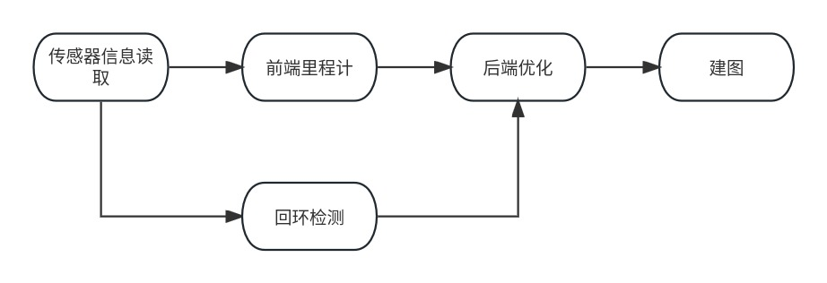
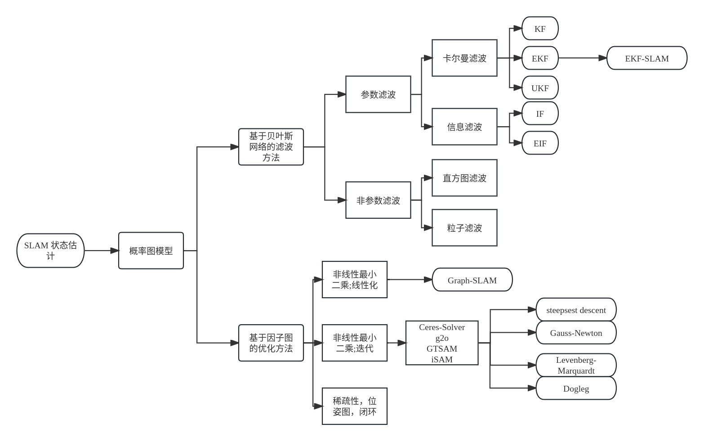
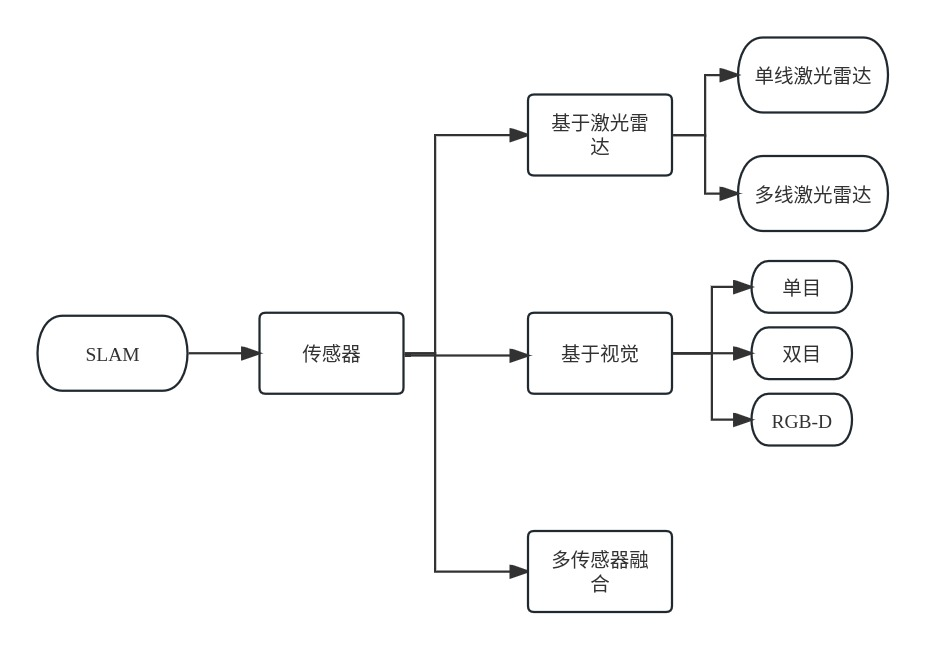
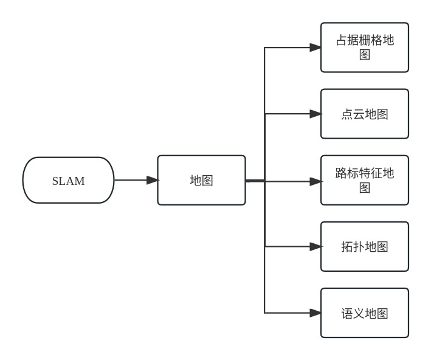

# ROS2 9_SLAM简介

## 1. SLAM 简介和框架

### SLAM 简介和经典SLAM框架 

SLAM 即 Simultaneous Localization and Mapping，即同时定位和建图。SLAM 主要解决感知周围环境（建图）和了解自身状态（位置）的问题。

> **例子**
>
> 在密闭有障碍物空间中，机器人要经过以下过程：
>
> 1. 使用传感器接收信息，观察标志性的障碍物，根据这些障碍物估算自身的位姿；
> 2. 构建局部子图，在运行过程中完善局部子图；
> 3. 使用局部子图和全局地图进行对比和匹配，估算自身姿态和进行路径规划

- 经典SLAM框架

> 1. **传感器信息读取**：读取硬件传感器的数据并进行预处理；
> 2. **前端里程计**：估算相邻位姿间的运动和局部地图；
> 3. **后端优化**：接收不同时刻里程计测量的位姿和回环检测的信息，并进行处理，得到与全局一致的轨迹和地图；
> 4. **回环检测**：判断机器人是否到达过先前的位置，如果检测到回环则交给后端进行处理；
> 5. **建图**：根据估计轨迹建立与任务要求对应的地图。

### SLAM 问题求解

SLAM 问题是一个状态估计问题，即根据可获取的测量数据估算动态系统的内部状态，根据求解方法的不同，形成了**滤波方法**和**优化方法**两个类别。其中，优化方法为主导地位。

### SLAM 技术方向

- 基于传感器的分类

- 基于建图目标的分类

## 2. Cartographer 

Cartographer是Google开源的一个可跨多个平台和传感器配置以2D和3D形式提供实时同时定位和建图（SLAM）的系统。
